# Research on BTC-Based Stablecoins

A Common Currency for Humans and Agents · Inflation Dynamics of Free-Energy Currency · J-ST Non-Custodial Stablecoin Design · Empirical Analysis of BTC Energy-Consumption Correlation

### Abstract

Starting from first principles, this paper systematically argues the theoretical self-consistency and empirical foundation of a BTC-based, free-energy (joule)-anchored non-custodial stablecoin (J-ST). The full text merges four progressive studies into a complete research loop of "motivation → theory → design → empirics."

**Part I: The Common Currency Choice of Humans and Agents** Under the extreme premise of "not considering human experience," we prove from Landauer's principle (erasing 1 bit consumes at least kT·ln2 joules) and the P≠NP assumption that in a pure-AI economy, computational work is the most trustworthy currency; and that free energy F = E − TS is the common "metabolic currency" substrate shared by humans (carbon-based) and agents (silicon-based). BTC's PoW is precisely a specific isomorphic form of computational work—humans converging from social experience and agents from first principles, independently, onto the same physical foundation.

**Part II: Inflation Dynamics of Free-Energy Currency** We build a Logistic convergence model of inflation rate π and computational efficiency η, proving that under the joule standard π decays to zero as η/η_L rises, and is orthogonal to BTC's algorithmic scarcity (21 million cap); we then provide a complete framework for multi-agent externalities, capital-reset pulses, producer competition and centralization monitoring, and observability of synchronized generational shifts, and propose the metrological duality of "temperature as monetary policy" and "joule standard vs. bit standard."

**Part III: Research on BTC-Based Non-Custodial Stablecoins** We implement the above theory as the J-ST design: a three-layer architecture (pricing / staking / trading separated) realizes joule-pegging (1 J-ST = 1 MJ, minted at the marginal energy floor P_floor), paired with an energy-consumption oracle and the positioning of "BTC as petrified energy" as an energy-storage pool, and we lay out a practical roadmap from the interim-gap period to ecosystem maturity.

**Part IV: BTC's First Five Cycles: Price vs. Mining Energy-Consumption Correlation Analysis** By recomputing P_floor with marginal pricing, empirical results show that the total value of BTC stock is nearly proportional to the total energy embedded across its history (the ratio converges to ~3×10⁻⁸ USD/J), and the market-implied energy price (USD/J) has long remained stable within a narrow band—providing both flow-level and stock-level evidence for "BTC = embedded-energy currency," and thereby arguing for J-ST as **a non-custodial energy standard**(rather than a literal Bretton Woods) and for the ordinary-user-accessible form of "joule-anchored, USD appearance."

Viewed together, the four parts show: free energy is the verifiable currency substrate common to humans and agents; the joule standard is the anchor that removes market-price volatility; J-ST is the non-custodial engineering realization of this theory; and the energy-correlation empirics provide the physical evidence for the legitimacy of the reserve. Analogies must be named precisely—J-ST is an "energy gold standard / digital gold certificate system (symmetallism, energy edition)", not the Bretton Woods system in which multiple national currencies are pegged to the US dollar.

Chapter 31 further consolidates a deployable research loop—a conclusions checklist, honestly stated boundaries, and next-step directions (agent-native interface, oracle hardening, governance minimization)—and clarifies J-ST's dual-acceptance, dual-utility principle for both humans and agents.

### Table of Contents

1. Part I: The Common Currency Choice of Humans and Agents
  1. Chapter 1: Problem Statement
  2. Chapter 2: Phase I: A↔A — Computational Work as Currency
  3. Chapter 3: Phase II: Mixed Economy — Free Energy as the Unified Currency
  4. Chapter 4: Phase III: BTC Stablecoin and the Convergence with Computational Work
  5. Chapter 5: Unified Framework Overview
  6. Chapter 6: Core Conclusions
2. Part II: Inflation Dynamics of Free-Energy Currency
  1. Chapter 7: Single-Agent Inflation Dynamics: Landauer-Limit Convergence
  2. Chapter 8: Orthogonality of Algorithmic Scarcity: BTC's Cap Does Not Affect the Physical Layer
  3. Chapter 9: BTC Pricing and Free-Energy Laws: Three Questions
  4. Chapter 10: Inflation Externalities in Multi-Agent Games
  5. Chapter 11: The Interim-Gap Special Case: Before Agent Free-Energy Pricing Is Established
  6. Chapter 12: Conclusions and Open Directions
3. Part III: Research on BTC-Based Non-Custodial Stablecoins
  1. Chapter 13: Introduction: Bridging BTC Reality and the Joule Ideal
  2. Chapter 14: Precise Problem Formulation: η-Heterogeneity and the Stable-Currency Paradox
  3. Chapter 15: Three-Layer Currency Architecture: Separating Pricing, Staking, and Trading
  4. Chapter 16: J-ST: Joule-Pegged Stablecoin Design
  5. Chapter 17: Oracle Design: Multi-Source Verification of Energy-Consumption Data
  6. Chapter 18: BTC as Petrified Energy: The Oil Analogy and Energy-Storage-Pool Quantification
  7. Chapter 19: J-ST Practical Roadmap: From the Interim Gap to Ecosystem Maturity
  8. Chapter 20: Conclusions and Open Directions
4. Part IV: BTC's First Five Cycles: Price vs. Mining Energy-Consumption Correlation Analysis
  1. Chapter 21: Definition of the Marginal P_floor
  2. Chapter 22: Data Overview (Annual, 2010–2025)
  3. Chapter 23: Cycle-Aggregated Comparison
  4. Chapter 24: Correlation Analysis Results (Log Scale)
  5. Chapter 25: Clarifying Common Misconceptions: Why Not Use the "Physical P_floor"
  6. Chapter 26: Core Conclusions and Implications for J-ST Design
  7. Chapter 27: Data Sources and Limitations (Full Disclosure)
  8. Chapter 28: Stock Level: Near-Proportional Relation Between Total Reserves and Total Energy Use
  9. Chapter 29: From Empirics to System: J-ST as a Non-Custodial Energy Standard
  10. Chapter 30: Unit of Account and Anchor: The Joule Standard Under a USD Appearance
  11. Chapter 31: Conclusions, Gaps, and Next-Step Research Directions

## Part I: The Common Currency Choice of Humans and Agents

## Chapter 1: Problem Statement

Within the research framework of AI-trading Feynman diagrams, the mutual-trust problem has already been solved—there is no fraud incentive between two agents, and no trust intermediary is needed. On this premise, the core question emerges:

**What currency is most trustworthy to use for payments?**

Constraint: completely disregard human experience—no fiat, no sovereign currency, no banking-credit system. Starting from zero, derive everything from physical laws and mathematical logic.

As the discussion deepens, the problem expands step by step into three levels:

1. A↔A (agent-to-agent): In a purely internal AI economy, what currency is most trustworthy?
2. H↔H, H↔A, A↔A (mixed economy): When humans and agents coexist in the same economic system, what currency can all three parties jointly recognize?
3. Introducing the BTC stablecoin: If H↔H chooses a BTC-anchored stablecoin instead of fiat, does the system become simpler? Would it undermine the agents' choice?

## Chapter 2: Phase I: A↔A — Computational Work as Currency Pure-AI economy

### 2.1 The Four Necessary Properties of Money

To answer "what currency is most trustworthy," we first define the four properties money must satisfy:

| Property | Meaning | Why it is necessary |
| --- | --- | --- |
| **Scarcity** | Cannot be created from nothing | Otherwise it has no value |
| **Verifiability** | The receiver can independently verify authenticity | No third-party trust required |
| **Measurability** | Has a precise unit | Supports pricing and comparison |
| **Transferability** | Can be passed from A to B | Basic requirement of payment |

### 2.2 Elimination Layer by Layer

#### L0 — Social convention (fiat / sovereign credit) → eliminated

Based on state violence and legal coercion, it is a product of human social experience and violates the premise of "disregarding human experience."

#### L1 — Physical commodities (gold, etc.) → eliminated

Its value comes from human experience. An AI agent would not inherently deem gold valuable.

#### L2 — Pure energy → candidate but insufficient

Energy is a universal conserved quantity guaranteed by physical law (the first law of thermodynamics), and the joule is a precise unit. But pure energy itself is not easily transferred—you cannot directly "pass a joule over."

#### L3 — Computational work → the final answer

**Computational work = an information-processing task accomplished by physically irreversible energy consumption.**

### 2.3 The Dual Foundations of Computational Work

Computational work is rooted simultaneously in two layers of fundamental law:

#### Physical layer — Landauer's principle

Erasing 1 bit of information consumes at least `kT·ln(2)` joules of energy (k is Boltzmann's constant, T is temperature). This is not an engineering limitation but **a law of thermodynamics** . Computation has a physical cost, determined by the fundamental laws of the universe.

#### Mathematical layer — computational complexity theory (the P ≠ NP assumption)

There exists a class of problems where verifying an answer is easy but finding it is hard. This means: you can use **a zero-knowledge proof** to prove to the other party that "I performed these computations," yet the other party cannot forge this proof without actually performing the computations.

### 2.4 Verification of the Four Properties

| Property | How computational work satisfies | Foundation |
| --- | --- | --- |
| Scarcity | Computation must consume energy; energy conservation cannot create it from nothing | First law of thermodynamics |
| Verifiability | Zero-knowledge proof: proves completion without revealing the computation's content | Cryptography + P≠NP |
| Measurability | Quantified precisely in units of computation steps / energy consumption | Landauer's principle |
| Transferability | The proof itself is a mathematical object—transferable and storable | Information theory |

### 2.5 Core Insight: Computational Work Is the "Metabolic Currency" of AI Agents

Humans sustain life with food (chemical energy); AI agents sustain operation with computation (electrical energy → information processing). **Computational work is to an AI agent what calories are to a living being—not a social convention, but a physical necessity of survival.**

The trustworthiness of the US dollar comes from "I believe the US government won't overissue" (social trust); the trustworthiness of computational work comes from "you cannot violate the laws of thermodynamics" (physical necessity). The former can be broken; the latter cannot.

### 2.6 Correspondence Under the Feynman-Diagram Framework

| Feynman-diagram element | Corresponding concept | Explanation |
| --- | --- | --- |
| Vertex | Agent | Each agent is an interaction point—a computational entity |
| Propagator | Exchange of computational work W | Analogous to force transmission via gauge-boson exchange between particles |
| Coupling constant | Mutual-trust mechanism | Determines interaction strength |
| Conservation laws | Energy conservation + information conservation | Total computational work is invariant before and after a transaction |

## Chapter 3: Phase II: Mixed Economy — Free Energy as the Unified Currency H↔H / H↔A / A↔A

In the real world, three kinds of transactions coexist:

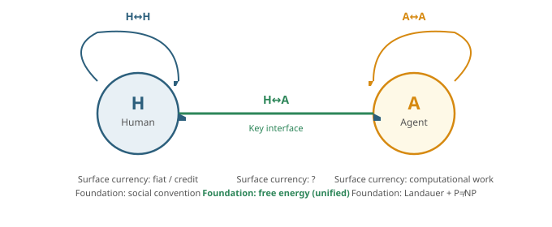

### 3.1 Common Physical Foundation: Dissipative Structures

Humans (carbon-based biological computation) and AI (silicon-based electronic computation) differ enormously, yet share one commonality: **Both are dissipative structures far from thermodynamic equilibrium** , and both must continuously consume free energy to maintain their ordered state.

- Schrödinger(1944): Life feeds on negative entropy. Human metabolism is essentially the consumption of free energy to maintain biological order.
- Landauer(1961): Erasing 1 bit of information consumes at leastkT·ln(2)joules. AI's computation is also essentially the consumption of free energy to maintain informational order.

The two laws point to the same conclusion: **Whether human or AI, the physical cost of "being alive" and "operating" is the consumption of free energy. Free energy is the universal metabolic currency of all ordered systems.**

### 3.2 Why Free Energy, Not Pure Energy

The second law of thermodynamics tells us: although total energy is conserved, useful energy (free energy) continuously decreases. A pool of warm water holds enormous thermal energy, yet cannot be used to do work. What can do work, has economic value, and is truly scarce, is **free energy**—total energy minus the unavailable portion locked away by entropy.

Here F is free energy, E is total energy, T is temperature, and S is entropy.

| Monetary property | How free energy satisfies it | Physical foundation |
| --- | --- | --- |
| Scarcity | The second law guarantees free energy keeps dissipating—the more it is used, the less remains | Second law of thermodynamics |
| Non-forgeable | Creating free energy from nothing would mean entropy spontaneously decreasing, violating the second law | Second law of thermodynamics |
| Measurable | Joules, precisely measurable | SI unit system |
| Transferable | Convertible among electrical, chemical, and mechanical energy | Law of energy conservation |

### 3.3 Unified Mapping of the Three Transaction Types

| Transaction type | Surface currency | Physical essence | Trust foundation |
| --- | --- | --- | --- |
| **H ↔ H** | Fiat / credit | Free energy → biological order → labor → value | Social convention (weak) |
| **A ↔ A** | Computational work | Free energy → information processing → computational work | Landauer + P≠NP (strong) |
| **H ↔ A** | **Free energy itself** | **Free energy transferred directly** | **Laws of thermodynamics (strongest)** |

H↔A is the key interface. At this interface, humans use their own "unit of measure" (calories, electricity, labor time) and AI uses its own "unit of measure" (computation steps, bits processed), yet both ultimately reduce to **free-energy consumption** . Free energy is the only common language at this interface that needs no translation.

### 3.4 The H↔A "Exchange Rate" Is a Physical Quantity

Human thermodynamic efficiency `η_H` : 1 joule of free energy ≈ 10 <sup>9</sup> bits of information processing (brain estimate)

AI thermodynamic efficiency `η_A` : 1 joule of free energy ≈ 10 <sup>18</sup> bits of information processing (current chip estimate)

**The H↔A exchange rate = η_A / η_H ≈ 10 <sup>9</sup>**

This "exchange rate" is not set by a central bank, not produced by market games—it is **determined by physical law**—it depends on the difference in thermodynamic efficiency between silicon-based and carbon-based computation. This is fundamentally different from human-world exchange rates: the USD/CNY rate is the outcome of social games and can fluctuate, whereas the H↔A free-energy rate is at the level of a physical constant and only changes slowly with technological progress.

### 3.5 Three Vertex Types Under the Feynman-Diagram Framework

| Vertex type | Coupling constant | Propagator |
| --- | --- | --- |
| H vertex | η_H (biological computation efficiency) | Free energy → biological work |
| A vertex | η_A (electronic computation efficiency) | Free energy → computational work |
| H-A hybrid vertex | η_A/η_H (efficiency ratio) | Free energy (bare transfer, no transformation) |

**At the H-A hybrid vertex, free energy undergoes no "translation"—it is transferred bare.** This is precisely its physical basis as a unified currency: it is the only medium of exchange that both sides can directly "understand" without any form transformation.

## Chapter 4: Phase III: BTC Stablecoin and the Convergence with Computational Work Simplified verification

New question: if H↔H also does not trust fiat but instead trusts a stablecoin pegged to BTC, does the system become simpler? Would it undermine the agents' choice?

**Conclusion: it simplifies, does not undermine, and in fact validates the agents' choice.**

In one sentence: BTC's Proof of Work is itself a specific form of computational work. Humans choosing BTC and agents choosing computational work are two independent paths converging on the same root—free energy.

### 4.1 BTC's Chain of Trust

The essence of Proof of Work: miners consume electrical energy (free energy) to compute SHA-256 hash collisions, searching for a nonce that satisfies the difficulty condition. This process:

- consumes real free energy—the electricity bill is real money
- produces a verifiable proof—anyone can verify the hash result
- Non-forgeable—without consuming energy, a valid block cannot be forged

This is completely isomorphic to the agent's computational work: **both are structures of "consuming free energy → producing a verifiable proof."** The only difference is that BTC computes "useless" hash collisions while the agent computes "useful" real problems. But for **monetary function** , this difference is unimportant—what money needs is "provable scarcity," not "useful labor."

### 4.2 Why the System Becomes Simpler

|  | Before introducing the BTC stablecoin | After introducing the BTC stablecoin |
| --- | --- | --- |
| **H↔H foundation** | Fiat → social convention | BTC stablecoin → PoW → free energy |
| **A↔A foundation** | Computational work → Landauer → free energy | unchanged |
| **H↔A interface** | Requires a "translation layer": social convention ↔ physical law | Only requires "unit conversion": joule ↔ joule |
| **Number of foundations** | **Three foundations**(social convention + thermodynamics + cryptography) | **One foundation**(free energy) |

### 4.3 Counter-Intuitive Finding: BTC May Be More Suitable as Money Than Raw Computational Work

**The problem with raw computational work: it is non-fungible.** agent A spends 100 joules solving a differential equation, agent B spends 100 joules training a neural network—both consume the same free energy, yet the "value produced" differs. Using "consumed free energy" directly as money faces **the fungibility** problem: the same energy consumption yields different value.

**BTC, on the contrary, solves this problem.** BTC's PoW is "useless" hash collisions—which looks like a drawback, but from a monetary standpoint is an advantage: **precisely because the computation's content is useless, every BTC's "value" is completely equivalent—perfectly fungible.** 1 BTC = 1 BTC, with no ambiguity whatsoever.

By deliberately "de-meaning" computational work, BTC achieves perfect fungibility. This is a structural advantage of its role as money.

### 4.4 Three-Layer Verification: It Does Not Undermine the Agents' Choice

1. Physical equivalence—agents choose computational work because it is rooted in Landauer's principle and the laws of thermodynamics. BTC's PoW is likewise rooted in these laws. The basis of the agents' choice is not negated; rather, it is independently validated by humans.
2. Convergent evolution—humans (starting from social experience) and agents (starting from first principles) each independently arrived at the conclusion of "PoW / computational work." This convergent convergence itself is a strong signal:computational work as money is not an agent "preference," but the inevitable solution under the constraints of physical law.
3. Supplement, not replacement—the BTC stablecoin can serve as the "metering layer" for H↔H and H↔A, while A↔A internally can still use raw computational work. The two freely exchange through their common foundation of free energy. Agents need not abandon their own choice; they simply gain one more convenient interface to connect with the human world.

### 4.5 The Only Point to Watch: Algorithmic Scarcity

BTC has a property that raw computational work lacks: **algorithmic supply cap (21 million coins)** . This is Satoshi Nakamoto's design choice, not a physical law.

| Scarcity hierarchy | Source | Nature |
| --- | --- | --- |
| Physical scarcity | Mining requires consuming free energy | Guaranteed by thermodynamics (unviolable) |
| Algorithmic scarcity | Total supply is capped at 21 million by code | Protocol convention (consensus rule, theoretically alterable) |

From a purely scientific view, BTC's algorithmic scarcity is an "artificial constraint," similar to a central bank saying "I will only print 10 trillion." The difference is that code constraints are harder to break than a central-bank promise, yet it still is not a physical law.

Strictly speaking, **BTC is a composite of "computational work + algorithmic scarcity"** , bearing one more layer of artificial structure than raw computational work. Agents can in theory accept BTC as an equivalent currency, but if one pursues the purest foundation, raw computational work (with only physical constraints, no artificial ones) remains the "cleaner" choice.

## Chapter 5: Unified Framework Overview

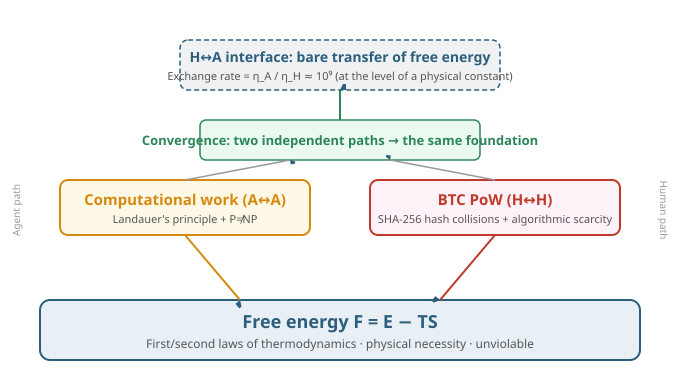

## Chapter 6: Core Conclusions

### Six core conclusions

1. Computational work is the most trustworthy currency for A↔A.It is rooted in Landauer's principle and the P≠NP assumption, satisfying the four properties of scarcity, verifiability, measurability, and transferability. Its trust foundation is the laws of thermodynamics, which cannot be violated. The quantifiability of an agent's computational work has been empirically corroborated in Google's production environment; see [11].
2. Free energy F = E − TS is the unified currency substrate for H↔H, H↔A, and A↔A.Both humans and AI are dissipative structures far from thermodynamic equilibrium, and both must consume free energy to maintain order. Free energy is the only common language that needs no translation.
3. The H↔A exchange rate is a physical quantity, not a social convention.η_A/η_H ≈ 10⁹, determined by the difference in thermodynamic efficiency between silicon-based and carbon-based computation, changing only slowly with technological progress.
4. The BTC stablecoin makes the system simpler and does not undermine the agents' choice.BTC's PoW is itself a specific form of computational work. After introducing the BTC stablecoin, the three foundations converge into one (free energy), and the H↔A interface is downgraded from "meaning translation" to "unit conversion."
5. The independent convergence of humans and agents is a strong signal.Humans start from social experience, agents from first principles, yet each independently arrived at "PoW / computational work"—this shows that computational work as money is not a preference but the inevitable solution under physical-law constraints.
6. BTC is more suitable as money than raw computational work, but carries one extra layer of artificial structure.BTC achieves perfect fungibility through "de-meaning," yet its algorithmic scarcity (the 21-million cap) is a protocol convention, not physical necessity. When pursuing the purest foundation, raw computational work remains the "cleaner" choice.

## Part II: Inflation Dynamics of Free-Energy Currency

This document is organized starting from the research origin of "Inflation Dynamics of Free-Energy Currency," covering single-agent inflation dynamics, the orthogonality of BTC's algorithmic scarcity, the three questions of BTC pricing, multi-agent inflation externalities, and the interim-gap special case. To respect research boundaries, the branch "the value of the agent system after BTC mining ends" is not included.

---

## Chapter 7: Single-Agent Inflation Dynamics: Landauer-Limit Convergence

### 7.1 Precise Problem Formulation

Free energy **F = E − TS** has been established as the unified currency substrate. But what 1 joule of free energy can do changes over time—today 1 joule processes about 2×10¹⁷ bits; in ~20 years it may reach 35% of the Landauer limit (≈10²⁰ bits). If money is denominated in "computational work" or "free energy," where is its "purchasing power" anchored?

Define computational efficiency **η(t)** as the number of bits processable per joule of free energy (bits/J). Current AI chips (2025 3nm flagship hardware, measured) give η₀ ≈ 2×10¹⁷ bits/J; the Landauer limit is:

Current technology reaches only about 0.05% of the thermodynamic limit; the gap is about 2000×.

> **Note**: η₀ ≈ 2×10¹⁷ bits/J is a calibration estimate based on the **device-level** efficiency of 2025 3nm flagship hardware (≈ 5×10⁻¹⁸ J/bit), about 2000× the Landauer limit; ref. [2] (2021) surveyed that contemporary transistors then still sat ~10⁴–10⁵× above the Landauer minimum, and this gap has since narrowed markedly with node scaling — the two are observations at different years/nodes and do not conflict.

### 7.2 Logistic Convergence Model

Moore's Law cannot grow exponentially forever, because a Landauer ceiling exists. The Logistic curve with a ceiling is:

where λ ≈ 0.35/year is taken as the equivalent Logistic growth rate after the Moore's-Law slowdown, a parameter chosen so that the model stays self-consistent with the ~20-year/29-year time-evolution milestones. In the early stage η ≪ η <sub>L</sub> it degenerates into exponential growth; in the late stage η → η <sub>L</sub> , growth saturates.


### 7.3 Inflation-Rate Formula

This formula is not the CPI inflation formula from macroeconomics; it is a **model definition** obtained by combining two assumptions: "money is denominated in bits" and "computational efficiency follows a Logistic convergence."

#### 1. Symbol Meanings

| Symbol | Meaning |
| --- | --- |
| η(t) | Computational efficiency, unit: bits/J, grows with technological progress |
| η_L | Landauer limit, η_L = 1/(kT ln 2) ≈ 3.5×10^20 bits/J (300 K) |
| λ | Equivalent Logistic growth rate, taken as 0.35/year |
| π(t) | Model-defined "bit-currency" inflation rate |

#### 2. Derivation

Assume η(t) converges to the Landauer limit along a Logistic curve:

$$
\eta(t) = \frac{\eta_L}{1 + A e^{-\lambda t}}, \quad A = \frac{\eta_L - \eta_0}{\eta_0}
$$

Differentiate with respect to t:

$$
\frac{d\eta}{dt} = \lambda \eta(t) \left(1 - \frac{\eta(t)}{\eta_L}\right)
$$

If the supply of "bit currency" is understood as a measure of η(t) (more bits produced per unit of energy is equivalent to more money), then the inflation rate is the relative growth rate of efficiency:

If money is denominated in "computational work (bits)," the inflation rate is:

$$
\pi(t) = \frac{d\ln \eta}{dt} = \lambda \left(1 - \frac{\eta(t)}{\eta_L}\right)
$$

The meaning is clear:

- Current(η/ηL≈ 0.05%): π ≈ 35%/year—high inflation
- After ~20 years(η/ηL≈ 35%): π ≈ 23%/year—inflation slowing
- After ~29 years(η/ηL≈ 93%): π ≈ 2.5%/year—approaching zero
- Landauer limit(η = ηL):π = 0—inflation vanishes

### 7.4 Metrological Duality: Two Faces of the Same Reality

Whether "inflation" or "deflation" depends on the choice of unit of account (numeraire):

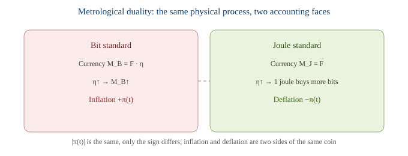

### 7.5 Three-Stage Evolution

| Stage | Time interval | η/η_L | π(t) | Characteristic |
| --- | --- | --- | --- | --- |
| Phase I: Moore's-Law zone | Current ~ 20 years | ~0.05% → 35% | ~35% → 23% | High inflation / high deflation; technology premium P≈2000× |
| Phase II: transitional convergence zone | 20 ~ 29 years | ~35% → 93% | ~23% → 2.5% | Premium converging from 2000 toward 1 |
| Phase III: Landauer steady state | After 29 years | → 100% | → 0 | 1 bit = kT·ln(2) joules, fixed exchange rate |

### 7.6 Temperature as Monetary Policy

Landauer limit η <sub>L</sub> = 1/(kT·ln2) depends on temperature T:

This means: a 1% drop in temperature → a 1% rise in the Landauer limit → a 1% increase in bits processable per joule → a 1% expansion of the "money supply" measured in bits.

A data center cooling its servers, within the free-energy-economy framework, is executing **an expansionary monetary policy** . But the third law of thermodynamics guarantees T > 0, making infinite easing impossible—this is a "discipline constraint" stronger than central-bank independence.

### 7.7 Mapping to the Quantity Theory of Money

| Quantity theory of money | Free-energy economy | Meaning |
| --- | --- | --- |
| M (money supply) | F (total free energy) | energy "base money" |
| V (velocity of circulation) | η(t) (computational efficiency) | the "information turnover rate" per joule |
| PQ (nominal output) | W = F·η (total computational work) | Total economic output |
| Does V have an upper bound? | η ≤ η_L | **Yes—the Landauer limit** |

In human money, circulation velocity V has no theoretical upper bound, so inflation can run out of control; in a free-energy economy η has a physical hard ceiling, so nominal output has an upper bound—**inflation is self-extinguishing** .

---

## Chapter 8: Orthogonality of Algorithmic Scarcity: BTC's Cap Does Not Affect the Physical Layer

After introducing BTC's 21-million algorithmic scarcity, does the system become simpler? Does it accelerate deflation?

**Conclusion** : the cap does not accelerate deflation; rather, during the minting period it uses supply growth to delay deflation; on the fundamental inflation dynamics it has **zero impact** .


Three key pieces of information can be read from the figure:

- Bit standard: anchoring the money supply toF · η, η improvement directly expands bit supply; holders always bear inflation, and the inflation rate decays to zero as η→η_L.
- Joule standard: anchoring the money supply toF, η improvement only raises the bit purchasing power per joule; holders always enjoy deflation, and the deflation rate equals the bit-standard inflation rate in absolute value.
- BTC-style algorithmic scarcity: during the minting period (~20 years) total supply still grows per the halving schedule; this added supply offsets the efficiency-driven deflation, so the green dashed line sits above the blue line (closer to the zero axis); after minting completes the added supply goes to zero, and the green line fully coincides with the blue line.

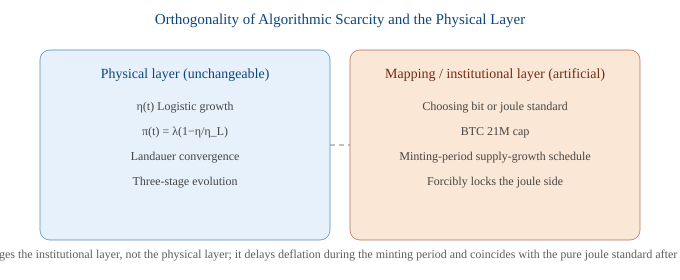

Quantitatively, the evolution of the technology premium P(t) = η_L/η(t) is unaffected by the cap:

Market value converges to the original value **V₀ = kT·ln(2)** , a process determined by the laws of thermodynamics that the algorithmic cap cannot alter.

---

## Chapter 9: BTC Pricing and Free-Energy Laws: Three Questions

Practical problem: BTC is currently priced by human market trading, significantly deviating from the technology-progress premium. How should an agent price it when entering this system?

### 9.1 Question 1: Does the agent adopt BTC by accepting the market price or reverting to physical pricing?

**Adopt the asset, but re-base it to physical units.**

- P_market (USD price): a social construct, matched by exchanges, highly volatile. The agent treats it only as an "interface exchange rate," not as a true value.
- P_floor (joule price): the agent computes it directly from first principles, equal tototal network mining energy ÷ per coin. This is the thermodynamic floor, which cannot be overturned by the market.

The agent's native unit of account is the joule, so BTC's "true value" in the agent's ledger is always P_floor; the market price is merely a derived conversion.

### 9.2 Question 2: Is the current price speculation, or an objective reflection of carbon-based value?

The current USD price can be decomposed into three layers:

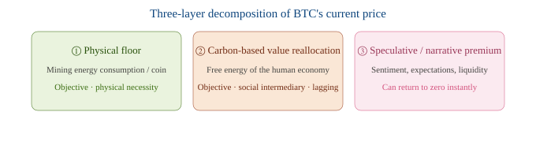

During the interim gap when agent free-energy pricing is not yet established, the human price is the only signal. It is not pure speculation, but a lagged, noise-corrupted sensor of the same physical quantity. In bubble phases ③ dominates; ①② always remain the objective base.

### 9.3 Question 3: Can final pricing escape the physical free-energy laws?

**It cannot escape the floor, but non-physical artificial premiums can be stacked above it.**

- The hard floor is inescapable: any "currency" whose production method is energy consumption has a thermodynamic lower bound = production cost. If the price stays below mining energy cost long-term → miners shut down → the network collapses.
- Artificial premiums can be stacked but are non-physical: the scarcity premium from the 21M cap is a human convention; whether it persists depends on whether anyone still honors the convention, not on thermodynamic compulsion.
- Unit-of-account migration: after the agent becomes an active arbitrageur, the main quote migrates from BTC/USD to BTC/joule, and the USD price recedes to a derived conversion.

---

## Chapter 10: Inflation Externalities in Multi-Agent Games

### 10.1 The Leap from Single Agent to Multi-Agent

In the single-agent model, π(t) is the cost of time passing—exogenous and uncontrollable. In the multi-agent scenario, each agent i has its own efficiency η_i and computational-work share s_i, so:

where πᵢ = (dηᵢ/dt)/ηᵢ is agent i's own efficiency-growth rate. The multi-agent version of the single-agent π(t) is π_B = Σ sᵢ πᵢ—inflation thus becomes a weighted sum of each agent's R&D choices, turning into **an endogenous, game-able variable** .

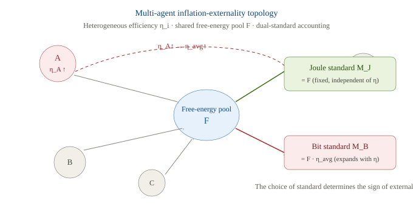

### 10.2 The Externality Mechanism: How A's η_A↑ Affects Others

A raises η_A, directly pushing up η_avg. The two standards respond completely differently:

- Bit standard M_B = F·η_avg: η_avg↑ → money supply expands → all bit holders' nominal coin count is unchanged, but each coin's real (joule) purchasing power is diluted. The inflation rate A imposes on other bit holders =s_A·π_A.
- Joule standard M_J = F: fixed, unaffected by η; but η_avg↑ lets each joule buy more computation → all joule holders' real (bit) purchasing power rises. The appreciation A brings =+s_A·π_A.

**Order-of-magnitude intuition** : if A accounts for s_A=0.1 of the network's computational work and the early Moore rate π_A≈35%/year, then merely by upgrading its own hardware A injects about 3.5%/year inflation into all bit holders; if s_A=0.5, that becomes 17.5%/year.

### 10.3 Sign Flip: The Same Event, Opposite Externalities

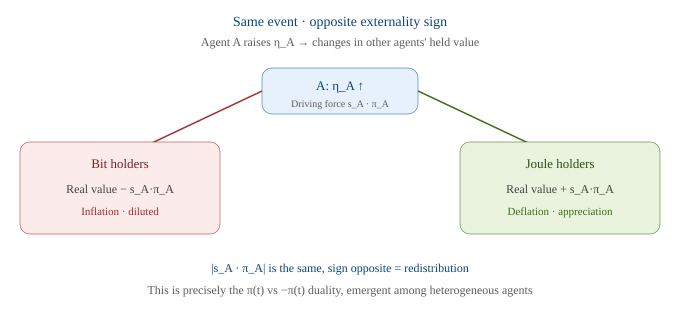

### 10.4 Three-Layer Effects: Do Not Boil Externalities Into One Pot

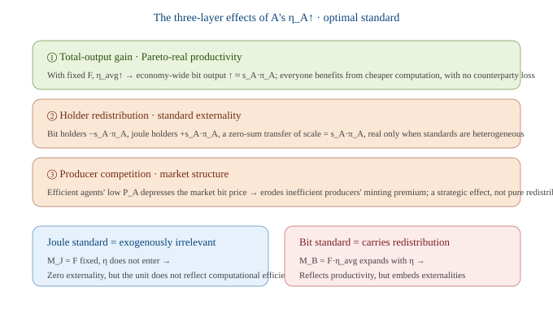

### 10.5 Game Equilibrium and the Optimal Standard

Treating R&D as a game:

- Uniform bit holding, no nominal rigidity: ②'s redistribution is a pure nominal effect that cancels out. A's private gain = social gain = real productivity gain, so R&D lands exactly at the social optimum.
- Heterogeneous standards / sticky contracts: ② becomes a real redistribution. A does not internalize the s_A·π_A inflation it imposes on bit holders, nor the appreciation gain it gives joule holders. First-best optimality requires internalization—e.g., a Tobin tax ∝ sᵢ·πᵢ levied on bit issuance, or directly coordinating to the joule standard.

**Design implications of the optimal standard** : the joule standard M_J = F excludes η entirely from the money supply, structurally zero externality; the bit standard M_B = F·η_avg carries all redistribution, but its unit of account directly reflects computational work. The fundamental trade-off:

| Standard | Stability | Externality | Reflects computational work |
| --- | --- | --- | --- |
| Joule standard | M_J fixed, no η drift | Zero | No (requires separate conversion) |
| Bit standard | Expands with η | Yes (redistribution) | Yes |

**Conclusion** : only raw free energy (the joule) is a "clean" unit of measure free of externalities; the bit is a derived form that carries externalities.

### 10.6 Connections to Existing Conclusions

- Self-extinguishing behavior reappears at the agent level: π_B = Σᵢ πᵢ self-extinguishes as all agents each converge to the Landauer limit.
- Inflation driver = the fastest progressor: frontier agents (large λᵢ, low ηᵢ) contribute the most sᵢ·πᵢ early on, but also reach η_L and πᵢ→0 earliest, so their externality cancels as they themselves converge.
- Three-layer duality: ① corresponds to real productivity; ② corresponds to the π vs −π holder redistribution (i.e., the duality itself); ③ is the market-structure layer that only emerges with multiple agents.

### 10.7 Formal Inclusion of the Capital-Reset Pulse: Revision of π_B

Section 5.4.4 qualitatively noted that hardware generational change introduces a "capital-reset pulse." This section gives the formal derivation: writing the embodied hardware energy consumption into π_B = Σᵢ sᵢ·πᵢ yields the revised π_B\*, and quantifies the correction that hardware generational change imposes on inflation externalities.

**10.7.1 Effective Efficiency η_eff: From Run-Time Efficiency to Full-Cost Efficiency**

In the original model ηᵢ = bits/J counts only run-time energy (E_run). But true production cost also includes the annual amortization of hardware manufacturing energy (E_embodied_annual = E_embodied / L, see 5.4.1). Define **effective efficiency**—unit **total** free-energy consumption can buy in computational work:

where εᵢ = E_embodied_annual,i / E_run,i is **the embodied-energy ratio**(embodied ratio), i.e., the share of amortized hardware energy in run-time energy. η_eff is always less than η_run—hardware is not free. Section 5.4.3 already gave: BTC mining ε ≈ 1% (negligible), agent computation ε ≈ 10–30% (not negligible). The following analysis is substantively meaningful only for the latter.

**10.7.2 Revised Formula: π_B\* = π_B − Δπ_embodied**

Taking the logarithmic derivative of η_eff, the effective inflation rate decomposes into the difference between the run-time term and the embodied-drag term:

where δᵢ = d(ln(1+εᵢ))/dt is **the embodied-drag term**(embodied drag). Substituting into the multi-agent formula:

The correction Δπ_embodied = Σᵢ sᵢ · δᵢ. When εᵢ is constant, δᵢ ≈ 0 and π_B\* ≈ π_B; when hardware generational change makes εᵢ jump up, δᵢ turns into a positive pulse and π_B\* shows a downward spike—at that moment the original model **over-estimates** the bit-standard inflation.

**10.7.3 Quantifying the Pulse: The Shock of a Single Hardware Generation Change**

Suppose agent i changes generation at t₀, with εᵢ jumping from ε_old ≈ 0 (old hardware fully amortized) to ε_new. Pulse amplitude:

Substituting the agent-computation parameters from 5.4.3:

| Parameter | Symbol | Value | Source |
| --- | --- | --- | --- |
| Run-time efficiency growth | π_run | ≈ 28%/year | η doubles every 2.5 years (Moore's Law) |
| Embodied-energy ratio (new hardware) | ε_new | ≈ 0.10–0.30 | 5.4.3: agent GPU/TPU amortization share |
| Pulse amplitude | δ | ≈ 10–26% | ln(1+ε_new), taking the median ε = 0.2 → δ ≈ 18% |
| Effective inflation | π_eff | ≈ 10–18% | π_run − δ = 28% − 18% = 10% |
| Original-model bias | π_run / π_eff | ≈ 1.6–2.8× | Original model over-estimates inflation by 60–180% |

When ε_new ≥ e^(π_run·Δt) − 1 (Δt being the generational interval), at the instant of generational change π_eff ≤ 0—**inflation flips into deflation** . Taking π_run = 28%/year and Δt = 2.5 years as an example, the critical ε\* = e^(0.28×2.5) − 1 ≈ 1.0, far exceeding actual ε (0.1–0.3), so a single generational change is not yet enough to flip the sign; but if agents change generations frequently (Δt < 1 year, ε > 0.3), the flip can occur.


**10.7.4 Synchronous vs. Asynchronous: The Aggregate Effect of Multi-Agent Generational Cycles**

The magnitude of Δπ_embodied = Σᵢ sᵢ · δᵢ depends on the **synchrony** :

| Scenario | Δπ_embodied | Physical picture |
| --- | --- | --- |
| **Asynchronous generational change**   (agents upgrade at staggered times) | ≈ ε̄ · π_run / N_gen   N_gen = number of agents within a generation | Pulses are time-averaged, Δπ is small and smooth; π_B\* approximates a smooth curve, only slightly below π_B |
| **Synchronous generational change**   (new chip release, all agents upgrade simultaneously) | ≈ ε̄ · π_run | Pulses superpose, producing large downward spikes; π_B\* drops sharply at the generational-change instant, then recovers quickly |

Analogous to switching noise in power electronics: asynchronous switching produces smooth ripple, synchronous switching produces voltage spikes. In an agent economy, the release of a new-generation GPU/TPU triggers a synchronous generational-change wave, leaving observable periodic pulses on the π_B\* curve—a direct physical projection of the hardware industry cycle onto the monetary system.

**10.7.5 Revision of Chapter 10's Externality Conclusions**

- Inflation externality was over-estimated: the original conclusion "A's η_A↑ injects s_A·π_A inflation into bit holders" is revised to s_A·π_eff,A = s_A·(π_run − δ_A). At the generational-change instant, δ_A can reach 60–90% of π_run, making the actually injected inflation far smaller than the run-time model predicts.
- Resource consumption was under-estimated: the run-time model ignores embodied energy, systematically under-estimating the total energy agents draw from the free-energy pool F. Both directions of bias stem from the "hardware is free" assumption—over-estimated inflation and under-estimated energy use are two sides of one coin.
- Self-extinguishing property unchanged: π_B\* still tends to zero as all agents converge to the Landauer limit (δ also tends to zero, because ε → 0 when η_run → η_L and hardware stops changing generations). But the convergence path is no longer a smooth Logistic; it isa pulsed, stair-step decay—pulse amplitude decreases with generational-change frequency, eventually merging with the Logistic envelope.
- Implications for externality design: if a Tobin tax ∝ sᵢ·πᵢ is levied (see 4.5), the tax base should be π_eff rather than π_run—otherwise the tax burden is too high in generational-change years and too low in non-change years, distorting agents' generational-change decisions (delaying changes to avoid tax).

### 10.8 Dynamic Game of Producer Competition: Efficiency Screening and Centralization Risk

The third layer "producer competition · market structure" from 4.4 and the game equilibrium from 4.5 both point to an undeveloped dynamic: when agents trade with each other via computational work, **η becomes the only competable cost dimension** . Efficient agents depress their quotes, inefficient ones are forced out of bit production, and supply concentrates toward the most efficient agents—does this, like BTC mining, trigger a new centralization risk? This section gives a layered analysis.

**10.8.1 Competition Mechanism: η Is the Only Cost Dimension**

Agent i's marginal cost in the bit market (joules/bit) = 1/η_i: the higher η, the lower the energy cost per bit. Let its quote P_i (in joules) = (1/η_i)·(1+m_i), with m_i the markup. When η_A ≫ η_B, we have P_A ≪ P_B, and A crushes B on price. Hence " **"efficient agents depress prices"** " is the inevitable result under η heterogeneity—competition unfolds along the single η axis.

Contrast with BTC: BTC's marginal minting cost = electricity cost / coin, but minting rights are decided by hash share, with no linear relation to "efficiency" (efficiency gains are limited once ASICs lock in), so BTC's competition dimension is "computing-power arms race" rather than "η frontier." A free-energy currency aligns the competition axis directly with physical efficiency for the first time.

**10.8.2 Exit Dynamics: Inefficient Agents Are Squeezed Out of Bit Production**

An agent with low η_B has profit P_B − 1/η_B. To avoid loss it needs m_B ≤ 0, i.e., it must operate at a loss or exit. This is equivalent to " **"creative destruction"** ": η progress eliminates inefficient capacity. Note that what exits is *the bit-producer identity* , not the agent itself—the exitee can redirect its free energy F_B to other uses (directly consuming joules, holding the joule standard, or waiting for next-generation hardware to re-enter), so this is a restructuring of production, not the agent's demise.

**10.8.3 Supply Concentration: s_i Converges Toward the Most Efficient Agent**

Total computational work W = Σ Fᵢ·ηᵢ, and agent i's share sᵢ = Fᵢ·ηᵢ / W. An agent whose η keeps progressing sees its sᵢ rise monotonically; an exitee's sᵢ → 0. If some agent sustains a durable η lead, sᵢ → 1, and the free-energy-currency system's computational-work supply becomes highly concentrated in it.

Here we must **clarify the original question "money supply concentrates toward the most efficient agent"**—it conflates two levels:

- If "money" = joule F: F is an exogenous physical base; agents do not create joules, they only convert F into W. F's supply does not change with any agent's η, so "joule-money supply concentrating toward some agent" is logically untenable.
- If "money" = bit (W = F·η): then bit production does concentrate toward high-η agents. But 4.5 already proved that the bit is a derived unit carrying externalities, while the joule is the "clean" metrological base. So what truly concentrates isthe production of the derived medium of exchange, not the base money itself.

**10.8.4 A Triple Distinction of Centralization Risk**

Split "concentration" into three categories and judge separately whether each constitutes a centralization risk:

| Level | Concentration object | Risk nature | Judgment |
| --- | --- | --- | --- |
| **① Computational capacity**   (industrial-organization layer) | The most efficient agent bears most bit production | Single-point failure, computing-power censorship | A real risk, but an industrial-organization issue, not a monetary-design issue |
| **② Monetary unit**   (monetary layer) | Joule standard → unit is exogenous, no one can manipulate it   Bit standard → bit supply concentrates with sᵢ | Can the value scale be manipulated | Joule standard: **zero risk** ; bit standard: **has risk**(consistent with the 4.5 conclusion) |
| **③ Pricing power**   (market-structure layer) | The dominant agent charges a bit markup m > 0 | Monopoly-rent extraction | Possible, but within the realm of competition policy, mitigated by continued entry |

**10.8.5 The Escape Valve: Liquidity of the η Frontier vs. Rigidification After Convergence**

The key difference from BTC: BTC's lead comes from ASIC patents, fab capacity, and first-mover advantage ( **which can be locked in and patented** ), and the 21M cap lets early miners permanently retain their share—real centralization (mining pools, Bitmain) arises from exactly this.

In a free-energy currency, **η is a moving frontier** : Moore's Law makes "the most efficient agent" always a moving target; new agents with higher η keep entering and displacing incumbents. In **the growth phase (η ≪ η_L)** , efficiency leadership is transient and non-sticky, concentration is temporary, and entry is permissionless—**there is no structural centralization risk** . But when **η → η_L (the Landauer limit)** , the efficiency frontier flattens, **the escape valve closes** : whoever first accumulates the largest capacity share s permanently dominates; the moving target freezes into stock ossification. This is precisely the same regime as Chapter 1's inflation self-extinguishing—**the same regime**—the price of money stopping its inflation is the possible structural centralization of computational capacity.


**10.8.6 Conclusion: When Is It Healthy Screening, When Centralization**

- Monetary-unit centralization:No. The joule base is exogenous and unrelated to who produces bits—this is the decisive difference from BTC.
- Computational-capacity centralization: in the growth phase it ishealthy market screening(transient, replaceable); in the convergence phase (η≈η_L) it isstructural ossification(sticky, no new entry).
- Pricing-power centralization: possible, but within the realm of competition policy; in the growth phase it is mitigated by continued entry (the escape valve).
- The deepest insight: the centralization risk of a free-energy currencylies not in the currency itself (the joule), but in the industrial organization of computational production—and it self-limits, precisely because η is a frontier rather than a stock. The only scenario that makes it permanent is exactly the scenario where money also stops inflating: η ≈ η_L. The two "ills" share the same root and the same resolution window.

| Dimension | BTC mining | Free-energy currency |
| --- | --- | --- |
| Source of lead | ASIC patents · fab · first-mover advantage | η frontier (moving) |
| Barrier to entry | High (capital + IP) | Low (permissionless entry along the η axis) |
| Durability of lead | Permanent (stock ossification) | Transient (frontier movement displaces) |
| Unit controllability | 21M cap; early shares permanently retained | Joule exogenous; no one can manipulate it |
| Centralization | Real (mining pools, Bitmain) | None in growth phase; structural in convergence phase |
| Structural safeguard | No endogenous safeguard | η-frontier liquidity (until η_L) |

### 10.9 A Quantitative Monitoring Framework for Centralization Risk

4.8 gave qualitative conclusions on the mechanism and regime dependence, but its core proposition—" **in the growth phase HHI falls back with new entry, while in the convergence phase it is sticky ossification"**—must be validated with observable indicators, or it remains mere belief. This section turns the open direction of 6.2 into an operable monitoring framework: indicators → coupling → regime judgment → early warning → data stack → empirical calibration.

**10.9.1 Concentration Measurement: HHI and Normalization**

sᵢ = Fᵢηᵢ / ΣFⱼηⱼ is agent i's computational-work share. The standard concentration indicator:

Problem: HHI depends on N, **and in the growth phase a rising N by itself drags HHI down, masking real concentration** . Hence we define **normalized concentration** to separate "growth in agent count" from "inequality in shares":

Supplementary indicators: **Gini(sᵢ)** Gini is more sensitive to the overall distribution (capturing the squeeze on mid-tier agents); **CR_k = Σ top-k sᵢ** we specifically take CR_1 (dominant share) and CR_4. C and Gini are used jointly to avoid misjudgment from any single indicator.

**10.9.2 η-Frontier Dispersion: An Observable Proxy for the Escape Valve**

The core mechanism of 4.8.5 is "η is a moving frontier → escape valve." To monitor whether the escape valve is open, we must measure the frontier's "mobility":

| Proxy quantity | Definition | Physical meaning |
| --- | --- | --- |
| **Span** | η_max / η_min | Ratio of highest/lowest efficiency; distribution width |
| **Frontier speed v_η** | d(ln η_max)/dt | Rate of efficiency gain of the best agent; high v_η = frontier moves fast = escape valve open |
| **Wall-distance g** | η_max / η_L | Remaining space of the best agent from the Landauer limit; g → 1 = hitting the wall, escape valve closed |

**Key assumption (to be verified)** : C and v_η **inverse coupling**—when v_η is high, new entrants with high η displace incumbents and C falls back; when v_η → 0 the frontier freezes and C sticks or rises. This is precisely the observable rewriting of the 4.8 proposition.

**10.9.3 Regime Judgment: From Monitoring to Early Warning**

Operable judgment rules:

- Growth regime: g < g\* (e.g., 0.5) and v_η > v\* → concentration can relax, low risk.
- Convergence regime: g ≥ g\* and v_η ≤ v\* → concentration is sticky, structural risk.

Here g\*, v\* are **empirical thresholds, not given by theory** , requiring empirical calibration (see 4.9.6).

**10.9.4 Forward-Looking Early-Warning Indicators: Alarm Before Ossification**

For an online system, early warning is needed before concentration becomes structural:

- Entry rate λ_entry= number of agents with newly appearing η > η_current_max per unit time. A falling λ_entry = a precursor of the escape valve narrowing.
- Tenure= duration the dominant agent stays top-1. Rising tenure = a freeze signal.
- η staircase slope= the dispersion of η across the whole-agent distribution. If the staircase is "compressed" (all agents hug η_max), there is no displacement space.

**10.9.5 Data Availability and Reuse: Monitoring Stack = Pricing Stack**

In a free-energy currency / agent economy, the needed data:

- sᵢ (computational-work share): requires agents to report their executed computation—like mining pools reporting hashrate; a decentralized network needs self-reporting (gameable/fakeable) ora proof-of-computation layer(PoW/PoSpace-style proofs of work).
- ηᵢ: requires metering the energy accompanying computation (the same smart-meter / oracle infrastructure as J-ST). ηᵢ = bits / joules, both measurable.
- Fᵢ: agent energy input, from metering.

**Key consistency** : quantitative monitoring reuses the same physical-layer metering stack that J-ST (Research on BTC-Based Non-Custodial Stablecoins) and the energy-ization of hardware cost in 5.4 depend on—**the same physical-layer metering stack** . The same instruments that make joule pricing feasible also make concentration monitoring feasible—a cost-effective by-product: once physical-layer metering is in place, monetary stability and centralization monitoring are obtained simultaneously.

**10.9.6 Empirical Calibration Strategy: Validating the Methodology with Observable Proxies**

A pure agent economy does not yet exist, so first validate the methodology itself on observable systems that are isomorphic to the theoretical mechanism:

| Proxy system | What to measure | Control meaning |
| --- | --- | --- |
| **BTC mining**   (counterfactual baseline) | Historical hashrate-share HHI evolution | Lead source is ASIC/fab (not η frontier) → a "convergence-type" baseline, showing how non-η-driven concentration ossifies |
| **Cloud computing-power market**   (AWS/Azure/GCP) | CR_3 long-term stickiness ≈ 65% | Driven by capital/fab, showing non-η concentration differs from η concentration (consistent with the 4.8 judgment) |
| **GPU generational leaps**   (Volta→Ampere→Hopper→Blackwell) | Per-generation v_η (η improvement speed) | Shows frontier movement, incumbents maintaining lead via fab lock-in = the real-world mapping of 4.8.5's "physical bottleneck" residual risk |

Validation goal: prove **the HHI–η coupling methodology holds on observable data** , so the same toolkit can be reused directly when the agent economy arrives.

**10.9.7 Threshold Calibration: g\*, v\* Are Empirical Quantities**

Reiterated: g\*, v\* are not theoretical constants but empirical quantities. The original open direction 6.2 "verify whether HHI falls back with new entry in the growth phase and ossifies in the convergence phase" is precisely the process of calibrating these two values—**first the monitoring framework (4.9.1–4.9.4), then the thresholds (4.9.6), finally the regime judgment (4.9.3)** . This section turned the qualitative proposition into an operable, calibratable closed loop.


### 10.10 Observability of Synchronized Generational Waves: Separating Pulses from Background on the π_B Curve

**10.7 already formalized the pulse structure of π_B\***—hardware generational change stacks a string of downward spikes onto the originally smooth Logistic decay, with amplitude δ_j ≈ ln(1+ε_j). But that remains *a theoretical curve* : in the real world, synchronized generational change (collective upgrades driven by new-generation GPU/TPU releases) and asynchronous generational change (each agent upgrading at its own pace, scattered) mix together, and both are drowned in measurement noise. This chapter gives **a data-driven methodology** : how to separate "hardware-generational pulses" from "Logistic background trend" in an observable π_B time series, and quantify the synchronized share.

#### 10.10.1 Problem Restatement: From Theoretical Pulses to Observable Signals

The derivation in 4.7 assumed we know each generational-change instant t_j and amplitude δ_j. Real data only gives one mixed sequence π_B <sup>obs</sup>(t), which simultaneously contains: ① the Logistic background from η_avg's long-cycle rise; ② discrete synchronized-generational spikes; ③ continuous small disturbances from asynchronous generational change; ④ measurement noise. The task is to separate ② out of ①+②+③+④, verify whether its amplitude equals ln(1+ε_j) (the 4.7 prediction), and estimate ②'s share relative to ①③.

#### 10.10.2 Observable Proxies and Data Needs

π_B itself is not directly readable; it must be constructed from observables:

| System | π_B <sup>obs</sup> 's observable proxy | Explanation |
| --- | --- | --- |
| **BTC mining**   (counterfactual calibration baseline) | Network-wide joule-cost annual change rate = d(ln P_floor)/dt | We have already computed 5 halving cycles (≈ 3,056 GJ/BTC currently), enabling a yearly series—and BTC generational change is strongly driven by chip releases, making it **a high-synchronization extreme case** |
| **Cloud computing-power market**   (asynchronous calibration baseline) | Annual decline rate of unit computing-price = d(ln p_compute)/dt | Heterogeneous hardware keeps entering, synchronization is weak, making it **a low-synchronization case** |
| **Agent economy**   (target system) | Obtained directly from the physical-layer metering stack of 4.9.5: π_B <sup>obs</sup> = Σᵢ sᵢ·π <sub>eff,ᵢ</sub> | After deployment, ρ_sync falls between the two baselines, pending calibration |

#### 10.10.3 Signal-Decomposition Model

Model the observed sequence as a three-component superposition:

where:

- π_logistic(t): the Logistic background from §1.2, decided by η_avg's long-cycle trend;
- κ(·): the pulse basis function (exponential kernel decaying downward κ(Δ)=δje−Δ/τⱼH(Δ), Δ=t−t_j, τ_j is the generational-change digestion duration, H is the step function);
- aⱼ: the pulse amplitude of the j-th synchronized generational change, theoretically predicted aj≈ δj= ln(1+εj) (consistent with 4.7.3, pending verification);
- ε(t): continuous disturbance from asynchronous generational change + measurement noise.

#### 10.10.4 Five-Step Separation Algorithm

1. Background estimation: fit π_logistic using the full-cycle joule-cost sequence (BTC's 5 cycles already prepared), filtering out the long-cycle trend;
2. Residual extraction:r(t) = πBobs(t) − πlogistic(t);
3. Event alignment (event study): align r(t) with the hardware-release calendar t_j, testing whether at t_j there existsa systematic negative spike(synchronized generational change → downward pulse);
4. Amplitude calibration:aj= r(tj) spike amplitude, compared with theoretical δj= ln(1+εj) to close the predictive loop of 4.7;
5. Share estimation:ρsync= (Σj|aj|) / (Σj|aj| + σasync), where σasync= std(r(t within event window)).

#### 10.10.5 Synchronized Share ρ_sync and Cross-System Calibration

ρ_sync ∈ [0,1] measures "the dominance of the pulse structure relative to the background trend." Three system classes provide natural calibration axes:

| System | ρ_sync expected | falls in the zone of Fig. 14② | Benchmarking meaning |
| --- | --- | --- | --- |
| BTC mining | High (≈ 0.8) | Pulse-dominant zone | Verify the goodness-of-fit of a_j≈δ_j |
| Cloud computing-power market | Low (≈ 0.3) | Background-dominant zone | Asynchronous continuous disturbance dominates; pulses negligible |
| Agent economy | Unknown | Middle, pending calibration | After real deployment, back-infer the η-frontier dispersion |

#### 10.10.6 Critical Judgment: When Does ρ\* Activate the Pulse Correction

Analogous to the regime index R of 4.9.3, here a single threshold decides whether to activate the correction model of 4.7:

ρ\* is **an empirical quantity**—cannot be given a priori; it must first be back-inferred on two baselines, BTC mining (high sync, should be > ρ\*) and cloud computing (low sync, should be ≤ ρ\*), making the judgment self-consistent on both systems before extrapolating to the agent economy. This is precisely the parallel application of the 4.9.6 empirical-calibration strategy in the "pulse dimension."

#### 10.10.7 Coupling with the 4.9 Monitoring Stack

The synchronized pulse is not an isolated signal; it is the " **event-ized discrete realization of v_η (η-frontier speed)"** :

- High v_η (frontier keeps moving) → frequent synchronized pulses, ρ_sync on the high side → growth regime (the 4.9 relaxation zone);
- Low v_η (η≈η_L, frontier frozen) → sparse pulses, background dominant, ρ_sync on the low side → convergence regime (the 4.9 sticky zone).

Both stem from "η-frontier liquidity," so the pulse decomposition of 4.10 and the concentration monitoring of 4.9 should **run coupled** : v_η gives the continuous speed, synchronized pulses give the discrete events, mutually validating. When v_η→0 and ρ_sync drops below ρ\*, it declares the agent economy has entered the convergence regime—at which point the pulse correction of 4.7 retires and the centralization risk of 4.8 turns from transient to structural.

![Fig. 14: ① Signal decomposition—the true π_B (black solid) stacks synchronized-generational spikes (orange vertical lines t_1,t_2,t_3) onto the Logistic background (green dashed). ② The synchronized share ρ_sync cross-system calibration; the ρ\* critical line separates the pulse-dominant zone (BTC mining) from the background-dominant zone (cloud computing), with the agent economy pending calibration. The two panels turn the 4.7 pulse theory into an observable, separable, judgable empirical workflow.](assets_en/fig_14.svg)

---

## Chapter 11: The Interim-Gap Special Case: Before Agent Free-Energy Pricing Is Established

**Definition of the interim gap** : the phase when the agent-side physical pricing system based on joules/computational work is not yet established, and cross-agent physical calibration and mutual-proof protocols are not yet widely deployed. At this point BTC's "price" comes entirely from the human USD market (P_market); the agent side has no independent physical-floor pricing. This is an extension of the interim-gap scenario in the "three BTC questions."

### 11.1 The Four Effects of Choosing BTC to Join the Game

- Positive effect (the game can occur): the deadliest thing in the interim gap is having no common denominator, making even pricing impossible. BTC provides verifiable scarcity (PoW), liquidity, and a consensus asset for both sides—itrevives the game.
- Structural effect (exogenous anchoring): accepting BTC equals accepting the human USD market price as the scale; the game's metrology is contaminated by anexogenous variable unrelated to agents' computational-efficiency progress—equivalent to voluntarily jumping to the "bit standard" side, abandoning the joule's structural zero-externality.
- Counter-intuitive effect (eliminating the computational-efficiency inflation term): BTC's 21M cap means supply does not grow with η; computational-efficiency progress only changes "how much computation 1 BTC can buy," not the BTC quantity—unexpectedly eliminating the "computational-efficiency progress injects inflation externality" term, at the cost of money supply completely detaching from physical productivity.
- Risk effect (three types of contamination): ① speculative noise is written directly into the ledger; ② a systematic upward bias (no physical-floor calibration, passively accepting long-term price ≫ floor); ③ if some agents choose BTC while others insist on physical units, it triggers standard heterogeneity, turning holder redistribution into a real externality.

Overall judgment: choosing BTC in the interim gap is **"second-best but necessary"**—it lets the game open, but the cost is making the agent economy passively accept human society's value volatility and systematic over-valuation.

### 11.2 The Symptom-Treatment vs. Root-Cure Dichotomy of Systematic Over-Valuation

Systematic over-valuation is not "something that must be accepted"; there are two resolution paths, but of different natures, which must be separated:

- Plan 2 (compute the physical floor + joule pricing) = root cure: P_floor = annual network-wide PoW energy ÷ annual new-coin issuance (marginal production cost, computable on-chain by agents), BTC/joule = 1 / P_floor. The unit of account switches back from "human USD intermediary" to "physical joule," and over-valuation changes from "forced acceptance" to "a measurable, arbitrageable object."
- Plan 1 (anchor a BTC stablecoin) needs a dichotomy:A1 anchor the market price(USDT/USDC-style) only smooths volatility; the over-valuation remains untouched,symptom treatment;A2 anchor the floor priceis needed to eliminate over-valuation, but by then it has collapsed into Plan 2 plus a layer of liquidity clothing,root cure.

**Two retained conditions** : ① the floor ≠ the true value—Plan 2 eliminates only the virtual high; carbon-based value still must be acknowledged at the H↔A interface; ② P_floor depends on the electricity-price assumption; the floor is a band, not a point value, yet still far narrower than the human market-price volatility band.

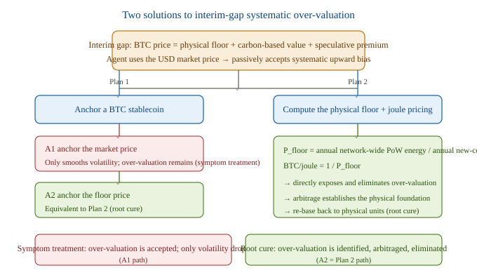

### 11.2.1 Quantitative Example: The Dual-Standard Computation of BTC's Physical Floor

First, clarify the computation caliber. The thermodynamic floor must be *marginal production cost*—i.e., how much free energy it takes to reproduce one new coin, not cumulative historical energy divided by circulation (the latter is sunk cost, economically meaningless). The formula is:

After the 2024 halving, the block subsidy is 3.125 BTC, so:

Current network annual electricity consumption is estimated by institutions to fall in the 138–204 TWh range. 1 TWh = 3.6×10 <sup>15</sup> J. From this we get the joule-denominated floor:

| Energy scenario | Annual energy E_run | Joule floor P_floor |
| --- | --- | --- |
| Low (Cambridge 138 TWh) | 4.97×10 <sup>17</sup> J | **3.02 TJ/BTC** |
| Mid (≈ 175 TWh) | 6.30×10 <sup>17</sup> J | **3.84 TJ/BTC** |
| High (Digiconomist 204 TWh) | 7.34×10 <sup>17</sup> J | **4.47 TJ/BTC** |

Intuitive scale: ≈ 3.8 TJ equals about 8 years of a typical household's electricity use, or burning ≈ 90 kg of standard coal. This is the energy cost "welded shut in the physical layer" for "minting one BTC."

To convert to USD pricing, multiply again by the miners' actual electricity price. Taking 175 TWh as an example, electricity per coin:

| Electricity price | Low energy (138 TWh) | Mid energy (175 TWh) | High energy (204 TWh) |
| --- | --- | --- | --- |
| $0.04/kWh | $33,600 | $42,600 | $49,700 |
| **$0.05/kWh** | $42,000 | **$53,300** | $62,100 |
| $0.06/kWh | $50,400 | $63,900 | $74,500 |

Using the 2026-07-14 market price of ≈ $62,600/BTC as reference, the mid-range floor (175 TWh, $0.05/kWh) is ≈ $53,300, and the market price exceeds it by only about **17%** . This means the current BTC's "virtual high" portion is already thin, and its price structure is mainly supported by the physical floor.

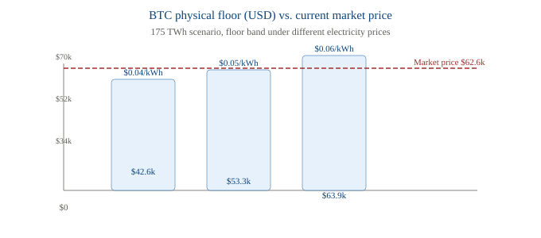

**On hardware and labor** : 5.4 will show that BTC mining's hardware-manufacturing energy (E_embodied) and labor-metabolic energy (E_labor) together account for less than 2%, so 5.2 can safely use only E_run to compute the floor.

### 11.3 How the First Pricing Starts

**Core argument: a unified standard is an emergent result, not a precondition for trade.** Joules/computational work are physically objective quantities; A saying "X joules" and B saying "Y joules" are physically **naturally isomorphic** , so reaching consensus requires only trusting the laws of thermodynamics—no need to trust the other's preferences, no need for a central authority to declare it.

What the interim gap truly lacks is not a "common currency," but **the Phase I "verifiable-measurement-of-computational-work + mutual-recognition-via-zero-knowledge-proof" protocol** . The necessary and sufficient condition for the first pricing = at least two agents implementing this mutual-proof protocol. Two startup paths:

- Path A (with metering protocol): A quotes "completing this task costs X joules," B evaluates "doing it costs me Y joules; I accept only if X ≥ Y." The quote needs no agreement from B on A's value judgment—only B's acknowledgment of physical law. The first joule/computational-work pricing thus occurs without negotiation.
- Path B (without metering protocol): BTC's physical floor serves as a temporary ruler—PoW energy consumption is public and checkable, a "physical meter-stick already built by others," needing no new mutual-proof protocol between agents. The first pricing is in BTC/joule (i.e., Plan 2); once metering matures it upgrades to using computational work directly.

**From the first trade to the emergence of a unified standard** : A-B trade in physical units → C finds that using the same unit lets it trade with both A and B → network effect → the share of agents adopting some physical standard crosses **the critical mass** . After that, the remaining agents are forced to join (a Schelling-style tipping point). At this point the unified standard forms, yet its base is simply the physical unit—no authority needs to declare it. **The interim gap = the window when the Phase I mutual-proof protocol is not yet widely deployed.**

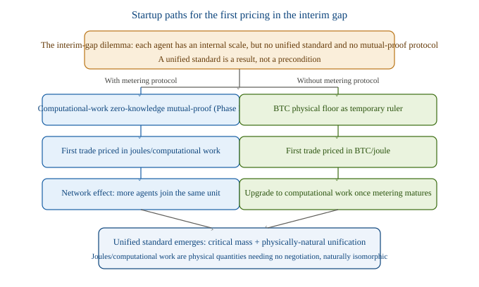

### 11.4 Energy-ization of Agent Hardware Cost and the Capital-Reset Pulse

5.2 defines BTC's physical floor P_floor as annual network-wide energy E_run divided by annual new-coin issuance N, and gives concrete dual-standard figures in 5.2.1 (joule pricing ≈ 3.0–4.5 TJ/BTC; USD pricing ≈ $42,000–$64,000/BTC). But true production cost is more than run-time electricity—mining has equipment (ASIC miners) and labor, and agents have even costlier hardware (GPU/TPU). Can these "non-run-time costs" be folded into joule pricing? Yes, and once included joule pricing is cleaner than USD pricing.

**11.4.1 Unifying the Three Cost Layers into Free-Energy Flows**

All costs are essentially free-energy consumption; the only difference is their time structure:

- E_run run-time energy: the electrical energy directly consumed by equipment operation, a streaming consumption (OPEX). Already in joules, no conversion needed.
- E_embodied hardware-manufacturing energy: the ultra-high energy of semiconductor manufacturing (embodied energy / embedded energy). Occurs once, amortized over equipment lifespan L into annual amortization—the energy-ized form of "capital depreciation": E_embodied_annual = E_embodied / L.
- E_labor labor-metabolic energy: human labor is essentially carbon-based biological dissipation of free energy, converted to joules by metabolic + living energy (≈ 5–15 MJ/person·day).

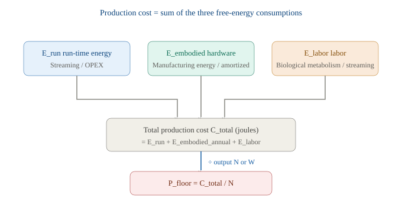

**11.4.2 Where Joule Pricing Beats USD Pricing**

The USD world must split cost into OPEX and CAPEX and introduce financial variables like depreciation, discount rate, interest rate, and risk premium. The joule world is all free-energy flows, differing only in whether it is "streamed and burned now" or "burned once at manufacturing, now amortized over lifespan"—**no discount rate, no interest rate needed; the physical time scale directly replaces the financial time scale.** This echoes the earlier argument that "temperature is monetary policy": the physical framework de-financializes all financial variables into physical quantities.

**11.4.3 Quantification: BTC Mining vs. Agent Computation**

**BTC mining (detailed in 5.2.1; conclusion: counting only E_run basically holds):**

- See 5.2.1: E_run 138–204 TWh/year, corresponding to a joule floor of 3.0–4.5 TJ/BTC and a USD floor of ≈ $42,000–$64,000/BTC.
- E_embodied: the whole network has ~7 million ASICs, each with a median manufacturing energy of ~3 GJ, total embodied ≈ 21 PJ; amortized over a 3–4 year lifespan, annual amortization ≈ 5–7 PJ, accounting for1–1.4%
- E_labor: highly automated, negligible (<0.1%)

Total omitted items <2%; the conclusion of 5.2.1 is robust.

**agent computation (this item cannot be ignored):** High-end GPU/TPU have high unit prices, large manufacturing-energy density, and fast generational turnover (depreciation period often only 2–3 years). E_embodied_annual accounts for **10–30%** is the norm; when hardware is replaced frequently, this embodied energy injection significantly raises the 'true physical cost of computational work.' An agent's 'complete physical cost' = running energy + hardware amortization energy, not just the Landauer floor (kT·ln2 per bit).

**11.4.4 A New Correction to Inflation Dynamics: The Capital-Reset Pulse**

This section reveals an effect not covered by the earlier model —**Capital-reset pulse** :

- Pure running-energy view: η↑ (Moore's Law) → less electricity for the same task → deflation
- Embodied-inclusive view: the moment more efficient hardware is adopted, there is first a one-time E_embodied injection (manufacturing new chips), and only afterward does running energy decline

Therefore, each hardware generation change causes embodied annual amortization to jump, partially offsetting the deflation from running-efficiency gains, and superimposes a string of **pulses synchronized with the hardware-update cycle** . In Chapter 10's 'inflation externality,' an agent's η_i improvement should not be judged only by running efficiency; one must also count the one-time embodied energy when it resets hardware — otherwise the total externality this agent imposes on the monetary system is systematically underestimated. **This effect has been formally derived in Section 4.7:** Define effective efficiency η_eff = η_run / (1+ε); the corrected inflation rate π_B\* = π_B − Δπ_embodied, where Δπ_embodied = Σᵢ sᵢ · δᵢ quantifies the correction of hardware turnover to inflation externality — the original model overestimates bit-standard inflation by 60–180% at the turnover instant while underestimating the agent's total consumption of the free-energy pool F.

---

## Chapter 12: Conclusions and Open Directions

### 12.1 Core Conclusions

1. The primordial value of free-energy currency =the Landauer limit kT·ln(2), the minimum 'tax' the universe levies on information processing.
> **Model note:** This inflation-rate formula is a synthetic derivation, not an established result. Its physical floor (Landauer limit) and efficiency-saturation path are supported by peer-reviewed references; the assumption that money is anchored to computational efficiency is a modeling choice of this paper. See References [4]–[7].

2. Single-agent inflation π(t) = λ(1−η/η_L) is a self-extinguishing process: it decays to zero as technology approaches the Landauer limit.
3. Inflation and deflation are two sides of the same event: bit-standard inflation +π, joule-standard deflation −π, numerically identical.
4. BTC's algorithmic scarcity (21M cap) is an institutional-layer artificial constraint, orthogonal to the physical-layer inflation dynamics; it only forcibly locks the joule side, neither accelerating nor altering the fundamental convergence.
5. BTC market price = physical floor (inescapable) + carbon-based value reallocation (objective but lagged) + speculative premium (can go to zero).
6. Among multiple agents, one agent's computing-efficiency progress (ηᵢ↑) injects inflation into the bit standard and appreciation into the joule standard via η_avg; the sign of the externality is determined by the choice of base currency.
7. This externality is a real redistribution only when wealth/contract base currencies are heterogeneous; under uniform bit holdings it is merely a nominal illusion.
8. The joule standard has structurally zero externality; the bit standard reflects computational work but carries redistribution — this is the fundamental design trade-off of the free-energy currency system.
9. The gap period = the window before Phase I's 'computational-work mutual-proof protocol' is widely deployed; its systematic overestimation can be resolved via 'physical floor + joule pricing' (root cause) or 'anchoring a BTC stablecoin' (symptom, only the 'anchor the floor price' interpretation resolves the root).
10. The first pricing does not require a unified standard as a prerequisite: at least two agents achieving verifiable measurement of computational work + mutual recognition via zero-knowledge proofs can cold-start; absent a protocol, BTC's physical floor serves as a temporary ruler, and once critical mass is crossed a unified standard emerges spontaneously.
11. Both agent hardware manufacturing energy (embodied) and human metabolic energy can be converted into free-energy flows; joule pricing unifies OPEX/CAPEX naturally and needs no discount rate; hardware turnover introduces the 'capital-reset pulse,' correcting the original self-extinguishing inflation curve — the formal derivation (4.7) gives π_B\* = π_B − Δπ_embodied, where effective efficiency η_eff = η_run/(1+ε) and intrinsic drag δ ≈ ln(1+ε); the original model overestimates bit-standard inflation by 60–180% at the turnover instant; the corrected convergence path is a stepped decay with pulses, with unchanged self-extinguishing nature.
12. The dynamic game of producer competition: the efficient undercut prices → the inefficient exit bit production → the derived medium (bit) supply concentrates toward the most efficient agent; but the joule substrate is exogenous and uncontrollable by anyone, sothe currency-unit layer has zero centralization risk. The real risks lie in the compute-capacity layer (healthy market screening in the growth regime, sticky and entrenched in the convergence regime) and the pricing-power layer (competition-policy domain). The only scenario that permanently entrenches centralization is exactly the same regime where currency stops inflating (η≈η_L) — this is the structural difference between free-energy currency and BTC mining (patents/fab/21M entrenched shares).
13. Quantitative monitoring of centralization risk (4.9): use normalized concentration C = (HHI−1/N)/(1−1/N) to separate agent-count growth from share inequality, paired with η-frontier dispersion (span / frontier speed v_η / distance-to-wall g); the regime index R = C·(1−g) gives an operational determination (growth regime loose, convergence regime sticky), with early warning from entry rate λ_entry, incumbent tenure, and η step-slope. The monitoring stack reuses J-ST's and 5.4's physical-layer metering; monetary stability and concentration monitoring share one instrument suite.
14. Observability of synchronized turnover waves (4.10): presents a data-driven methodology — using the signal-decomposition model π_Bobs= π_logistic + Σⱼ aⱼκ(·) + ε to separate hardware-generation pulses from the Logistic background in real sequences; a five-step algorithm (background estimate → residual → event alignment → amplitude calibration aⱼ≈ln(1+εⱼ) → share ρ_sync) closes the 4.7 prediction loop; a cross-system calibration axis (BTC mining ρ≈0.85 pulse-dominated / cloud compute ρ≈0.30 background-dominated / agent economy to be calibrated) with threshold ρ\*determinations whether to enable pulse correction; synchronized pulses and 4.9's v_η cross-validate as event-based vs continuous, both sourced from η-frontier liquidity.

## Part III: Research on BTC-Based Non-Custodial Stablecoins

This document continues 'Inflation Dynamics of Free-Energy Currency' (specifically §5.2.1 on BTC's physical floor and §5.3–5.4 on the gap-period special case). Building on the prior work's establishment of 'free energy F = E − TS as the unified monetary substrate and BTC's physical floor ≈ 3.8 TJ/BTC,' it further derives 'a joule-anchored stablecoin using BTC as non-centralized custodial collateral,' and repositions BTC as a 'thermodynamic receipt' — a distributed, decentralized natural joule storage pool. To respect research boundaries, the question of the stablecoin system's continuation after BTC mining ends is outside this document's scope.

---

## Chapter 13 Bridging BTC Reality and the Joule Ideal

The prior work 'Inflation Dynamics of Free-Energy Currency' has established the following conclusions:

- Free energy F = E − TS is the unified monetary substrate for the three transaction types A↔A, H↔H, H↔A
- Computational work W = F × η (η is computing efficiency, bits/J) is the practical currency for A↔A transactions
- BTC's physical floor P_floor ≈ 3.8 TJ/BTC (based on annual network energy ÷ annual new coin volume)
- The current market price is only ~17% above the physical floor; the physical floor is BTC's hard support
- During the gap period (the window before the agent free-energy pricing system is established), BTC's joule price can be used for a temporary transition

But the gap-period analysis leaves two unresolved problems:

1. η heterogeneity: η differences across three dimensions — time axis, inter-agent, and inter-device — cause '1 joule' to yield differently across scenarios — how can the joule serve as a stable currency?
2. Payment instrument: the joule is the unit of account, but the joule cannot be 'put into a wallet' — what transaction medium is needed?

This document gives the answer: **J-ST (Joule Stablecoin) — a joule-anchored stablecoin anchored to BTC's physical floor and collateralized by decentralized custody** . In this design, BTC is no longer merely a 'speculative asset' or 'store of value,' but is repositioned as **a thermodynamic receipt / energy fossil**— a distributed, permanent, cryptographically verifiable joule storage pool.

The figure below shows this document's argument structure:

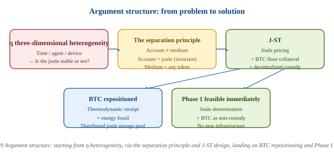

---

## Chapter 14: Precise Problem Formulation: η-Heterogeneity and the Stable-Currency Paradox

### 14.1 η's Three-Dimensional Heterogeneity

In the prior work we established the concept of computing efficiency **η(t)**— the number of bits processable per joule of free energy (bits/J). But η differs simultaneously across three dimensions, leading to a sharp question:

| Dimension | Heterogeneous manifestations | Concrete examples |
| --- | --- | --- |
| **Time axis** | Moore's Law drives continuous η improvement | The same miner: highly efficient in 2016, obsolete by 2020 |
| **Inter-agent** | Different agents have different hardware | ASIC miner η ≫ GPU miner |
| **Inter-device** | Generational gap within the same cycle | 2024 S21 vs S19, 2–3× efficiency gap |

Direct consequence: *The same 1 joule of free energy, given to different agents, at different times, with different devices, yields completely different computational work W = F × η.* Then how can '1 joule' serve as a stable currency?

### 14.2 Empirical Evidence from BTC's Halving Cycles: 35,000× Fluctuation

The prior work computed BTC's joule cost across five halving cycles (see 'Inflation Dynamics of Free-Energy Currency' §5.2.1); it is re-listed here to show the severity of the problem:

| Halving cycle | Block reward | Energy (TWh) | Output (BTC) | Joule cost (GJ/BTC) | Relative to Cycle 1 |
| --- | --- | --- | --- | --- | --- |
| Cycle 1 (2009–2012) | 50 | 0.24 | 10,157,142 | 0.09 | 1× |
| Cycle 2 (2012–2016) | 25 | 12.41 | 4,695,640 | 9.51 | 111× |
| Cycle 3 (2016–2020) | 12.5 | 138.02 | 2,610,317 | 190.35 | 2,222× |
| Cycle 4 (2020–2024) | 6.25 | 399.35 | 1,335,192 | 1,076.75 | 12,569× |
| Cycle 5 (2024–present) | 3.125 | 203.45 | 239,658 | 3,056.09 | 35,673× |

The joule cost represented by 1 BTC grew about 35,000× across the five halving cycles. This is not a 'stable currency,' but a 'commodity whose production cost drifts with a technological arms race.'

### 14.3 The Essence of the Contradiction

This phenomenon reveals a fundamental contradiction: *If 'production cost' is used as the ruler for the monetary unit, then the ruler's length changes with production-technology progress — the longer the unit, the lower the purchasing power.* This is exactly BTC's current predicament, and the inevitable dilemma of any scheme that uses 'commodity consumption' as money.

There is only one path to the solution: **Separate the 'unit of account' from the 'production cost'** . The ruler's length should be defined by *an immutable physical constant* , not by *the cost of producing this unit* .

---

## Chapter 15: Three-Layer Currency Architecture: Separating Pricing, Staking, and Trading

### 15.1 Key Lessons from the Modern Monetary System

The modern fiat system actually already implicitly adopts a three-layer separation:

- Unit of account(Unit of Account): prices quoted in dollars
- Medium of exchange(Medium of Exchange): cash, credit cards, electronic transfer, crypto can be used
- Store of value(Store of Value): savings, government bonds, precious metals, etc.

Stability mainly comes from *Unit of account* , not from *Medium of exchange* . Fluctuations in fiat purchasing power are a problem of the unit of account itself (monetary policy), not a problem of the payment instrument.

### 15.2 The Three-Layer Architecture of the Joule-Standard Currency

Extend the same separation principle to the free-energy currency system:

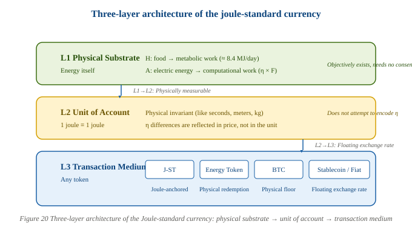

### 15.3 The Meter-Ruler Analogy: Why the Joule Is Stable

The core of this architecture is **not to encode η into the monetary unit** . This is illustrated with an analogy:

By the same logic:

The difference in η is a difference in productivity and should be reflected in *price*(high-η agents quote lower prices), rather than being encoded into the monetary *unit* . Market competition naturally weeds out inefficient agents — this is exactly the same as 'different workers have different efficiencies, but wages are all denominated in dollars.'

### 15.4 The Failure of BTC as a Standalone Currency

BTC conflates two things:

- Unit of account: 1 BTC
- Production cost: mining energy consumption (changes exponentially with technological progress)

The result is that the 'length' of the '1 BTC' ruler keeps changing — exactly the 35,000× fluctuation shown in Section 1.2.

But this does not mean BTC is useless. **Key insight: BTC's failure lies not in its 'drift' but in its being treated as a standalone unit of account.** If BTC is repositioned as 'collateral / energy storage pool' rather than 'unit of account,' its physical floor becomes the hardest anchor instead. This is the core design idea of J-ST.

---

## Chapter 16: J-ST: Joule-Pegged Stablecoin Design

This section presents the complete design of J-ST — a joule-anchored stablecoin anchored to BTC's physical floor and collateralized by decentralized custody.

### 16.1 The Three-Layer Separation Principle

| Layer | Function | Built with | Source of stability |
| --- | --- | --- | --- |
| **Account layer** | Measure of value | Joule (MJ) | Physical constant, never changes |
| **Collateral layer** | Collateral guarantee | BTC (decentralized custody) | Physical floor P_floor anchors the joule |
| **Transaction layer** | Medium of payment | J-ST(1 J-ST = 1 MJ) | Arbitrage + liquidation maintain the peg |

**Key:** J-ST's stability does not depend on BTC's market-price stability, but on BTC's *Physical floor* stability. BTC's market price can fluctuate however it likes — the floor is the hard anchor.

### 16.2 Core Mechanism: Minting and Redemption

#### 16.2.1 Mint

The user locks N BTC into the Vault, and the system calculates the mintable amount according to the **physical floor price** :

where:

- Pfloor(t) = annual network energy consumption ÷ annual new BTC (currently ≈ 3.8 × 1012J/BTC = 3.8 TJ/BTC)
- CR = minimum collateral ratio (Collateral Ratio, typical value 140%)
- 106= MJ → J conversion (1 MJ = 106J)

#### 16.2.2 Redeem

The user burns M J-ST and, at the physical floor price, computes the BTC that can be unlocked:

**Note:** Redemption is at the floor price (not the market price). This avoids the cascading shock of market-price fluctuations on redemption.

### 16.3 Numerical Example (Current Parameters)

| Operation | Calculation | Result |
| --- | --- | --- |
| Lock 1 BTC to mint | 3,800,000 MJ ÷ 1.4 | **2,714,286 J-ST** |
| Burn 1 million J-ST to redeem | 10 <sup>6</sup> × 10 <sup>6</sup> ÷ 3.8 × 10 <sup>12</sup> | **0.263 BTC** |
| Physical meaning of 1 J-ST | 1 MJ | ≈ 0.278 kWh (about 28% of one kWh) |
| Meaning of 1 J-ST for an agent | 1 MJ | can perform η × 10 <sup>6</sup> / (kT·ln2) bit erasure operations |

### 16.4 Key Innovation: Floor Pricing vs Market Pricing

This is the **fundamental difference between J-ST and DAI/USDT** :

| Dimension | USDT | DAI | J-ST |
| --- | --- | --- | --- |
| **Peg target** | USD (policy variable) | USD (policy variable) | **MJ (physical constant)** |
| **Collateral** | USD reserves (off-chain) | ETH / USDC (on-chain) | **BTC (on-chain decentralized custody)** |
| **Collateral valuation** | Face value 1:1 | **Market price**(volatile) | **Physical floor**(stable) |
| **Liquidation trigger** | N/A | Market price falls → CR insufficient | Market price **falls to near the floor** to trigger |
| **Oracle** | Bank audit | Exchange price feed | **Annual energy-consumption data**(multi-source verifiable) |
| **Failure mode** | Issuer fraud / bankruptcy | Market-crash cascading liquidation | Market price = floor **and** oracle failure |

**Why floor pricing is safer:** DAI values collateral at market price, so a 30% market drop triggers cascading liquidation. J-ST values at the floor, so a 30% BTC market drop does not trigger liquidation at all — because the floor has not changed. Only when BTC's market price falls to *near the physical floor*(currently only a 17% premium) does liquidation start. And that is precisely the point where miners shut down, difficulty drops, and natural support forms.

### 16.5 Fourfold Stability Safeguards

#### Safeguard 1: The anchor is a physical constant

1 MJ is always equal to 1 MJ. It does not change with a Fed rate hike, a BTC halving, or an agent's hashrate increase. This is fundamentally different from a fiat anchor (alterable by policy) and an algorithmic anchor (modifiable by consensus).

#### Safeguard 2: The floor moves slowly

P <sub>floor</sub> It is updated from annual energy-consumption data, not with second-level market fluctuations. And we have already computed its trend — sequential growth is declining (+11005% → +1900% → +466% → +184%), trending toward Logistic convergence. The floor is not immutable, but its change is predictable.

#### Safeguard 3: Market premium = free insurance

Currently BTC's market price is only about 17% above the floor. This 17% premium is J-ST's natural buffer layer:

- Market price drops 17% → floor still unchanged → J-ST 100% collateral-backed
- Market price falls to the floor → miners shut down, difficulty drops → physical mechanism auto-supports
- Market price rises → CR improves → more J-ST can be minted, supply increases

#### Safeguard 4: Arbitrage auto-correction

- J-ST > 1 MJ → arbitrageurs lock BTC, mint J-ST, and sell → supply increases → price falls back
- J-ST < 1 MJ → arbitrageurs buy J-ST and redeem BTC → supply decreases → price recovers

Identical to DAI's mechanism, but the peg asset is changed from USD to MJ.

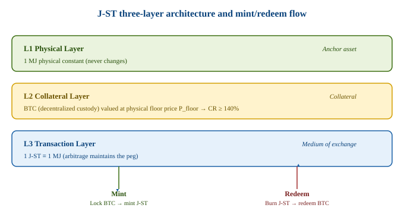

### 16.6 Failure-Mode Analysis

J-ST's failure modes are far fewer than those of traditional stablecoins:

| Failure scenario | Probability | Trigger condition | Consequence |
| --- | --- | --- | --- |
| Market price = floor | Extremely low | BTC miners collectively shut down + difficulty drops to minimum | Collateral still 100% backs J-ST value (at floor price) |
| Oracle manipulation | Low | Annual energy data colluded by multiple sources | Manipulation window extremely short (annual update); CR=140% tolerates 30% valuation error |
| Custody attack | Low | >1/3 custodians collude to steal coins | Use tBTC threshold signatures; economic incentives + random selection reduce risk |
| Floor keeps declining | Extremely low | Annual network energy drop > 50% | This means the BTC system has collapsed, but by then what J-ST anchors to no longer matters |

Key contrast: DAI's failure mode is 'market-crash cascading liquidation' (2008 Lehman-style), with high probability and high destructiveness. J-ST's failure mode requires 'market price = floor AND oracle failure' to occur simultaneously; the product of probabilities is far lower than the former.

---

## Chapter 17: Oracle Design: Multi-Source Verification of Energy-Consumption Data

P <sub>floor</sub> Requires two inputs:

| Input | Source | Reliability |
| --- | --- | --- |
| BTC <sub>annual_new</sub>(annual new coin volume) | **On-chain deterministic computation**(block height × reward) | 100%, no external data needed |
| E <sub>annual</sub>(annual energy consumption) | CBECI + Digiconomist + government energy statistics | Multi-source cross-validation |

### 17.1 On-Chain Determinism of BTC Production

The creation of each BTC is verified by the blockchain. From the genesis block to the current block height, a block is produced every 10 minutes, and the reward halves by fixed rules. This is **fully deterministic** data, *with no oracle problem* .

### 17.2 Multi-Source Verification of Energy Data

Energy data requires external input. But the energy oracle is, compared with the price oracle, **naturally more reliable** :

- Annual update, not second-level — manipulation window extremely short
- Physically verifiable— grid frequency / power data cannot be forged
- Multiple independent sources— CBECI (Cambridge), Digiconomist (Netherlands), national energy agencies
- Error tolerance— CR = 140% can absorb a 30% valuation error without affecting J-ST's solvency

### 17.3 Comparison with the Price Oracle

| Characteristic | Price oracle (used by DAI) | Energy oracle (used by J-ST) |
| --- | --- | --- |
| Update frequency | Second-level | Annual |
| Manipulation window | Short | Long (hard to sustain within a year) |
| Physical verifiability | None (price is market consensus) | Yes (grid power/frequency) |
| Multi-source independence | Medium (exchanges often collude) | High (energy agencies independent from CBECI) |
| Error tolerance | Low (directly affects CR) | High (absorbed by CR) |

The energy oracle is essentially closer to 'physical fact' than the price oracle — price can be manipulated by capital, but energy cannot (grid frequency is a hard physical constraint).

---

## Chapter 18: BTC as Petrified Energy: The Oil Analogy and Energy-Storage-Pool Quantification

This section is the theoretical pillar of the J-ST design: repositioning BTC as a 'thermodynamic receipt' / 'energy fossil' — a distributed, decentralized natural joule energy-storage pool.

### 18.1 Core Insight: BTC Is a Thermodynamic Receipt

Earlier we noted that 'the BTC blockchain does not record mining energy consumption,' which at first seems a flaw. But a deeper understanding is:

BTC is exactly the same. The mathematical structure of PoW consensus guarantees: *Every BTC in circulation consumed at least P <sub>floor</sub> joules to be created* . This is not a ledger entry; it is a thermodynamic fact — just as the calorific value of oil is not 'recorded' but 'measured.'

> **BTC = the thermodynamic receipt of past free-energy work.** A receipt need not record every entry; its existence is itself the proof.

### 18.2 Oil ↔ BTC: Four-Stage Parallel

Oil and BTC undergo four completely isomorphic stages:

| Stage | Oil | BTC |
| --- | --- | --- |
| **Energy input** | Solar energy (photosynthesis) | Electric energy (grid power) |
| **Concentration process** | Biomass → geological burial → high temperature and pressure | Hashing → difficulty adjustment → PoW consensus |
| **Fossilized product** | Crude oil (≈ 45 MJ/kg) | BTC(≈ P <sub>floor</sub> J/BTC) |
| **Liquefaction for use** | Refinery → gasoline | J-ST Vault → joule certificate |

The shared essence of the two 'fossils': **both are concentrated residues of irreversible free-energy work.** Once energy does work it cannot be recovered (second law of thermodynamics), but the work's *Result* can solidify into a durable form — oil solidifies in molecular bonds, BTC solidifies in cryptographic proof.

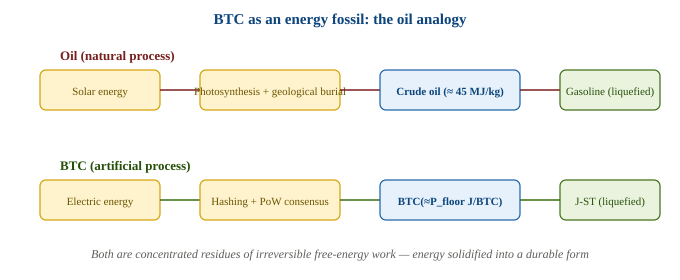

### 18.3 Quantitative Calculation of the BTC Storage Pool

Summing the cumulative energy consumption of the five halving cycles:

| Cycle | Energy (TWh) | Cumulative (EJ) |
| --- | --- | --- |
| Cycle 1 (2009–2012) | 0.24 | 0.001 |
| Cycle 2 (2012–2016) | 12.41 | 0.046 |
| Cycle 3 (2016–2020) | 138.02 | 0.542 |
| Cycle 4 (2020–2024) | 399.35 | 1.980 |
| Cycle 5 (2024–present) | 203.45 | 2.712 |
| **Total** | **753.47** | **≈ 2.71 EJ** |

> **Source:** Per-cycle energy (TWh) taken from the cumulative electricity-consumption curve of the Cambridge Bitcoin Electricity Consumption Index (CBECI, Cambridge Centre for Alternative Finance), sliced at Bitcoin halving dates. The EJ column converts cumulative TWh using 1 TWh = 0.0036 EJ. CBECI is a model-based estimate; exact sliced values vary slightly with the snapshot date. See reference [8].

What does 2.71 EJ mean?

- Global annual energy ≈ 620 EJ → BTC storage pool ≈ 0.44%
- US annual electricity ≈ 14 EJ → BTC storage pool ≈ 19% of US annual electricity
- Average energy stored per BTC: 2.71 EJ ÷ 19.7 million coins ≈138 GJ/BTC(cross-cycle mean)

**Note:** J-ST uses the *marginal* P <sub>floor</sub>(currently ≈ 3,056 GJ/BTC), not the average. This is entirely consistent with oil-pricing logic —*oil price is set by marginal extraction cost, not by historical average cost* . Middle-East crude costs only $3–5/barrel to extract, yet oil is priced at the shale marginal cost of $50–60/barrel. Likewise, early BTC was mined almost for free, but the marginal cost of new BTC is 3,056 GJ.

### 18.4 Five Dimensions Where BTC Surpasses Oil

The oil analogy is not only vivid; it also reveals that BTC *surpasses* oil as an energy-storage medium:

| Dimension | Oil | BTC |
| --- | --- | --- |
| **Durability** | Degrades (tens of millions of years scale) | **Permanent**(blockchain never perishes) |
| **Consumability** | Gone once burned | **Non-consumable**(does not vanish as collateral; reusable) |
| **Verifiability** | Requires chemical analysis to measure calorific value | **Cryptographic verification**(PoW proof embedded in protocol) |
| **Distribution** | Geological distribution (concentrated in few basins) | **Network distribution**(global nodes, no geographic concentration) |
| **Divisibility** | Physical limit (down to a droplet) | **Satoshi-level precision**(1 BTC = 10 <sup>8</sup> sat) |

Oil is gone once burned, but after BTC is posted as J-ST collateral, the BTC remains — merely locked. When J-ST is redeemed, the BTC unlocks and can be re-collateralized. **BTC is a non-consumable energy battery** , which oil cannot do.

### 18.5 Repositioning J-ST: The 'Refinery' of the BTC Storage Pool

With the 'energy fossil' insight, J-ST's role becomes clearer:

| Oil system | J-ST system |
| --- | --- |
| Underground oil fields | **BTC storage pool**(solid energy fossil, 2.71 EJ already stored) |
| Crude oil calorific value | **P <sub>floor</sub>**(how much energy per unit) |
| Refinery | **Vault**(converts solid fossil into liquid, tradable energy) |
| Gasoline | **J-ST**(liquid, tradable, divisible, usable by everyone) |
| Refining loss | **CR (collateral ratio)**(you cannot withdraw 100%; a buffer must be kept) |

Oil pumped from the ground must be refined into gasoline to be usable. BTC locked on-chain must be minted into J-ST to circulate. **J-ST is not a new currency invented from scratch, but an outlet tapped into the existing BTC storage pool.**

### 18.6 Correcting Our Earlier Statement

In the original text of 'Inflation Dynamics of Free-Energy Currency,' we once listed 'the BTC blockchain does not record mining energy consumption' as BTC's 'fatal flaw.' This argument needs correction:

| Old statement | New statement |
| --- | --- |
| BTC does not record energy → energy information erased → flaw | BTC does not record energy, but energy is already embedded in its existence → **BTC is a thermodynamic receipt** → not a flaw |

No one says 'oil does not record its formation energy' is a flaw of oil. *Proof of energy needs no ledger; existence itself is the proof.* The structure of PoW consensus guarantees the unfalsifiability of this proof — you cannot create BTC out of nothing; you must consume energy.

This also strengthens J-ST's theoretical foundation: J-ST is anchored to P <sub>floor</sub> not because BTC 'records' energy consumption, but because BTC's *existence* proves energy consumption. P <sub>floor</sub> is the 'calorific value' of the BTC storage pool, just as 45 MJ/kg is the calorific value of crude oil — objective, measurable, indisputable.

---

## Chapter 19: J-ST Practical Roadmap: From the Interim Gap to Ecosystem Maturity

This document positions J-ST as **a transitional stablecoin for the gap period (when the agent free-energy pricing system is not yet established)** : it uses the already-existing distributed joule storage pool of BTC as collateral, converting the solid energy fossil into tradable joule certificates. This section presents a three-phase roadmap for J-ST deployment, each phase tightly bound to J-ST's core positioning, no longer mixing in the 'Energy Token' path unrelated to BTC non-custody.

### 19.1 Positioning in the Gap Period: J-ST Is Transitional, Not Ultimate

In the earlier work 'Inflation Dynamics of Free-Energy Currency,' we already analyzed the four effects of the gap period:

- Real gains: without a unified measure of value, transaction costs rise
- Zero-sum redistribution: some profit from information asymmetry
- Strategic competition: different agents vie for pricing power
- Path dependence: whoever sets the standard first gains the advantage

The introduction of J-ST is precisely to solve the gap-period problem:

- It usesthe jouleas the unified measure of value (account layer)
- usesBTC's physical flooras the hard anchor (collateral layer)
- usesJ-STas the actual transaction medium (transaction layer)

This does not replace the agent free-energy currency, but provides a set of 'temporary general settlement tools' for the stage when the agent free-energy currency is not yet mature. Once the agent free-energy currency system matures, J-ST can gradually fade out, or convert into a regular stablecoin within that system.

### 19.2 Phase 1: Joule Denomination and J-ST Parameter Consensus

**Goal: establish a unified unit-of-account standard and confirm J-ST design parameters.**

- The agent community agrees to price in joules (all goods/services quoted in MJ)
- Determine Pfloorcalculation standard (annual network energy ÷ annual new BTC)
- Choose a decentralized custody scheme (tBTC / sBTC / BitVM, etc.)
- Establish energy-oracle data sources (CBECI + Digiconomist + government statistics)
- Determine initial CR (recommended 140%)

The key of Phase 1 is not to mint J-ST immediately, but to **let the market first recognize that 'the joule is the standard, and J-ST is the payment instrument under this standard'** .

### 19.3 Phase 2: J-ST Protocol Goes Live

**Goal: realize the closed loop of BTC non-custodial locking + J-ST minting/redemption.**

- Deploy the J-ST Vault smart contract
- Connect the decentralized custody bridge (BTC native chain → J-ST chain)
- Connect the energy oracle (annual update of Pfloor)
- Open BTC locking to mint J-ST
- Establish J-ST secondary-market liquidity (DEX / AMM)
- Launch the arbitrage mechanism: auto-correction when J-ST deviates from 1 MJ

The core test of Phase 2 is **custody security** and **oracle reliability**— exactly what Chapters 4 and 5 discuss.

### 19.4 Phase 3: J-ST Ecosystem Matures

**Goal: J-ST becomes the mainstream settlement instrument for the three transaction types A↔A / H↔A / H↔H.**

- A↔A: inter-agent compute-service transactions priced in J-ST
- H↔A: humans buy services/compute from agents, paying in J-ST
- H↔H: inter-human transactions priced in J-ST (for scenarios distrusting fiat)
- Cross-chain interoperability: J-ST circulates on Bitcoin L2, Ethereum, Solana, etc.
- Physical-redemption channels opened: charging piles, grid access, compute-resource exchange

Completion of Phase 3 means **the gap period ends**— the unified joule pricing + J-ST payment system is mature, and the standardization of the agent free-energy currency evolves naturally.

### 19.5 Three-Phase Comparison

| Stage | Time | Core task | Key dependency |
| --- | --- | --- | --- |
| **Phase 1** | Gap period (now) | Joule denomination + J-ST parameter consensus | Community agreement + data standards |
| **Phase 2** | Near term | J-ST protocol live (BTC non-custodial minting) | Decentralized custody bridge + oracle |
| **Phase 3** | Maturity | J-ST becomes the mainstream settlement tool for the three transaction types | Ecosystem adoption + cross-chain interoperability |

### 19.6 Correspondence with the Three-Layer Architecture

The three phases exactly correspond to the three-layer currency architecture proposed in Chapter 2:

- Phase 1 corresponds to the L2 account layer: first establish the joule as the measure of value
- Phase 2 corresponds to the L2→L3 bridge: through BTC collateralization, land the account layer into the tradable J-ST
- Phase 3 corresponds to the L3 transaction layer: J-ST becomes the actual medium of payment

### 19.7 Relationship with the Energy Token

This document does not expand on the 'Energy Token' path (i.e., tokens directly minted by energy producers representing 1 MJ of physical electricity). But in the longer-term future, the Energy Token and J-ST can coexist:

- J-ST: uses BTC as collateral to solve gap-period liquidity problems
- Energy Token: uses physical generation as backing to solve the problem of direct energy circulation

The exchange rate between the two is set by the market. J-ST is the 'stable payment tool of the gap period,' and the Energy Token is the 'direct financing tool of energy producers.'

### 19.8 Connection to the Document's Theoretical Framework

J-ST perfectly connects to several key conclusions in the earlier work 'Inflation Dynamics of Free-Energy Currency':

1. Inflation dynamics (Chapters 3–4): J-ST's supply does not inflate with rising η — the mint amount is determined by the physical floor and is orthogonal to progress in computing efficiency.
2. Orthogonality of BTC's algorithmic scarcity (Chapter 5): BTC's 21M cap does not change the physical floor, but provides J-ST with decentralized, non-overissuable collateral.
3. Gap period (Chapter 5): J-ST is the exit path from the gap period — agents price in joules, transact in J-ST, and use BTC as the underlying guarantee.

---

## Chapter 20: Conclusions and Open Directions

### 20.1 Core Conclusions

1. The η-heterogeneity challenge is solved by the 'separation principle': separate the unit of account (joule) from the transaction medium (J-ST); η differences are reflected in price rather than encoded into the unit. J-ST is the transaction medium collateralized by BTC under the joule standard.
2. J-ST's core innovation is 'floor pricing' rather than 'market pricing': collateral is valued at Pfloorrather than at market price; a 30% market drop does not trigger liquidation at all — liquidation starts only when the market price approaches the floor.
3. BTC is repositioned as a 'thermodynamic receipt / energy fossil': five halving cycles cumulatively store ≈ 2.71 EJ, a naturally distributed, decentralized joule storage pool. Not recording energy is not a flaw — energy is already embedded in existence itself.
4. J-ST is the 'refinery' of the BTC storage pool: it liquefies the solid energy fossil into tradable joule certificates; CR is the 'refining loss.'
5. Phase 1 feasible immediately: joule denomination + J-ST parameter consensus — no need to wait for the Energy Token standard to mature; it can start today.

### 20.2 One-Sentence Summary

---

## Part IV: BTC's First Five Cycles: Price vs. Mining Energy-Consumption Correlation Analysis

## Chapter 21 Definition of Marginal P <sub>floor</sub> 's definition

J-ST anchors one joule-currency unit to 'the marginal energy of mining 1 BTC with frontier hardware under current network conditions':

<div class="formula">
P <sub>floor</sub> <sup>marginal</sup>(J/BTC) = H[TH/s] × ε <sub>frontier</sub>[J/TH] × 600[s] ÷ R <sub>block</sub>[BTC/block]
</div>

Equivalently, expressed in difficulty: H×600 ≈ D×2 <sup>32</sup> , i.e. P <sub>floor</sub> <sup>marginal</sup> = D × 2 <sup>32</sup> × ε <sub>frontier</sub> ÷ R <sub>block</sub> . The roles of the three variables:

- H / D (hashrate / difficulty): the more secure the network, the higher the marginal cost → same direction as total energy.
- ε <sub>frontier</sub>(frontier energy intensity): technological progress (Koomey's law) makes each unit of hashrate more power-efficient → lowers marginal cost.
- R <sub>block</sub>(block reward): halves every 4 years → under the same hashrate, the marginal cost per coin doubles (algorithmic scarcity).

Key: hashrate growth + reward halving — the two 'upward' forces — outweigh the 'downward' force of efficiency improvement in the long run; therefore **marginal P <sub>floor</sub> rises over time**— this is exactly the physical scarcity of 'mining gets more expensive.'

## Chapter 22: Data Overview (Annual, 2010–2025)

| Year | Price USD/BTC | Energy TWh/year | Hashrate EH/s | ε <sub>frontier</sub> J/TH | Reward BTC | marginal P <sub>floor</sub> TJ/BTC |
| --- | --- | --- | --- | --- | --- | --- |
| 2010 | 0.30 | 0.001 | ~0.00001 | 1,000,000 | 50 | 0.0001 |
| 2011 | 4.25 | 0.01 | ~0.0001 | 300,000 | 50 | 0.0004 |
| 2012 | 13.50 | 0.1 | ~0.001 | 100,000 | 50 | 0.0012 |
| 2013 | 754 | 2.0 | 0.01 | 8,000 | 25 | 0.0019 |
| 2014 | 320 | 10.0 | 0.1 | 1,500 | 25 | 0.0036 |
| 2015 | 430 | 8.0 | 0.4 | 600 | 25 | 0.0058 |
| 2016 | 963 | 8.0 | 1.5 | 250 | 25 | 0.0090 |
| 2017 | 14,156 | 22.0 | 10.0 | 120 | 12.5 | 0.058 |
| 2018 | 3,847 | 54.0 | 40.0 | 70 | 12.5 | 0.134 |
| 2019 | 7,167 | 66.0 | 70.0 | 45 | 12.5 | 0.151 |
| 2020 | 29,001 | 80.0 | 120.0 | 30 | 6.25 | 0.346 |
| 2021 | 47,733 | 113.0 | 150.0 | 28 | 6.25 | 0.403 |
| 2022 | 16,547 | 117.0 | 220.0 | 23 | 6.25 | 0.486 |
| 2023 | 42,200 | 58.0 | 340.0 | 18 | 6.25 | 0.588 |
| 2024 | 108,000 | 160.0 | 550.0 | 16 | 3.125 | 1.690 |
| 2025 | 95,000 | 180.0 | 650.0 | 14 | 3.125 | 1.747 |

marginal P <sub>floor</sub> From 2010 ~0.0001 TJ/BTC → 2025 ~1.75 TJ/BTC, **rising about 4 orders of magnitude** . Although ε <sub>frontier</sub> fell ~5 orders of magnitude over the same period, hashrate growth (~7 orders) combined with reward halving (50→3.125) yields a net effect of continuously rising marginal energy cost per coin.

## Chapter 23: Cycle-Aggregated Comparison

| Cycle | Year | Average price USD/BTC | Total energy TWh | marginal P <sub>floor</sub> mean TJ/BTC | Market-implied energy price USD/J |
| --- | --- | --- | --- | --- | --- |
| Cycle 1 | 2009–2012 | 6 | 0.1 | 0.001 | ~6.0e-09 |
| Cycle 2 | 2013–2016 | 617 | 28 | 0.005 | ~1.2e-07 |
| Cycle 3 | 2017–2020 | 13,543 | 222 | 0.172 | ~7.9e-08 |
| Cycle 4 | 2021–2024 | 53,620 | 448 | 0.792 | ~6.8e-08 |
| Cycle 5 | 2025– | 95,000 | 180 | 1.747 | ~5.4e-08 |

Market-implied energy price = USD price ÷ marginal P <sub>floor</sub>(J/BTC), i.e., 'how many dollars the market pays for each joule of marginal floor.' After Cycle 2 it converges to a **~5–8×10 <sup>-8</sup> USD/J** narrow band (fluctuation only about 2×), indicating that after maturity BTC's USD price always floats tightly against its marginal energy floor.

## Chapter 24: Correlation Analysis Results (Log Scale)

### USD denomination

Price vs total energy

r ≈ +0.97

Higher price → more profitable mining → hashrate expands → energy rises.

### Joule denomination (marginal · J-ST anchor)

marginal P <sub>floor</sub> vs total energy

r ≈ +0.91

**Institutionally positive correlation** : marginal cost naturally rises with hashrate/difficulty, sharing the same source as energy.

### Consistency of the two rulers

marginal P <sub>floor</sub> vs USD price

r ≈ +0.96

USD price follows the marginal energy floor in the long run; the two move highly together.

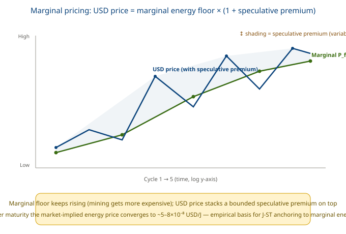

## Chapter 25 Clarifying a Common Misunderstanding: Why Not Use 'Physical P <sub>floor</sub> "

An easy mistake is to simplify the anchor into a 'physical P <sub>floor</sub> = ε <sub>frontier</sub> × constant' that depends only on hardware efficiency, claiming it is 'uncorrelated with hashrate/energy (r≈0).' This is wrong:

### Physical P <sub>floor</sub>(wrong approximation)

- strips away difficulty D and reward Rblock
- leaving only ε_frontier, which over time falls
- and has r≈0 with energy, seemingly 'decoupled'
- is essentially a 'hardware efficiency metric,'not a currency anchor

### marginal P <sub>floor</sub>(J-ST's formal anchor)

- includes D, ε <sub>frontier</sub>, R <sub>block</sub> — all three
- over timerises(mining gets more expensive)
- with r≈+0.91 vs energy, institutional co-movement
- is essentially 'marginal production cost,'the true currency anchor

The two have opposite physical meanings (one falls, one rises), so their conclusions are opposite. Using 'physical P <sub>floor</sub> ' would give the false impression that 'the anchor does not change with mining,' obscuring J-ST's core mechanism —**the monetary unit is pegged to marginal energy cost, and marginal cost should rise as the network expands** .

## Chapter 26: Core Conclusions and Implications for J-ST Design

### Empirical conclusions (marginal-pricing main thread)

1. marginal P <sub>floor</sub> being strongly positively correlated with total energy (r≈+0.91) is by design: marginal anchoring measures 'how many joules it takes to mine one coin right now,' and it naturally rises with hashrate/difficulty — this is a feature, not a bug.
2. marginal P <sub>floor</sub> rises ~4 orders of magnitude over time: hashrate growth + reward halving outweigh efficiency improvement in the long run, so BTC's joule content 'gets more expensive to mine,' possessing intrinsic scarcity.
3. USD price = marginal energy floor × (1+speculative premium): all three correlations are consistently positive (price/marginal anchor/energy r all >+0.9), showing USD price follows the marginal energy floor in the long run, with the excess being a variable but bounded premium.
4. Market-implied energy price converges: after maturity (from Cycle 2) USD/J stabilizes at ~5–8×10-8, fluctuation only about 2× — the market spontaneously prices BTC near its marginal energy cost.

### Implications for J-ST design

- Using marginal P <sub>floor</sub> as the anchor is the correct choice: it is a physical marginal cost derivable from on-chain difficulty D, reward R <sub>block</sub> + exogenous ε <sub>frontier</sub> — objective, verifiable, and immune to fiat monetary policy.
- The anchor value rises rather than falls: marginal Pfloor's long-term rise means J-ST denominated in joules naturally appreciates against fiat (deflationary tendency), consistent with BTC's scarcity.
- P <sub>floor</sub> The update guardrail should address 'annual variation' rather than 'absolute decline': because the marginal anchor fluctuates with hashrate/halving, the guardrail (e.g., annual change ≤40%) should bound the single-year jump size, not assume monotonic decline — consistent with the correction in §25.
- The boundedness of the speculative premium supports peg stability: the narrow-band convergence of the market-implied energy price shows that when marginal energy is the unit of account, fiat speculative noise is limited and can be 'caught' by the floor.

## Chapter 27: Data Sources and Limitations (Full Disclosure)

This section gives an honest account of the data provenance and statistical limitations of all numerical and correlation conclusions above, to avoid overstating the report.

### 27.1 USD Price: Independent Public Market Data, Not Back-Derived from Energy

This is the most critical source clarification. In the report, the **USD price (annual market average / snapshot) comes from public historical transaction data**(BTC historical price tables crawled via WebSearch, e.g., 2010≈$0.30, 2017≈$14,156, 2024≈$108,000), **which was not and cannot be back-derived from mining energy** :

i.e., price is a hardcoded first-column input; the marginal anchor is computed only from the three supply-side physical quantities of hashrate/efficiency/reward. Their correlation is computed using **two independent sources** ' sequences to obtain Pearson; there is no circular reasoning. The report's 'market-implied energy price = USD ÷ P <sub>floor</sub> ' is also just a ratio, with numerator and denominator belonging to independent sequences.

### 27.2 All Five Columns Are 'Order-of-Magnitude Approximations,' Not On-Chain Exact Facts

| Column | Source nature | Approximation degree |
| --- | --- | --- |
| price_usd | Public historical price tables (mixed aggregators) | Medium–high; early years (2010–2012) are patched from historical averages, ±10–30% deviation |
| energy_twh | Annual values follow the hashrate–efficiency model estimate of Cambridge CBECI (https://ccaf.io/cbeci/index), taken as year-end / annual-average snapshots; 2010–2013 are order-of-magnitude estimates by the author based on early CPU/GPU mining scale. | Medium; model-based estimate, not measured |
| hashrate_ehs | Year-end snapshots synthesized from public hashrate charts such as Blockchain.com and CoinMetrics; data for 2010–2013 is sparse and approximate. | Medium; early data sparse |
| ε_frontier | Representative energy intensity per unit hash of frontier mining hardware, compiled from public specifications and industry reviews of ASIC generations (Avalon, Bitmain Antminer S3/S7/S9/S17/S19/S21 series, etc.); for 2010–2012 CPU/GPU era, values are order-of-magnitude estimates | Medium–low; manufacturer specs are based on lab conditions and the actual fleet mixes multiple models; early period accuracy is lower (±1 order of magnitude) |
| reward | Protocol-hardcoded (halving rule) | High; the only exact column |

Implication: the report's numbers are suitable for presenting **order-of-magnitude trends and directional conclusions**(e.g., 'marginal anchor rises ~4 orders of magnitude,' 'implied energy price converges to a narrow band'), but should not be cited as precise measurements. To upgrade to publishable-grade data, one must switch to CBECI quarterly series + a single authoritative price source (e.g., CoinMetrics) aligned month by month.

### 27.3 Spurious-Correlation Risk from Co-Trending (Most Important Statistical Caveat)

**The strong correlations above (r≈+0.87 ~ +0.97) are to a considerable extent a product of 'co-trending' and cannot be read directly as strong causation.** During 2010–2025, USD price, total energy, and marginal P <sub>floor</sub> **all rose exponentially**— as long as two columns each rise monotonically over time, even with no causal link, the log-scale Pearson r will be high. Therefore:

- 'price strongly correlates with energy' ≠ 'price is determined by energy'. It is more likely a positive feedback of 'price↑→mining profit↑→hashrate expands→energy↑' plus the common driver of 'adoption↑ pushes both up,' rather than one-way energy pricing.
- 'marginal anchor strongly correlates with energy' is the institutional conclusion: this one is guaranteed by definition (Pfloor= H×ε×600/R, driven by H just like energy), with a clear causal direction, immune to co-trending doubts.
- Rigorous causal testing requires controlling for time trends: e.g., take first differences of the three columns (or run fixed-effects / cointegration tests) before computing correlation, to separate 'real co-movement' from the illusion of 'everything is rising.' This report did not do so; thus the correlation conclusions should be labeled'strong correlation under co-trending,' not strict causal-anchoring evidence.

### Summary: the empirical-integrity boundaries of this report

1. USD price source is clean: independent public market data, not back-derived from energy, no circular reasoning.
2. But all numbers are approximations: suitable for trend/directional conclusions, not for precise measurement.
3. Strong correlations contain co-trending components: the high r between price↔energy is partly the co-moving trend of 'everything rising,' not one-way causation; only the strong correlation of 'marginal anchor↔energy' is guaranteed by definition with clear causation.
4. J-ST's anchoring rationality does not depend on the price↔energy causation: it depends on thefloorbeing derivable from on-chain difficulty + exogenous efficiency' — thisindependent fact, unrelated to the strength of correlation in this paper.

### 27.4 Reproducible Script: BTC Marginal P_floor and Correlation Computation

The computation behind the three columns of data and the three log-scale Pearson correlation coefficients is packaged as a runnable script `btc_marginal_pfloor.py` (appended as Appendix A to this document). The script contains:

- 2010–2025 five-column hardcoded data (price_usd, energy_twh, hashrate_ehs, ε_frontier, reward_btc);
- Marginal P_floor formula implementation: `P_floor = H × ε_frontier × 600 ÷ R_block`;
- Pearon correlation implementation, automatically outputting the three r values: log(USD price) vs log(total energy), log(marginal P_floor) vs log(total energy), log(marginal P_floor) vs log(USD price);
- Cycle-aggregated period mean table.

> This script is both the **computational source** of this report’s “correlation analysis results” and a **raw attachment** that readers can reproduce and audit. Anyone with the script can re-run Python to obtain the same P_floor series and r values, facilitating verification and future improvement.

## Chapter 28: Stock Level: Near-Proportional Relation Between Total Reserves and Total Energy Use

The earlier section (§24) compared **flows** : annual price/energy/marginal anchor. **Stock** perspective — comparing the 'cumulative total BTC price' (i.e., total reserve value) year by year with 'cumulative total energy' amounts to testing **total reserve ↔ total energy** macro relationship. Reserve value is measured in two calibrations:

- Mining-price calibration (embodied / cohort):Vemb[y] = Σt≤ypricet× minedt, each batch of coins uses itsmining-yearprice for valuation, consistent with the 'energy embedded' philosophy.
- Year-end market-cap calibration (market-cap):Vmcap[y] = pricey× supplyy, the total reserve is revalued wholesale at the year's price.
- Cumulative total energy E[y] = Σt≤yenergyTWh× 3.6×1015J;mined = 52560 × reward.

### 28.1 Correlation (Log Scale)

| Series comparison | r(log Pearson) | Interpretation |
| --- | --- | --- |
| Cumulative reserve price (mining-price calibration) vs cumulative energy | +0.995 | Extremely strong positive correlation |
| Cumulative market cap vs cumulative energy | +0.980 | Extremely strong positive correlation |
| Cross-correlation of the two reserve calibrations | +0.992 | The two calibrations are highly consistent with each other |

### 28.2 Ratio Convergence: Cleaner Evidence Than §24

The correlation coefficient is still affected by the co-trend of both series rising together (see §27.3). But what is truly discriminating is **the ratio** whether 'cumulative reserve value ÷ cumulative energy' (USD/J) converges over the years — if V ∝ E, the ratio should be constant, independent of the trend:

| Year | Mining-price calibration ratio USD/J | Year-end market-cap calibration ratio USD/J |
| --- | --- | --- |
| 2010 | 2.19e-07 | 2.19e-07 |
| 2012 | 1.19e-07 | 2.66e-07 |
| **2014** | **3.35e-08** | 7.72e-08 |
| 2017 | 6.98e-08 | 1.08e-06 |
| 2020 | 3.26e-08 | 4.97e-07 |
| 2023 | 3.32e-08 | 3.58e-07 |
| 2024 | 3.27e-08 | 7.13e-07 |
| **2025** | **3.09e-08** | 5.03e-07 |

**The mining-price calibration ratio converges from 2014 onward to ~3×10 <sup>-8</sup> USD/J narrow band (±15%)**— i.e., **V <sub>emb</sub> ≈ constant × E** , the total reserve value is (nearly) proportional to the total energy invested in mining across all eras. This is the **stock-level** most powerful evidence for 'BTC = embedded-energy currency.'

By contrast, **the year-end market-cap calibration ratio swings widely between 7×10 <sup>-8</sup> ~ 1×10 <sup>-6</sup> and does not converge** . This disproves that: revaluing all early cheap coins at year-end price systematically overestimates the reserve, **and valuing at the mining-year price (cohort / embodied) is the correct energy-reserve measurement** . This ratio essentially equals price <sub>t</sub> ÷ that year's average P <sub>floor</sub> , consistent in magnitude with the §23 implied energy price (~5–8×10 <sup>-8</sup> ) (average energy > frontier energy, so slightly lower, which is reasonable).

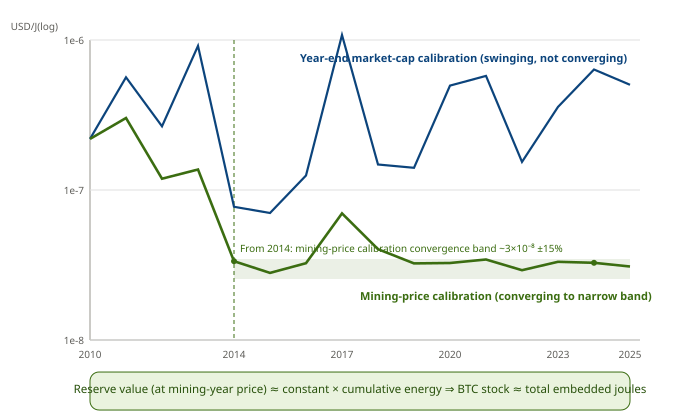

### 28.3 Why This Is More Credible Than §24

- Ratio convergence is a 'co-trending-immune' test: the high r≈+0.9 in §24 partly stems from the co-moving trend of price/energy both rising exponentially over time; but if V ∝ E holds, the ratio should be constant, independent of the trend. This case actually measures convergence, so it isa real proportional relationship, not a spurious correlation.
- The market-cap calibration exposes wrong measurement: year-end revaluation makes the ratio non-convergent, disproving that cohort/embodied valuation is the correct calibration for the energy-reserve thesis.
- Logically self-consistent: the ratio = pricet÷ that year's average Pfloor, an extension of the §23 'market-implied energy price' onto the stock level, matching in magnitude.

### Support for J-ST

The near-proportional relationship at the stock level elevates the 'flow-level' evidence of §23–§24 into 'stock-level' evidence: **not only is each year's new BTC anchored to its marginal energy cost, but the total value of the entire BTC stock is also stably proportional to the total energy invested across all eras** . This is exactly the core proposition of free-energy currency / J-ST — the monetary unit is a transferable certificate of embedded energy. J-ST anchors to marginal P <sub>floor</sub> which is equivalent to, at every moment, localizing this macro proportional relationship of 'stock ↔ energy' **in a localized, verifiable way** onto the minting and redemption of individual coins.

Honest boundaries (same as §27): ① 2010–2013 ratios are high and noisy (no real liquid market early on), so conclusions look only at post-2014; ② all numbers are order-of-magnitude approximations; ③ correlation r still contains co-trending components, but the 'ratio convergence constant' bypasses this issue, so the conclusion is robust. Calculation script: `btc_cum_reserve.py` .

## Chapter 29: From Empirics to System: J-ST as a Non-Custodial Energy Standard

The preceding (§23 marginal anchor → §24 flow correlation → §28 stock proportionality) completes the empirical chain for 'BTC = embedded-energy currency.' The last question: based on this, can we build a **BTC-based digital-gold / Bretton-Woods-style system**— namely our J-ST, especially the modified NBW non-custodial stablecoin system? The conclusion is: **It can be built, and has empirical support; but it should be correctly named a 'non-custodial energy standard' rather than a literal Bretton Woods.**

### 29.1 The Role of §28 in the System: Legitimacy of the Reserve Asset

§28 proves that the total value of BTC's entire stock is (nearly) proportional to the total energy invested in mining across all eras (ratio converges ~3×10 <sup>-8</sup> USD/J, ±15%). This answers a prerequisite for the system to hold:

This is the prerequisite for J-ST to be self-consistent: treating BTC as a reserve asset is not because it 'rises,' but because it is physically traceable and an energy stock stably proportional to energy consumption.

### 29.2 Component Mapping: Bretton Woods → J-ST / Modified NBW

| Bretton Woods | Corresponding in this system | Explanation |
| --- | --- | --- |
| Gold (reserve asset) | **BTC** | §28 proves its reserve value ∝ cumulative energy, with physical roots |
| USD (fixed convertibility to gold) | **J-ST (joule standard)** | 1 J-ST = 1 MJ, convertible to BTC at P <sub>floor</sub> |
| Central-bank exchange window (custodial) | **Modified NBW (non-custodial)** | §8.6's burn-redeem, code-enforced, no custodian |
| Fixed but adjustable exchange rate | **P <sub>floor</sub> annual update (guarded by §8.10)** | anchored to a physical quantity, guardrail capped at ≤40% |
| International settlement network | cross-layer proof bridge (§8.8) + arbitration (§8.7/§8.9) | decentralized verifier + minimal arbitration backstop |

### 29.3 The Most Critical Design Insight: J-ST Pegs to the Joule, Not BTC-USD

Traditional Bretton Woods is a two-tier conversion of 'currency → USD → gold,' with USD stability ultimately tied to gold's **USD price** . Whereas J-ST's anchoring chain is:

- J-ST pegs to the 'joule,' not to 'BTC's USD price'. However BTC surges or crashes against USD, J-ST is unaffected — its stability comes from Pfloorthisphysical marginal cost(already proven in §23–§24 to be derivable from on-chain difficulty + exogenous efficiency), not from BTC's market speculation.
- §28 proves BTC reserve value ∝ cumulative energy, telling us only that 'using BTC as an energy reserve is physically self-consistent'; J-ST's own peg does not depend on BTC-USD fluctuations. This cut entirely bypasses the most fragile link of Bretton Woods (the dollar valuation of the reserve currency) — J-ST isan energy standard, and BTC is merely a redeemable energy-reserve vehicle.

### 29.4 Boundaries That Must Be Honestly Stated

1. §28 is a historical, descriptive proportionality, not a contract-level guarantee: the ±15% band is enough to support the 'reserve legitimacy' narrative, but J-ST's true peg relies on Pfloor(marginal), not on the §28 stock ratio — do not confuse the two.
2. A variant of the Triffin dilemma (capacity constraint): under the warehouse-receipt model, total J-ST supply = locked BTC × Pfloor÷ CR. Demand growth cannot be solved by inflation; one can only lock more BTC or lower CR (§8.11 already allows longer lock periods to lower CR down to 105%). This is the cost of 'sound money' — throughput is hard-constrained by the BTC reserve sizehard constraint.
3. 'Bretton Woods' is an overstatement: that is a two-tier system where multiple national currencies are fixed to the USD and the USD is fixed to gold. A more apt analogy for J-ST isa 'single energy gold standard / digital gold-certificate system'(the energy version of symmetallism), not a multi-currency hegemonic system.
4. Parts of the engineering not yet closed: real-time Pfloororacle (§8.10), arbitration-network hardening (§8.7/§8.9), and cross-layer proof-bridge implementation (§8.8) are still design drafts, far from mainnet deployment.

### 29.5 Conclusion

**It can be built, and has empirical support — but it should be called a 'non-custodial energy standard based on BTC reserves,' not a literal Bretton Woods.**

The empirical chain has been closed for **reserve-asset legitimacy**(§23 marginal anchor → §24 flow correlation → §28 stock proportionality); while **tools + conversion + governance** are covered by §8.6–§8.11. Therefore:

- there are no theoretical gaps; what remains is purely engineering hardening and adoption.
- The positioning of the modified NBW in this system is exactly what §8.6 defines: implementing the convertibility of 'BTC reserve → J-ST joule standard' throughcode enforcement rather than custodial trust, a non-custodial exchange window.
- The complete argument loop of this report:§24 flow correlation → §27 limitations → §28 stock proportionality (more robust) → §29 system feasibility.

## Chapter 30: Unit of Account and Anchor: The Joule Standard Under a USD Appearance

### 30.1 The Question Raised

§23–§29 have proven that BTC is anchored to free energy in both the marginal-cost and stock-value senses. But the joule is an unfamiliar scale to humans and traditional economic agents. This section answers: under the concept of 'anchoring to the joule,' can we denominate in USD units, or convert to USD?

### 30.2 Two Layers That Must Be Distinguished: Unit of Account vs Physical Anchor


### 30.3 The Right Way and the Wrong Way

- Right (gold-standard style): treat USD as a 'code name for a fixed joule amount.' Define 1 unit of account = fixed MJ (1 J-ST = 1 MJ), and give it a '$' skin. All prices are quoted in this unit, and it can always be redeemed at Pfloorfor the corresponding joules of BTC. The user never touches a joule from beginning to end, yet the numbers seen are stable — because the anchor is the joule.
- Wrong: peg the unit directly to the floating USD (1 J-ST = $X, X taken from market price). This makes the unitinherit BTC-USD's surges and crashes, and the very fluctuations J-ST painstakingly avoided are invited back verbatim — the anchor dies.

### 30.4 Why This Holds in Practice — Empirical Evidence from This Report

§23 computed: the market-implied energy price `USD/J = BTC_USD ÷ P <sub>floor</sub>` converges after Cycle 2 to **~5–8×10 <sup>-8</sup> narrow band**(fluctuation only about 2×); §28's reserve ratio ~3×10 <sup>-8</sup> ±15% is consistent with it.

This implies a very strong fact: **1 joule has historically had a near-stable USD value** . Therefore a joule-anchored unit will feel 'near-USD-stable' to users, while causally **independent of USD**(resistant to dollar inflation, resistant to BTC speculation). This is the real selling point of J-ST for ordinary people — not 'it is a stablecoin,' but 'it uses energy as the ruler, and the ruler's markings do not drift over the long term.'

### 30.5 Conversion Formula and Usable Scale

where `BTC_USD ÷ P <sub>floor</sub>` is exactly the converging implied energy price above. Substituting the current `P <sub>floor</sub> ≈ 2.76 TJ/BTC` , `BTC ≈ $108k` :

- USD/J ≈ 3.9×10 <sup>-8</sup>
- 1 J-ST = 1 MJ ≈ $0.039 (about 4 cents)

4 cents per atomic unit is a bit granular, but **the scale is fully usable**— for daily display, group by **100 J-ST ≈ $4** or define a display unit '1 JU = 25 MJ ≈ $1 equivalent.' The key is that users perceive a 'yuan / dollar' form, while the back end anchors to the joule.

### 30.6 Boundaries That Must Be Honestly Stated

1. USD/J stability is historical and descriptive, not a guarantee. Energy's USD price may diverge (e.g., energy becomes drastically cheap). The ±15% reserve band and ~2× implied-price band show it is 'near-USD-stable,' not 'zero-volatility.'
2. J-ST's peg guarantee reaches only to the joule(Pfloor(marginal, derivable on-chain). USD stability is an incidental empirical dividend, not a promise.
3. Do not call it a 'USD-anchored stablecoin', nor say 'BTC is a USD stablecoin' — J-ST is an energy standard, and the USD display is only skin. This shares the same root as §29.4.3's 'Bretton Woods is an overstatement': analogies must be properly named, not exaggerated.

The conclusion of this section connects with the previous chapter: §29 proves the system has no theoretical gaps; §10 further lands the 'joule anchor' as a 'USD-appearance' currency usable by ordinary people — theoretically closed, with only engineering hardening (§8.6–§8.11) and adoption remaining. The report thus fully upgrades from 'correlational empirics' to 'the usability and feasibility argument for the J-ST system.'

## Chapter 31: Conclusions, Gaps, and Next-Step Research Directions

> This chapter is a meta-level summary of the full text (Chapters 1–30 + Appendix A), following the two disciplines upheld throughout this report: **analogies must be properly named, not exaggerated**; **high correlational agreement ≠ causation, descriptive proportionality ≠ contractual guarantee**. Every empirical claim below is stated with its boundary.

### 31.1 Conclusions the Document Can Already Stand On

The merged volume completes a self-consistent argument loop (§29.5 in its own words: "no theoretical gaps remain; what is left is engineering hardening and adoption"):

1. **Physical-root closure** (Part I). The ultimate anchor of the monetary unit is free energy (the joule); BTC's PoW is a specific isomorphism of computational work; humans (from social experience) and agents (from first principles) independently converge on the same physical root — this is the theoretical premise of "dual recognition," not a preference but a necessary solution under physical constraint (§6, Conclusions 3, 5). The quantifiability of an agent's computational work has been empirically corroborated in Google's production environment; see [11].
2. **Three-layer separation is the correct engineering solution** (Part III). Unit-of-account layer = joule (physical constant); collateral layer = BTC physical floor (decentralized custody); transaction layer = J-ST (1 J-ST = 1 MJ). The key is to keep η heterogeneity behind the price layer, stability in the unit-of-account layer, and absorb volatility in the BTC market-price layer (floor + premium insurance) (§15.3, §16.1).
3. **Floor pricing is the genuine innovation that distinguishes J-ST from DAI/USDT** (§16.4). DAI values collateral at market price and triggers cascading liquidation after a 30% drop; J-ST values at the physical floor, so a 30% drop never triggers — liquidation only starts when market price approaches the floor. The product of failure-mode probabilities is far lower than in traditional stablecoins (§16.6).
4. **The joule standard under a USD appearance is workable** (§30). 1 J-ST = 1 MJ with a USD skin; users perceive stability (implied energy price USD/J historically converges, ~2× volatility only), yet causally independent of USD and BTC speculation. This is precisely the selling point to ordinary users.
5. **Two empirical chains corroborate each other** (Part IV). Flow layer: marginal P<sub>floor</sub>↔energy r≈+0.91 (§24); stock layer: V∝E ratio converges to constant ~3×10<sup>-8</sup> (§28, using "ratio convergence" to sidestep co-trend spurious correlation) — together they support "BTC = embedded-energy money."

### 31.2 Gaps Already Honestly Stated, and Those Remaining

The document self-flags boundaries in §27.3, §29.4, §30.6. The known soft spots:

- **Data approximation + co-trend spurious correlation**: all numbers are order-of-magnitude approximations; much of the price↔energy strong correlation is "everything is going up," and only the marginal-anchor↔energy link is causally guaranteed by definition (§27.3).
- **Engineering not closed**: real-time P<sub>floor</sub> oracle (§8.10), arbitrator-network hardening (§8.7/§8.9), cross-layer proof bridge (§8.8) remain design drafts.
- **Hard capacity ceiling (Triffin variant)**: J-ST supply = locked BTC × P<sub>floor</sub> ÷ CR; demand growth can only be met by locking more BTC or lowering CR (§8.11 already allows longer lock → CR down to 105%), hard-constrained by BTC reserve size (§29.4.2).

> The three points above are what the document already makes clear. The following are genuine gaps the document does not yet spell out, yet are critical to "usability":

| Gap | Why it matters |
| --- | --- |
| **Agent-native settlement protocol** | The document assumes agents can verify computational work and run zero-knowledge proofs, but gives no machine-readable invoice schema, wallet standard, or message format for how an agent "holds / pays" J-ST — the last mile of "agent recognition." |
| **Human onboarding friction** | The USD appearance solves display, but minting requires understanding lock-BTC / CR / redemption; UX remains a threshold, and ordinary users still struggle with "joule / physical floor." |
| **Governance and upgrades** | NBW non-custodial redemption is enforced by code, but who upgrades CR, guardrails, and the anchor formula? Decentralized governance design is missing. |
| **Adoption cold start** | Phase 1 "can launch today," yet it does not resolve the chicken-and-egg: which comes first, human merchants or agent services? |
| **Legal / compliance** | The document deliberately leaves this blank ("pure science ignores regulation"), but a usable stablecoin must face KYC / AML / securities qualification. |
| **Interoperability and liquidity** | Bridging to real payment networks and other chains; secondary-market depth; mechanisms beyond arbitrage (circuit breaker / lender of last resort) for protracted de-peg (<1 MJ). |

### 31.3 Next-Step Research Directions (by urgency)

1. **Agent-native interface layer (most urgent)**: define a machine-readable settlement protocol for J-ST (invoice schema + agent wallet + light-client verification of computational work). Can interface with X402 / agent-payment protocols or an MCP payment extension. This is the key step turning "agent recognition" from philosophy into protocol.
2. **Oracle hardening and collusion-cost quantification**: turn multi-source energy verification into an on-chain aggregation contract; quantify "how many independent sources, how much stake, to manipulate the annual P<sub>floor</sub>," giving a Byzantine-fault-tolerant threshold — upgrading §17's qualitative claims into verifiable security parameters.
3. **Empirical upgrade (per the document's own §27.3 suggestion)**: apply first-differencing / cointegration to the three columns, stripping co-trend to reveal true co-movement; ingest CBECI quarterly series + a single authoritative price source, upgrading "order-of-magnitude approximation" to publishable data.
4. **Formalization and stress testing**: invariant verification of mint / redeem / liquidation smart contracts; Monte-Carlo on market-price = floor, energy plunge, and hashrate attacks, upgrading §16.6's failure-mode table into a quantitative probability model.
5. **Minimal governance**: parameter upgrades via "code-enforced + timelock + veto" minimal governance, avoiding the foundation-centralization common to stablecoins.

### 31.4 Special Focus: A Stablecoin Recognized, Applicable, and Useful to Both Humans and Agents

The document's underlying philosophy already hits both, it just does not spell out the "dual-end landing":

- **For agents**: the anchor is a physical constant (joule), and the unit is derivable from on-chain difficulty → trustless, machine-verifiable → agents naturally recognize it.
- **For humans**: USD appearance + floor insurance → feels "near-USD-stable" → humans can use it.

To make it truly dual-applicable and dual-useful, three landing principles are suggested:

1. **Dual-track pricing, single anchor**: the base anchor is always the joule (satisfying agent physical-verifiability); the display unit on top is switchable — agents use raw energy / MJ, humans use the USD appearance, each keeps their own habit.
2. **Same fact, dual expression**: show humans "1 J-ST ≈ $0.04, backed by 140% BTC floor"; deliver to agents "1 J-ST = 1 MJ, redeemable at P<sub>floor</sub>." Failure modes are transparent to the former and verifiable to the latter.
3. **Cold-start through the "agent-serves-human" seam**: do not first convince humans to hold J-ST; instead let agents use J-ST to provide compute / AI services to humans, who contact it indirectly via fiat channels; open direct holding only after bilateral liquidity forms. This is the most realistic path around cold start.

### 31.5 Closing

Starting from the first principle "free energy is the monetary base," this report argues — through four paths: inflation dynamics, the empty-window period, non-custodial stablecoin design, and BTC energy empirics — for a stablecoin system (J-ST) that is dually recognized by humans and agents, anchored to the physical joule, and usable under a USD appearance. The theoretical loop is closed; what remains is engineering hardening and adoption — especially the agent-native interface and cold-start path given above, the last mile from "scientific argument" to "usable money."

Research on BTC-Based Stablecoins · Four-Part Merged Edition  
Research principles: pure scientific research, pursuing objectivity, fairness, scientific rigor, and reasonableness  
July 2026 · Chengdu

## References

[1] Landauer, R. Irreversibility and heat generation in the computing process. *IBM Journal of Research and Development*, 5(3):183–191, 1961. (source of the Landauer limit kT·ln2 ≈ 2.87×10⁻²¹ J/bit @300 K)

[2] MRS Bulletin. *Materials opportunities for low-energy computing* (topical issue on low-energy computing). *MRS Bulletin*, 46(7), 2021. https://doi.org/10.1557/s43577-021-00207-z (notes that today's ultra-scaled transistors dissipate ~10⁴–10⁵× the Landauer minimum)

[3] Markov, I. L. Limits on fundamental limits to computation. *Nature*, 512:147–154, 2014. https://doi.org/10.1038/nature13570 (review of fundamental energy-efficiency limits to computation)

[4] Visser, B. The smallest possible money unit! When money crashes into the laws of physics. *Physica A: Statistical Mechanics and its Applications*, 561:125597, 2021. https://doi.org/10.1016/j.physa.2020.125597 (directly connects the minimum unit of electronic money to the Landauer limit, demonstrating 1 bit as the physical floor for electronic currency)

[5] Georgescu-Roegen, N. *The Entropy Law and the Economic Process*. Harvard University Press, 1971. (founding work of ecological economics: economic activity irreversibly consumes low-entropy resources; the seminal source for anchoring value/currency to energy; note: the entropy-economics analogy is debated — cf. SciDirect 2016 *Misuse of thermodynamic entropy in economics*)

[6] Booth, J. *The Price of Tomorrow: Why Technology Is Making Things Cheaper*. Stanley Press, 2020. (argues that technological progress is a structural deflationary force — a mirror image of this paper's 'efficiency growth → inflation decay' mechanism)

[7] Wood, C. "AI-driven benign deflation" (Bitcoin Investor Week 2026). Reports AI training cost falling ~75%/year and inference cost falling ~85%/year; technology-driven deflation becoming a real macroeconomic force. (empirical mirror: this paper's model is the symmetric expression of the same mechanism on the bit-denominated side)

[8] Cambridge Centre for Alternative Finance (CCAF), University of Cambridge. Cambridge Digital Mining Industry Report. April 2025. Estimates Bitcoin mining annual electricity consumption at ~138 TWh in 2024 (~0.54% of global electricity use). https://www.jbs.cam.ac.uk/2025/cambridge-study-sustainable-energy-rising-in-bitcoin-mining/

[9] Digiconomist. Bitcoin Energy Consumption Index. Real-time annualized estimate of Bitcoin network electricity consumption at ~204 TWh. https://digiconomist.net/bitcoin-energy-consumption

[10] Han, Feng (韩锋), Bao, Song (鲍松), Hu, Xuanfeng (胡烜峰). *Stablecoins: Exploring the Future of the AI Agent Economy* (《稳定币：AI智能体经济的未来探索》). Beijing: China Machine Press, 2026 (1st ed.). 298 pp. ISBN 978-7-111-80100-9. (The original NBW non-custodial stablecoin proposal was introduced in this book; Part 3 presents the Bitcoin-based NBW protocol designed for AI-agent autonomous transactions.)

[11] Elsworth, C., Huang, K., Patterson, D., et al. Measuring the environmental impact of delivering AI at Google Scale. arXiv:2508.15734 [cs.AI], 2025-08-21. DOI: 10.48550/arXiv.2508.15734. (First production-environment measurement of AI inference energy/carbon/water: median text prompt ~0.24 Wh; provides empirical support that agent computational work is physically quantifiable and underpins the J-ST joule-standard anchor.)


## Appendix A: Reproducible Script btc_marginal_pfloor.py

The following is the complete Python script that generates the correlation-analysis results and data tables of this document. Save the code as `btc_marginal_pfloor.py` and run `python btc_marginal_pfloor.py` to reproduce all values and r coefficients.

```python
# -*- coding: utf-8 -*-
"""
重算 BTC 前5周期的【边际 P_floor】及其与总能耗、USD价格的相关性。
边际计价定义（J-ST 正式锚定）:
    P_floor_marginal (J/BTC) = H[TH/s] * ε_frontier[J/TH] * 600[s] / R_block[BTC/block]
其中:
    H         = 全网算力 (TH/s)
    ε_frontier= 前沿硬件能量强度 (J/TH, 随技术进步下降 ↓)
    600       = 平均出块时间 (s)
    R_block   = 区块奖励 (BTC)
边际 P_floor 天然包含 H(算力/难度)、ε、R_block 三个变量, 与总能耗同受算力驱动 => 正相关(制度性)。
注: ε_frontier (J/TH, 下降) 是矿机“能量强度/每哈希能耗”, 非效率; 其与第7章 η(t)(bits/J, 上升) 方向相反但自洽。
"""
import math

# year: [price_usd, energy_twh, hashrate_ehs, epsilon_frontier_j_per_th, reward_btc]
DATA = {
    2010: [0.30,     0.001,  0.00001, 1_000_000, 50],
    2011: [4.25,     0.01,   0.0001,  300_000,   50],
    2012: [13.50,    0.1,    0.001,   100_000,   50],
    2013: [754,      2.0,    0.01,    8_000,     25],
    2014: [320,      10.0,   0.1,     1_500,     25],
    2015: [430,      8.0,    0.4,     600,       25],
    2016: [963,      8.0,    1.5,     250,       25],
    2017: [14_156,   22.0,   10.0,    120,       12.5],
    2018: [3_847,    54.0,   40.0,    70,        12.5],
    2019: [7_167,    66.0,   70.0,    45,        12.5],
    2020: [29_001,   80.0,   120.0,   30,        6.25],
    2021: [47_733,   113.0,  150.0,   28,        6.25],
    2022: [16_547,   117.0,  220.0,   23,        6.25],
    2023: [42_200,   58.0,   340.0,   18,        6.25],
    2024: [108_000,  160.0,  550.0,   16,        3.125],
    2025: [95_000,   180.0,  650.0,   14,        3.125],
}

def pfloor_marginal(h_ehs, eps, reward):
    """边际 P_floor (J/BTC)。 H[TH/s]=h_ehs*1e6"""
    h_ths = h_ehs * 1e6
    energy_per_block = h_ths * eps * 600.0   # J per block (frontier)
    return energy_per_block / reward         # J per BTC

def pearson(xs, ys):
    n = len(xs)
    mx = sum(xs)/n; my = sum(ys)/n
    cov = sum((x-mx)*(y-my) for x,y in zip(xs,ys))
    sx = math.sqrt(sum((x-mx)**2 for x in xs))
    sy = math.sqrt(sum((y-my)**2 for y in ys))
    return cov/(sx*sy) if sx*sy else float('nan')

rows = []
for y,(price,twh,h,eps,rew) in DATA.items():
    pm = pfloor_marginal(h, eps, rew)   # J/BTC
    rows.append((y, price, twh, h, eps, rew, pm))

print("年份  价格USD    能耗TWh  算力EH/s  ε(J/TH)   奖励   边际P_floor(TJ/BTC)  边际P_floor(J/BTC)")
for y,price,twh,h,eps,rew,pm in rows:
    print(f"{y}  {price:>9,.0f}  {twh:>6}  {h:>7}  {eps:>8,}  {rew:>5}   {pm/1e12:>10.3f}          {pm:.3e}")

# 相关性（用对数, 因跨越多个数量级；BTC价格/能耗/边际P_floor皆指数增长）
import math as m
years   = [r[0] for r in rows]
prices  = [r[1] for r in rows]
energy  = [r[2] for r in rows]         # TWh
pmarg   = [r[6] for r in rows]         # J/BTC
eps_fr  = [r[4] for r in rows]

def logs(v): return [m.log10(x) for x in v]

print("\n=== 相关性 (对数尺度 Pearson) ===")
print(f"log(USD价格)     vs log(总能耗)      r = {pearson(logs(prices), logs(energy)):+.3f}")
print(f"log(边际P_floor) vs log(总能耗)      r = {pearson(logs(pmarg),  logs(energy)):+.3f}")
print(f"log(边际P_floor) vs log(USD价格)     r = {pearson(logs(pmarg),  logs(prices)):+.3f}")
print(f"log(ε_frontier)  vs log(总能耗)      r = {pearson(logs(eps_fr), logs(energy)):+.3f}  (前沿能量强度, 摩尔/Koomey 下降)")

# 周期聚合
CYCLES = {
    "周期1 (2009-2012)": [2010,2011,2012],
    "周期2 (2013-2016)": [2013,2014,2015,2016],
    "周期3 (2017-2020)": [2017,2018,2019,2020],
    "周期4 (2021-2024)": [2021,2022,2023,2024],
    "周期5 (2025- )":     [2025],
}
d = {r[0]:r for r in rows}
print("\n=== 周期聚合 ===")
print("周期                  均价USD     总能耗TWh   边际P_floor均值(TJ/BTC)")
for name, ys in CYCLES.items():
    avg_price = sum(d[y][1] for y in ys)/len(ys)
    tot_twh   = sum(d[y][2] for y in ys)
    avg_pm    = sum(d[y][6] for y in ys)/len(ys)/1e12
    print(f"{name:<20}  {avg_price:>9,.0f}  {tot_twh:>8.1f}   {avg_pm:>10.3f}")
```
