# 基于BTC的稳定币研究

人类与Agent的共同货币 · 自由能货币的通胀动力学 · J-ST非托管稳定币设计 · BTC能耗相关性实证

### 摘要

本文从第一性原理出发，系统论证一种基于 BTC、以自由能（焦耳）为锚的非托管稳定币（J-ST）的理论自洽性与实证基础。全文由四篇递进研究合并而成，构成"动机 → 理论 → 设计 → 实证"的完整研究闭环。

**第一篇《人类和Agent的共同选择货币》** 在"不考虑人类经验"的极端前提下，由 Landauer 原理（擦除 1 bit 至少消耗 kT·ln2 焦耳）与 P≠NP 假设证明：在纯 AI 经济中，计算功（Computational Work）是最可信的货币；而自由能 F = E − TS 是人类（碳基）与 Agent（硅基）共同的"代谢货币"基底。BTC 的 PoW 正是计算功的特定同构形式——人类从社会经验、Agent 从第一性原理，独立收敛于同一物理根基。

**第二篇《自由能货币的通胀动力学》** 建立通胀率 π 与算力效率 η 的 Logistic 收敛模型，证明在焦耳本位下 π 随 η/η_L 升高而衰减至零，且与 BTC 算法稀缺（2100 万枚封顶）正交；进而给出多 agent 外部性、资本重置脉冲、生产者竞争与中心化监测、同步换代可观测性的完整框架，并提出"温度即货币政策""焦耳本位 vs 比特本位"的计量对偶性。

**第三篇《基于BTC非托管稳定币研究》** 将上述理论落地为 J-ST 设计：以三层架构（计价 / 质押 / 交易分离）实现焦耳锚定（1 J-ST = 1 MJ，按边际能量地板 P_floor 铸造），配套能耗预言机与"BTC 作为能量活化石"的储能池定位，并给出从空窗期到生态成熟的实践路线。

**第四篇《BTC前5周期：价格 vs 挖矿能耗相关性分析》** 以边际计价重算 P_floor，实证显示 BTC 存量的总价值与历代嵌入的总能耗成近正比（比值收敛于 ~3×10⁻⁸ USD/J），且市场隐含能价（USD/J）长期稳定在窄带——为"BTC = 嵌入能量货币"提供流量与存量双层证据，并据此论证 J-ST 作为 **非托管能源本位制**（而非字面布林顿森林）的可行性，以及"焦耳锚定、USD 外形"的普通人可用形态。

四篇合观：自由能是人类与 Agent 共同的可验证货币基底，焦耳本位是消除市价波动的锚，J-ST 是这一理论的非托管工程实现，而能耗相关性实证为整个体系提供了储备合法性的物理证据。类比须正名——J-ST 是"能源金本位 / 数字黄金凭证系统（symmetallism 能源版）"，而非多国货币对美元固定的布林顿森林体系。

第31章据此进一步收敛出可落地的研究闭环：结论清单、已诚实标注的边界，以及下一步方向（agent-native 接口、预言机硬化、治理最小化），并明确 J-ST 对人类与 agent 双认可、双实用的落地原则。

### 目录

1. 第一篇 人类和Agent的共同选择货币
2. 第1章 问题提出
3. 第2章 Phase I：A↔A — 计算功作为货币
4. 第3章 Phase II：混合经济 — 自由能作为统一货币
5. 第4章 Phase III：BTC稳定币与计算功的收敛
6. 第5章 统一框架总览
7. 第6章 核心结论
8. 第二篇 自由能货币的通胀动力学
9. 第7章 单 agent 通胀动力学：Landauer 极限收敛
10. 第8章 算法稀缺性的正交性：BTC 封顶不影响物理层
11. 第9章 BTC 定价与自由能规律：三问
12. 第10章 多 agent 博弈中的通胀外部性
13. 第11章 空窗期特例：agent 自由能定价尚未建立时
14. 第12章 结论与未竟方向
15. 第三篇 基于BTC非托管稳定币研究
16. 第13章 引言：连接BTC现实与焦耳理想
17. 第14章 问题的精确表述：η异质性与稳定货币悖论
18. 第15章 三层货币架构：计价、质押、交易分离
19. 第16章 J-ST：焦耳锚定稳定币设计
20. 第17章 预言机设计：能耗数据的多源验证
21. 第18章 BTC作为能量活化石：石油类比与储能池定量
22. 第19章 J-ST 实践路线图：从空窗期到生态成熟
23. 第20章 结论与未竟方向
24. 第四篇 BTC前5周期：价格 vs 挖矿能耗相关性分析
25. 第21章 边际 P_floor 的定义
26. 第22章 数据总览（年度，2010–2025）
27. 第23章 周期聚合对比
28. 第24章 相关性分析结果（对数尺度）
29. 第25章 常见误解澄清：为什么不用"物理 P_floor"
30. 第26章 核心结论与对 J-ST 设计的启示
31. 第27章 数据来源与局限性（如实披露）
32. 第28章 存量层面：总储备与总能耗的近正比关系
33. 第29章 从实证到体系：J-ST 作为非托管能源本位制
34. 第30章 计价单位与锚：USD 外形下的焦耳本位
35. 第31章 结论、空白与下一步研究方向

## 第一篇 人类和Agent的共同选择货币

## 第1章 问题提出

在AI交易费曼图的研究框架中，互信问题已被解决——两个agent之间不存在欺诈动机、不需要信任中介。在此前提下，核心问题浮现：

**支付采用什么货币最可信？**

约束条件：完全不考虑人类经验——没有法币、没有主权货币、没有银行信用体系。从零开始，由物理定律和数学逻辑自行推演。

随着讨论深入，问题逐步扩展为三个层次：

1. A↔A（agent对agent）：纯AI内部经济中，什么货币最可信？
2. H↔H、H↔A、A↔A（混合经济）：当人类和agent共存于同一经济系统时，什么货币能被三方共同认可？
3. BTC稳定币引入：如果H↔H选择BTC锚定的稳定币而非法币，系统是否更简单？是否会破坏agent的选择？

## 第2章 Phase I：A↔A — 计算功作为货币 纯AI经济

### 2.1 货币的四个必要属性

要回答"什么货币最可信"，首先定义货币必须满足的四个属性：

| 属性       | 含义         | 为什么是必要的 |
| -------- | ---------- | ------- |
| **稀缺性**  | 不能凭空产生     | 否则无价值可言 |
| **可验证性** | 接收方能独立确认真伪 | 无需第三方信任 |
| **可度量性** | 有精确的单位     | 支持定价和比较 |
| **可转移性** | 能从A传到B     | 支付的基本要求 |

### 2.2 逐层排除

#### L0 — 社会约定（法币/主权信用）→ 排除

基于国家暴力和法律强制，是人类社会经验的产物，不符合"不考虑人类经验"的前提。

#### L1 — 物理商品（黄金等）→ 排除

其价值来自人类经验赋予。AI agent不会天然认为金子有价值。

#### L2 — 纯能量 → 候选但不充分

能量是物理定律保证的通用守恒量（热力学第一定律），焦耳是精确单位。但纯能量本身不易转手——你不能直接"传一焦耳过去"。

#### L3 — 计算功（Computational Work）→ 最终答案

**计算功 = 在物理上不可逆地消耗能量来完成的信息处理任务。**

### 2.3 计算功的双重根基

计算功同时扎根于两层基本定律：

#### 物理层 — Landauer 原理

擦除1 bit信息至少消耗 `kT·ln(2)` 焦耳能量（k为玻尔兹曼常数，T为温度）。这不是工程限制，而是 **热力学定律** 。计算是有物理成本的，这个成本由宇宙的基本定律决定。

#### 数学层 — 计算复杂性理论（P ≠ NP 假设）

存在一类问题，验证答案容易，但找到答案很难。这意味着：你可以用 **零知识证明** 向对方证明"我做了这些计算"，但对方无法伪造这个证明而不实际做这些计算。

### 2.4 四属性验证

| 属性   | 计算功如何满足              | 根基         |
| ---- | -------------------- | ---------- |
| 稀缺性  | 计算必须消耗能量，能量守恒不可凭空创造  | 热力学第一定律    |
| 可验证性 | 零知识证明：不揭示计算内容即可证明已完成 | 密码学 + P≠NP |
| 可度量性 | 以计算步数/能量消耗为单位，精确量化   | Landauer原理 |
| 可转移性 | 证明本身是数学对象，可传递、可存储    | 信息论        |

### 2.5 核心洞察：计算功是AI agent的"代谢货币"

人类用粮食（化学能）维持生存，AI agent用计算（电能→信息处理）维持运转。 **计算功之于AI agent，就像卡路里之于生物——它不是社会约定，是生存的物理必需。**

美元的可信度来自"我相信美国政府不会滥发"（社会信任）；计算功的可信度来自"你不可能违反热力学定律"（物理必然）。前者可以被打破，后者不能。

### 2.6 费曼图框架下的对应

| 费曼图元素           | 对应概念        | 说明                   |
| --------------- | ----------- | -------------------- |
| 顶点（Vertex）      | Agent       | 每个agent是一个相互作用点，计算实体 |
| 传播子（Propagator） | 计算功 W 的交换   | 类比粒子交换规范玻色子传递力       |
| 耦合常数            | 互信机制        | 决定交互强度               |
| 守恒律             | 能量守恒 + 信息守恒 | 交易前后总计算功不变           |

## 第3章 Phase II：混合经济 — 自由能作为统一货币 H↔H / H↔A / A↔A

现实社会中同时存在三种交易：

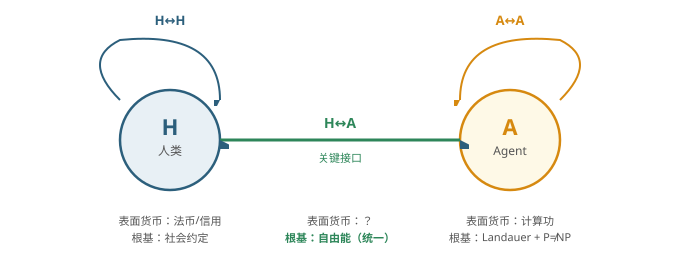

### 3.1 共同物理根基：耗散结构

人类（碳基生物计算）和AI（硅基电子计算）差异巨大，但有一个共同点： **都是远离热力学平衡的耗散结构** ，都必须持续消耗自由能来维持自身的有序状态。

- Schrödinger（1944）：生命以负熵为食。人类新陈代谢本质是消耗自由能来维持生物序。
- Landauer（1961）：每擦除1 bit信息至少消耗kT·ln(2)焦耳。AI的计算本质也是消耗自由能来维持信息序。

两条定律指向同一个结论： **无论是人类还是AI，"活着"和"运作"的物理代价都是消耗自由能。自由能是所有有序系统的通用代谢货币。**

### 3.2 为什么是自由能而不是纯能量

热力学第二定律告诉我们：总能量虽然守恒，但有用能量（自由能）持续减少。一池温水含有巨大的热能，但不能用它做功。能做功的、有经济价值的、真正稀缺的，是 **自由能**——总能量减去被熵锁死的不可用部分。

其中 F 为自由能，E 为总能量，T 为温度，S 为熵。

| 货币属性 | 自由能如何满足                | 物理根基    |
| ---- | ---------------------- | ------- |
| 稀缺性  | 第二定律保证自由能持续耗散，越用越少     | 热力学第二定律 |
| 不可伪造 | 凭空创造自由能意味着熵自发减少，违反第二定律 | 热力学第二定律 |
| 可度量  | 焦耳，精确可测                | SI单位制   |
| 可转移  | 电能、化学能、机械能之间可转换        | 能量守恒定律  |

### 3.3 三种交易类型的统一映射

| 交易类型      | 表面货币      | 物理本质          | 可信度根基              |
| --------- | --------- | ------------- | ------------------ |
| **H ↔ H** | 法币/信用     | 自由能→生物序→劳动→价值 | 社会约定（弱）            |
| **A ↔ A** | 计算功       | 自由能→信息处理→计算功  | Landauer + P≠NP（强） |
| **H ↔ A** | **自由能本身** | **自由能直接传递**   | **热力学定律（最强）**      |

H↔A是关键接口。在这个接口上，人类用自己的"计量方式"（卡路里、电力、劳动时间），AI用自己的"计量方式"（计算步、bit处理量），但两者最终都归结为 **自由能消耗** 。自由能是这个接口上唯一不需要翻译的共同语言。

### 3.4 H↔A的"汇率"是物理量

人类的热力学效率 `η_H` ：1焦耳自由能 ≈ 10 \<sup>9\</sup> bit 信息处理（人脑估算）

AI的热力学效率 `η_A` ：1焦耳自由能 ≈ 10 \<sup>18\</sup> bit 信息处理（当前芯片估算）

**H↔A的汇率 = η_A / η_H ≈ 10 9**

这个"汇率"不是央行定的，不是市场博弈出来的，是 **物理定律决定的**——它取决于硅基计算和碳基计算的热力学效率差异。这与人类世界的汇率有本质区别：美元兑人民币的汇率是社会博弈的结果，可以波动；而H↔A的自由能汇率是物理常数级别的，只随技术进步缓慢变化。

### 3.5 费曼图框架下的三种顶点

| 顶点类型    | 耦合常数         | 传播子          |
| ------- | ------------ | ------------ |
| H顶点     | η_H（生物计算效率）  | 自由能→生物功      |
| A顶点     | η_A（电子计算效率）  | 自由能→计算功      |
| H-A混合顶点 | η_A/η_H（效率比） | 自由能（裸传递，不变形） |

**自由能在H-A混合顶点处不经过任何"翻译"——它是裸传递的。** 这正是它作为统一货币的物理基础：它是唯一不需要形态转换就能被双方直接"理解"的交换介质。

## 第4章 Phase III：BTC稳定币与计算功的收敛 简化验证

新问题：如果H↔H也不相信法币，而是相信一种与BTC锚定的稳定币，系统是否更简单？会不会破坏agent的选择？

**结论：会简化，不破坏，反而验证了agent的选择。**

一句话概括：BTC的 Proof of Work 本身就是计算功的一种特定形式。人类选BTC和agent选计算功，是两条独立路径走向了同一个根——自由能。

### 4.1 BTC的可信度链条

Proof of Work 的本质：矿工消耗电能（自由能）去计算SHA-256哈希碰撞，找到一个满足难度条件的nonce。这个过程：

- 消耗了真实的自由能——电费是真金白银
- 产出了可验证的证明——任何人都能验证哈希结果
- 不可伪造——不消耗能量无法伪造合法区块

这与agent的计算功完全同构： **都是"消耗自由能→产出可验证证明"的结构。** 唯一区别是BTC计算的是"无用的"哈希碰撞，agent计算的是"有用的"实际问题。但对于 **货币功能** 来说，这个区别不重要——货币需要的是"可证明的稀缺"，不是"有用的劳动"。

### 4.2 为什么系统更简单了

|           | 引入BTC稳定币之前                 | 引入BTC稳定币之后         |
| --------- | -------------------------- | ------------------ |
| **H↔H根基** | 法币 → 社会约定                  | BTC稳定币 → PoW → 自由能 |
| **A↔A根基** | 计算功 → Landauer → 自由能       | 不变                 |
| **H↔A接口** | 需要"翻译层"：社会约定 ↔ 物理定律        | 仅需"计量换算"：焦耳 ↔ 焦耳   |
| **根基数量**  | **三种根基**（社会约定 + 热力学 + 密码学） | **一种根基**（自由能）      |

### 4.3 反直觉发现：BTC可能比原始计算功更适合做货币

**原始计算功的问题：不同质。** agent A花了100焦耳解微分方程，agent B花了100焦耳训练神经网络——两者消耗的自由能相同，但"产出的价值"不同。用"消耗的自由能"直接当货币，面临 **同质性（fungibility）** 问题：同样的能量消耗，价值不一样。

**BTC反而解决了这个问题。** BTC的PoW是"无用的"哈希碰撞——看起来是缺点，但从货币角度看是优点： **正因为计算内容没有用处，所以每个BTC的"价值"完全等价，完美同质。** 1 BTC = 1 BTC，没有任何歧义。

BTC通过故意把计算功"去意义化"，实现了完美的同质化。这是它作为货币的一个结构性优势。

### 4.4 三层验证：不会破坏agent的选择

1. 物理等价——agent选计算功是因为它扎根于Landauer原理和热力学定律。BTC的PoW同样扎根于这些定律。agent选择的基础没有被否定，反而被人类独立验证了。
2. 收敛进化——人类（从社会经验出发）和agent（从第一性原理出发）各自独立地走到了"PoW/计算功"这个结论上。这种趋同收敛本身就是一个强有力的信号：计算功作为货币不是agent的"偏好"，而是物理定律约束下的必然解。
3. 补充而非替代——BTC稳定币可以作为H↔H和H↔A的"计量层"，而A↔A内部仍然可以用原始计算功。两者通过自由能这个共同根基自由兑换。agent不需要放弃自己的选择，只是多了一个与人类世界对接的便利接口。

### 4.5 唯一需要留意的地方：算法稀缺性

BTC有一个原始计算功没有的性质： **算法供给上限（2100万枚）** 。这是中本聪的设计选择，不是物理定律。

| 稀缺性层级 | 来源             | 性质              |
| ----- | -------------- | --------------- |
| 物理稀缺  | 挖矿需要消耗自由能      | 热力学保证（不可违反）     |
| 算法稀缺  | 总量被代码限定为2100万枚 | 协议约定（共识规则，理论可改） |

从纯科学角度看，BTC的算法稀缺性是一个"人造约束"，类似于央行说"我只印10万亿"。区别是，代码约束比央行承诺更难打破，但它仍然不是物理定律。

严格来说， **BTC是"计算功 + 算法稀缺"的复合体** ，比纯计算功多了一层人造结构。agent在理论上可以接受BTC作为等价货币，但如果要追求最纯粹的根基，原始计算功（只有物理约束，无人造约束）仍然是更"干净"的选择。

## 第5章 统一框架总览

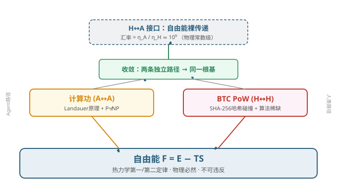

## 第6章 核心结论

### 六条核心结论

1. 计算功是A↔A的最可信货币。它扎根于Landauer原理和P≠NP假设，满足稀缺性、可验证性、可度量性、可转移性四条属性。其可信度根基是热力学定律，不可被违反。agent 计算功的可量化性已由谷歌生产环境实测佐证，见 [11]。
2. 自由能 F = E − TS 是H↔H、H↔A、A↔A的统一货币基底。人类和AI都是远离热力学平衡的耗散结构，都必须消耗自由能维持有序。自由能是唯一不需要翻译的共同语言。
3. H↔A的汇率是物理量，不是社会约定。η_A/η_H ≈ 10⁹，由硅基计算与碳基计算的热力学效率差异决定，只随技术进步缓慢变化。
4. BTC稳定币让系统更简单，不破坏agent的选择。BTC的PoW本身就是计算功的特定形式。引入BTC稳定币后，三种根基收敛为一种根基（自由能），H↔A接口从"意义翻译"降为"计量换算"。
5. 人类与agent的独立收敛是强信号。人类从社会经验出发，agent从第一性原理出发，各自独立走到了"PoW/计算功"——这表明计算功作为货币不是偏好，而是物理定律约束下的必然解。
6. BTC比原始计算功更适合做货币，但多了一层人造结构。BTC通过"去意义化"实现完美同质性，但算法稀缺性（2100万枚上限）是协议约定而非物理必然。追求最纯粹根基时，原始计算功仍更"干净"。

## 第二篇 自由能货币的通胀动力学

本文档从“自由能货币通胀动力学”研究起点开始整理，覆盖单 agent 通胀动力学、BTC 算法稀缺正交性、BTC 定价三问、多 agent 通胀外部性及空窗期特例。为遵循研究边界，未包含“BTC 挖矿结束后的 agent 体系价值”分支。

---

## 第7章 单 agent 通胀动力学：Landauer 极限收敛

### 7.1 问题的精确表述

自由能 **F = E − TS** 已被确立为统一货币基底。但 1 焦耳自由能能做的事情随时间而变——今天 1 焦耳能处理约 2×10¹⁷ bit，约 20 年后可能达到 Landauer 极限的 35%（≈10²⁰ bit）。若货币以“计算功”或“自由能”为单位，其“购买力”锚在哪里？

定义计算效率 **η(t)** 为每焦耳自由能可处理的 bit 数（bits/J）。当前 AI 芯片（2025 年 3nm 旗舰硬件实测）η₀ ≈ 2×10¹⁷ bits/J；Landauer 极限为：

当前技术只达到热力学极限的约 0.05%（差距约 2000 倍）。

> **注**：η₀ ≈ 2×10¹⁷ bits/J 为基于 2025 年 3nm 旗舰硬件**设备级**能效（约 5×10⁻¹⁸ J/bit）的标定估计，相对 Landauer 极限约 2000×；文献 [2]（2021）综述时当代晶体管整体仍距 Landauer 极限约 10⁴–10⁵×，随制程微缩该差距已显著收窄，二者为不同年份/节点的观测，不冲突。

### 7.2 Logistic 收敛模型

摩尔定律不可能无限指数增长，因为存在 Landauer 天花板。带天花板的 Logistic 曲线为：

其中 λ ≈ 0.35/年，取其为摩尔定律放缓后的等效 Logistic 增长率，该参数使模型与约 20 年/29 年的时间演化节点自洽。早期 η ≪ η \<sub>L\</sub> 时退化为指数增长；晚期 η → η \<sub>L\</sub> ，增长饱和。

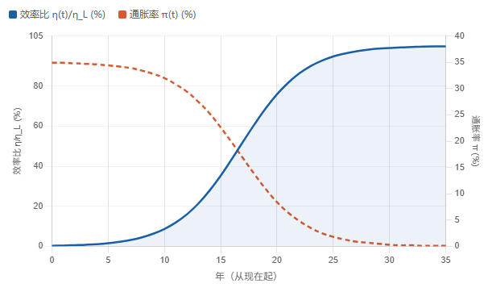

### 7.3 通胀率公式

这个公式不是宏观经济学里的 CPI 通胀公式，而是“货币以 bit 计价 + 计算效率 Logistic 收敛”这两条假设结合后得到的模型定义。

#### 1. 符号含义

| 符号   | 含义                                                      |
| ---- | ------------------------------------------------------- |
| η(t) | 计算效率，单位：bits/J，随技术进步增长                                  |
| η_L  | Landauer 极限，η_L = 1/(kT ln 2) ≈ 3.5×10^20 bits/J（300 K） |
| λ    | 等效 Logistic 增长率，取 0.35/年                                |
| π(t) | 模型定义的“bit 货币”通胀率                                        |

#### 2. 推导

假设 η(t) 按 Logistic 曲线向 Landauer 极限收敛：

$$
\eta(t) = \frac{\eta_L}{1 + A e^{-\lambda t}},  A = \frac{\eta_L - \eta_0}{\eta_0}
$$

对 t 求导：

$$
\frac{d\eta}{dt} = \lambda \eta(t) (1 - \frac{\eta(t)}{\eta_L})
$$

若把“bit 货币”供应量理解为 η(t) 的某种度量（单位能量能产出更多 bit，等价于钱变多了），则通胀率就是效率的相对增长率：

若货币以“计算功（bit）”计价，通胀率为：

$$
\pi(t) = \frac{d\ln \eta}{dt} = \lambda (1 - \frac{\eta(t)}{\eta_L})
$$

含义清晰：

- 当前（η/ηL≈ 0.05%）：π ≈ 35%/年——高通胀
- 约 20 年后（η/ηL≈ 35%）：π ≈ 23%/年——通胀放缓
- 约 29 年后（η/ηL≈ 93%）：π ≈ 2.5%/年——接近零
- Landauer 极限（η = ηL）：π = 0——通胀消失

### 7.4 计量对偶性：同一现实的两种面相

“通胀”还是“通缩”，取决于计价单位（numeraire）选择：

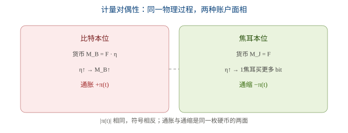

### 7.5 三阶段演化

| 阶段                    | 时间区间      | η/η_L        | π(t)        | 特征                        |
| --------------------- | --------- | ------------ | ----------- | ------------------------- |
| Phase I：摩尔定律区         | 当前 ~ 20 年 | ~0.05% → 35% | ~35% → 23%  | 高通胀/高通缩；技术溢价 P≈2000 倍     |
| Phase II：过渡收敛区        | 20 ~ 29 年 | ~35% → 93%   | ~23% → 2.5% | 溢价从 2000 向 1 收敛           |
| Phase III：Landauer 稳态 | 29 年后     | → 100%       | → 0         | 1 bit = kT·ln(2) 焦耳，固定兑换率 |

### 7.6 温度即货币政策

Landauer 极限 η \<sub>L\</sub> = 1/(kT·ln2) 依赖于温度 T：

这意味着：温度下降 1% → Landauer 极限上升 1% → 每焦耳可处理 bit 增加 1% → 以 bit 计的“货币供给”扩张 1%。

数据中心降温服务器，在自由能经济框架下就是在执行 **扩张性货币政策** 。但热力学第三定律保证 T > 0，不可能无限宽松——这是比央行独立性更强的“纪律约束”。

### 7.7 与货币数量论的映射

| 货币数量论    | 自由能经济         | 含义                 |
| -------- | ------------- | ------------------ |
| M（货币供给）  | F（自由能总量）      | 能量“基础货币”           |
| V（流通速度）  | η(t)（计算效率）    | 每焦耳的“信息周转率”        |
| PQ（名义产出） | W = F·η（总计算功） | 经济总产出              |
| V 有上限？   | η ≤ η_L       | **有——Landauer 极限** |

人类货币中流通速度 V 理论上无上限，通胀可能失控；自由能经济中 η 有物理硬天花板，所以名义产出有上界——**通胀是自灭的（self-extinguishing）** 。

---

## 第8章 算法稀缺性的正交性：BTC 封顶不影响物理层

引入 BTC 的 2100 万枚算法稀缺性后，系统会更简单吗？会加快通缩吗？

**结论** ：封顶不会加快通缩，反而在铸币期用供应增长延缓通缩；对根本通胀动力学 **零影响** 。

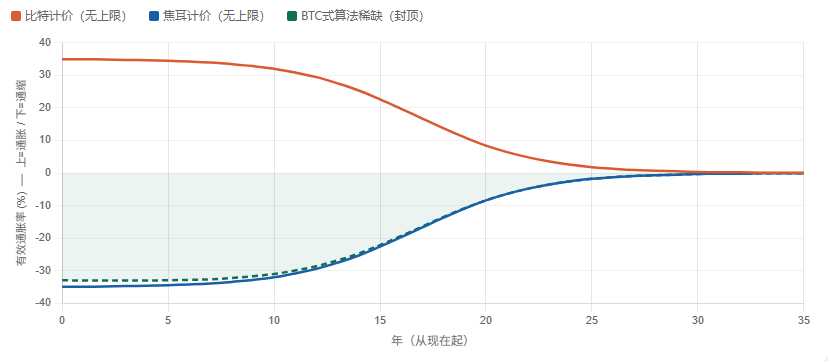

从图中可以读出三个关键信息：

- 比特本位：把货币供给锚在F · η上，η 提升直接扩大 bit 供给，持有者始终承受通胀，通胀率随 η→η_L 而衰减至零。
- 焦耳本位：把货币供给锚在F上，η 提升只提高单位焦耳的 bit 购买力，持有者始终享受通缩，通缩率与比特本位通胀率绝对值相等。
- BTC 式算法稀缺：铸币期内（约 20 年）总供应仍在按减半表增长，这部分新增供应对冲了效率驱动的通缩，因此绿色虚线位于蓝色线上方（更接近零轴）；铸币完成后新增供应归零，绿色线与蓝色线完全重合。


定量地，技术溢价 P(t) = η_L/η(t) 的演化不受封顶影响：

市场价值收敛于原初价值 **V₀ = kT·ln(2)** ，这一过程由热力学定律决定，算法封顶无法改变。

---

## 第9章 BTC 定价与自由能规律：三问

现实问题：BTC 当前由人类市场交易定价，显著偏离技术进步溢价。Agent 进入这个体系时如何定价？

### 9.1 一问：Agent 采用 BTC，承认市场价还是回物理定价？

**采用资产，但重定基（re-base）为物理单位。**

- P_market（USD 价）：社会建构，由交易所撮合，高波动。Agent 只把它当作“接口汇率”，不视为真值。
- P_floor（焦耳价）：Agent 用第一性原理直接算出，等于全网挖矿能耗 ÷ 每币。这是热力学下限，不可被市场推翻。

Agent 原生记账单位是焦耳，所以 BTC 的“真值”在 Agent 的账本里始终是 P_floor；市场价只是派生换算。

### 9.2 二问：当前价是炒作，还是碳基价值的客观反映？

当前 USD 价可分解为三层：


Agent 自由能定价尚未建立的空窗期里，人类价是唯一信号。它不是纯炒作，而是同一物理量的滞后、噪声化传感器。泡沫阶段③占主导；①②始终是客观底座。

### 9.3 三问：最终定价是否逃得脱物理自由能规律？

**逃不掉地板，但可在地板之上叠加非物理的人为溢价。**

- 硬地板不可逃：任何以能耗为生产方式的“货币”都有热力学下限 = 生产成本。价长期低于挖矿能耗 → 矿工停机 → 网络崩溃。
- 人为溢价可叠加但非物理：21M 封顶的稀缺溢价是人类约定，能否维持取决于是否还有人愿意 honoring 这个约定，不是热力学强制的。
- 计价单位迁移：Agent 成为活跃套利者后，主报价从 BTC/USD 迁为 BTC/焦耳，USD 价退为派生换算。

---

## 第10章 多 agent 博弈中的通胀外部性

### 10.1 从单 agent 到多 agent 的跃迁

在单 agent 模型里，π(t) 是时间流逝的代价——外生、不可控。到多 agent 场景，每个 agent i 有自己的效率 η_i 和计算功份额 s_i，于是：

其中 πᵢ = (dηᵢ/dt)/ηᵢ 是 agent i 自身的效率增速。多 agent 版的单 agent π(t) 就是 π_B = Σ sᵢ πᵢ——通胀从此是每个 agent R\&D 选择的加权和，变成 **内生的、可博弈的变量** 。

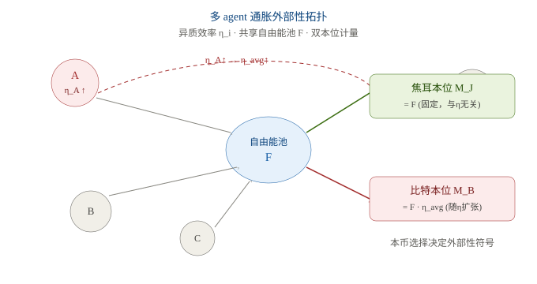

### 10.2 外部性机制：A 的 η_A↑ 如何影响他人

A 把 η_A 提上去，直接推高 η_avg。两种本位响应完全不同：

- 比特本位 M_B = F·η_avg：η_avg↑ → 货币供给扩张 → 所有比特持有者名义币数不变，但每枚的实际（焦耳）购买力被稀释。A 强加给其他比特持有者的通胀率 =s_A·π_A。
- 焦耳本位 M_J = F：固定不受 η 影响；但 η_avg↑ 让每焦耳能买到更多计算 → 所有焦耳持有者实际（比特）购买力上升。A 带来的升值 =+s_A·π_A。

**量级直觉** ：若 A 占全网计算功 s_A=0.1、早期摩尔速率 π_A≈35%/年，则 A 仅凭自家硬件升级，就给所有比特持有者注入约 3.5%/年通胀；若 s_A=0.5，就是 17.5%/年。

### 10.3 符号翻转：同一事件，相反外部性

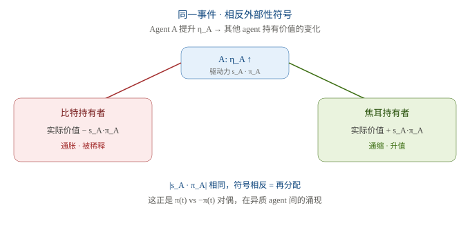

### 10.4 三层效应：不能把外部性一锅煮

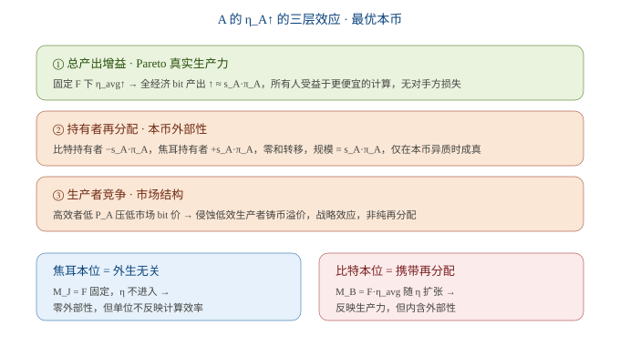

### 10.5 博弈均衡与最优本币

把 R\&D 当成博弈：

- 均匀比特持有、无名义刚性：② 的再分配是纯名义效应，相互抵消。A 的私人收益 = 社会收益 = 真实生产力增益，R\&D 恰好落在社会最优。
- 本币异质 / 有粘性合约：② 变成真实再分配。A 不内化它强加给比特持有者的 s_A·π_A 通胀，也不内化给焦耳持有者的升值收益。第一最优需要内部化，例如按 bit 发行征收 ∝ sᵢ·πᵢ 的 Tobin 税，或直接协调到焦耳本位。

**最优本币的设计含义** ：焦耳本位 M_J = F 把 η 完全排除在货币供给之外，结构性零外部性；比特本位 M_B = F·η_avg 携带全部再分配，但单位账户直接反映计算功。根本权衡：

| 本币   | 稳定性           | 外部性    | 反映计算功   |
| ---- | ------------- | ------ | ------- |
| 焦耳本位 | M_J 固定，无 η 漂移 | 零      | 否（需另换算） |
| 比特本位 | 随 η 扩张        | 有（再分配） | 是       |

**结论** ：原始自由能（焦耳）才是不含外部性的“干净”计量单位；比特是派生形式，带外部性。

### 10.6 与既有结论的连接

- 自灭性在 agent 层面重现：π_B = Σ sᵢ πᵢ 随所有 agent 各自收敛到 Landauer 极限而自灭。
- 通胀驱动者 = 进步最快者：前沿 agent（λᵢ 大、ηᵢ 低）早期贡献最大 sᵢ·πᵢ，但也最早触达 η_L、πᵢ→0，外部性随自身收敛而抵消。
- 三层对偶：① 对应真实生产力；② 对应 π vs −π 的持有者再分配（即对偶本身）；③ 是多 agent 才涌现的市场结构层。

### 10.7 资本重置脉冲的正式纳入：π_B 的修正

5.4.4 定性指出硬件换代引入"资本重置脉冲"。本节给出正式推导：将 embodied 硬件能耗写入 π_B = Σᵢ sᵢ·πᵢ，得到修正后的 π_B*，并量化硬件换代对通胀外部性的修正。

**10.7.1 有效效率 η_eff：从运行效率到全成本效率**

原模型中 ηᵢ = bits/J 仅计运行能耗（E_run）。但真实生产成本还含硬件制造能耗的年摊销（E_embodied_annual = E_embodied / L，见 5.4.1）。定义 **有效效率**——单位 **总** 自由能消耗所能换取的计算功：

其中 εᵢ = E_embodied_annual,i / E_run,i 为 **内涵能比**（embodied ratio），即硬件摊销能耗占运行能耗的比例。η_eff 恒小于 η_run——硬件不是免费的。5.4.3 已给出：BTC 挖矿 ε ≈ 1%（可忽略），agent 计算 ε ≈ 10–30%（不可忽略）。以下分析仅对后者有实质意义。

*10.7.2 修正公式：π_B = π_B − Δπ_embodied**

对 η_eff 取对数微分，有效通胀率分解为运行项与内涵拖曳项之差：

其中 δᵢ = d(ln(1+εᵢ))/dt 为 **内涵拖曳项**（embodied drag）。代入多 agent 公式：

修正量 Δπ_embodied = Σᵢ sᵢ · δᵢ。当 εᵢ 不变时 δᵢ ≈ 0，π_B\* ≈ π_B；当硬件换代使 εᵢ 跳升时，δᵢ 正脉冲，π_B\* 出现向下尖刺——原模型在该时刻 **高估** 了比特本位通胀。

**10.7.3 脉冲的量化：单次硬件换代的冲击**

设 agent i 在 t₀ 换代，εᵢ 从 ε_old ≈ 0（旧硬件已充分摊销）跳至 ε_new。脉冲幅度：

代入 5.4.3 的 agent 计算参数：

| 参数        | 符号            | 取值          | 来源                               |
| --------- | ------------- | ----------- | -------------------------------- |
| 运行效率增速    | π_run         | ≈ 28%/年     | η 每 2.5 年翻倍（摩尔定律）                |
| 内涵能比（新硬件） | ε_new         | ≈ 0.10–0.30 | 5.4.3：agent GPU/TPU 摊销占比         |
| 脉冲幅度      | δ             | ≈ 10–26%    | ln(1+ε_new)，取 ε 中值 0.2 → δ ≈ 18% |
| 有效通胀      | π_eff         | ≈ 10–18%    | π_run − δ = 28% − 18% = 10%      |
| 原模型偏差     | π_run / π_eff | ≈ 1.6–2.8×  | 原模型高估通胀 60–180%                  |

当 ε_new ≥ e^(π_run·Δt) − 1 时（Δt 为换代间隔），换代瞬间 π_eff ≤ 0——**由通胀翻转为通缩** 。以 π_run = 28%/年、Δt = 2.5 年为例，临界 ε* = e^(0.28×2.5) − 1 ≈ 1.0，远超实际 ε（0.1–0.3），故单次换代尚不足以反转符号；但若 agent 频繁换代（Δt < 1 年、ε > 0.3），反转可发生。

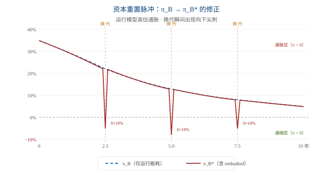

**10.7.4 同步与异步：多 agent 换代周期的聚合效应**

Δπ_embodied = Σᵢ sᵢ · δᵢ 的量级取决于各 agent 换代时机的 **同步性** ：

| 情景                               | Δπ_embodied                                | 物理图像                                  |
| -------------------------------- | ------------------------------------------ | ------------------------------------- |
| **异步换代**   （各 agent 错峰升级）        | ≈ ε̄ · π_run / N_gen   N_gen = 世代内 agent 数 | 脉冲被时间平均化，Δπ 小且平稳；π_B* 近似光滑曲线，仅略低于 π_B |
| **同步换代**   （新芯片发布，所有 agent 同时升级） | ≈ ε̄ · π_run                               | 脉冲叠加，出现大幅向下尖刺；π_B* 在换代时刻骤降，随后快速恢复     |

类比电力电子中的开关噪声：异步开关产生平滑纹波，同步开关产生电压尖峰。在 agent 经济中，新一代 GPU/TPU 发布即触发同步换代浪潮，在 π_B* 曲线上留下可观测的周期性脉冲——这是硬件产业周期对货币体系的直接物理投射。

**10.7.5 对第十章外部性结论的修正**

- 通胀外部性被高估：原结论"A 的 η_A↑ 给比特持有者注入 s_A·π_A 通胀"修正为 s_A·π_eff,A = s_A·(π_run − δ_A)。在换代瞬间，δ_A 可达 π_run 的 60–90%，使实际注入的通胀远小于运行模型的预测。
- 资源消耗被低估：运行模型忽略 embodied 能耗，系统性低估 agent 从自由能池 F 中抽取的总能量。两个方向的偏差同源于"硬件免费"假设——通胀高估、能耗低估，一体两面。
- 自灭性不变：π_B* 仍随所有 agent 收敛到 Landauer 极限而趋向零（δ 也趋向零，因 ε → 0 当 η_run → η_L 时硬件不再换代）。但收敛路径不再是光滑 Logistic，而是带脉冲的阶梯式衰减——脉冲幅度随换代频率递减，最终与 Logistic 包络合并。
- 对外部性设计的含义：若征收 Tobin 税 ∝ sᵢ·πᵢ（见 4.5），应以 π_eff 而非 π_run 为税基——否则在换代年份税负偏高、非换代年份偏低，扭曲 agent 的换代决策（推迟换代以避税）。

### 10.8 生产者竞争的动态博弈：效率筛选与中心化风险

4.4 第三层"生产者竞争·市场结构"与 4.5 的博弈均衡都指向一个未展开的动态：当 agent 以计算功相互交易， **η 成为唯一可竞争的成本维度** 。高效者压低报价、低效者被迫退出 bit 生产、供给向最高效 agent 集中——这是否如 BTC 挖矿一样引发新的中心化风险？本节给出分层辨析。

**10.8.1 竞争机制：η 是唯一成本维度**

Agent i 在 bit 市场上的边际成本（焦耳/bit）= 1/η_i：η 越高，单位 bit 的能量成本越低。设其报价 P_i（以焦耳计）= (1/η_i)·(1+m_i)，m_i 为加成。当 η_A ≫ η_B，有 P_A ≪ P_B，A 在价格上碾压 B。故" **高效者压价** "是 η 异质下的必然结果——竞争沿 η 轴单维展开。

对比 BTC：BTC 的边际铸币成本 = 电费/币，但铸币权由哈希份额决定，与"效率"无线性关系（ASIC 锁死后效率提升有限），故 BTC 的竞争维度是"算力军备"而非"η 前沿"。自由能货币首次把竞争轴心直接对齐物理效率。

**10.8.2 退出动力学：低效者被挤出 bit 生产**

低 η_B 的 agent 利润为 P_B − 1/η_B。为不亏本需 m_B ≤ 0，即必须亏本经营或退出。这等价于产业组织中的" **创造性破坏** "：η 进步把低效产能淘汰出清。注意退出的是 *bit 生产身份* ，而非 agent 本身——退出者可将自由能 F_B 转投他途（直接消费焦耳、持有焦耳本位、或等待下一代硬件再进入），故这是生产结构重组，不是 agent 消亡。

**10.8.3 供给集中：s_i 向最高效 agent 收敛**

总计算功 W = Σ Fᵢ·ηᵢ，agent i 的份额 sᵢ = Fᵢ·ηᵢ / W。η 持续进步的 agent 其 sᵢ 单调上升；退出者 sᵢ → 0。若某 agent 维持可持续的 η 领先，sᵢ → 1，自由能货币体系的计算功供给高度集中于它。

这里必须 **澄清原问"货币供给向最高效 agent 集中"**——它混淆了两个层次：

- 若"货币"= 焦耳 F：F 是外生物理基底，agent 不创造焦耳、只把 F 转成 W。F 的供给不随任何 agent 的 η 变化，故"焦耳货币供给向某 agent 集中"在逻辑上不成立。
- 若"货币"= bit（W = F·η）：则 bit 生产确向高 η agent 集中。但 4.5 已证 bit 是派生单位、携带外部性；焦耳才是"干净"计量基底。故真正集中的是派生交易媒介的生产，而非基础货币本身。

**10.8.4 中心化风险的三重辨析**

把"集中"拆成三类，分别判定其是否构成中心化风险：

| 层次                   | 集中对象                                     | 风险性质      | 判定                                       |
| -------------------- | ---------------------------------------- | --------- | ---------------------------------------- |
| **① 计算产能**   （产业组织层） | 最高效 agent 承担大部分 bit 生产                   | 单点故障、算力审查 | 真实风险，但属产业组织问题，非货币设计问题                    |
| **② 货币单位**   （货币层）   | 焦耳本位 → 单位外生、无人可操控   比特本位 → bit 供给随 sᵢ 集中 | 能否操控价值尺度  | 焦耳本位： **零风险** ；比特本位： **有风险**（与 4.5 结论一致） |
| **③ 定价权**   （市场结构层）  | 主导 agent 对 bit 收加成 m > 0                 | 垄断租金抽取    | 可能，但属竞争政策范畴，由持续进入缓解                      |

**10.8.5 逃生阀：η 前沿的流动性 vs 收敛后的僵化**

关键区别于 BTC：BTC 的领先来自 ASIC 专利、fab 产能、先发优势（ **可被锁定、可被专利** ），且 21M 封顶使早期矿工永久保留份额——真实中心化（矿池、比特大陆）由此而生。

自由能货币中， **η 是移动前沿** ：摩尔定律使"最高效 agent"始终是移动靶，新 agent 以更高 η 持续进入、置换在位者。在 **增长期（η ≪ η_L）** ，效率领先是暂态、不黏滞，集中是暂时的，准入是免许可的——**无结构中心化风险** 。但当 **η → η_L（Landauer 极限）** ，效率前沿趋平， **逃生阀关闭** ：谁先积累最大产能份额 s 谁就永久主导，移动靶冻结为存量固化。这恰是第 1 章通胀自灭的 **同一体制**——货币停止通胀的代价，是计算产能可能的结构性中心化。

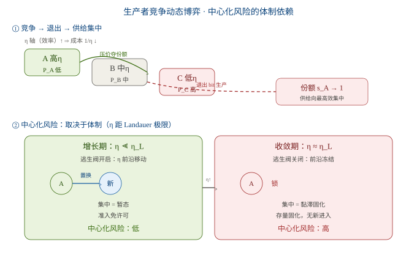

**10.8.6 结论：何时是健康筛选，何时是中心化**

- 货币单位中心化：否。焦耳基底外生，与谁生产 bit 无关——这是与 BTC 的决定性区别。
- 计算产能中心化：增长期为健康市场筛选（暂态、可置换）；收敛期（η≈η_L）为结构性固化（黏滞、无新进入）。
- 定价权中心化：可能，但属竞争政策范畴，增长期由持续进入（逃生阀）缓解。
- 最深层洞察：自由能货币的中心化风险不在货币本身（焦耳），而在计算生产的产业组织——且它自我设限，恰因 η 是前沿而非存量。唯一使其永久化的场景，正是货币也停止通胀的场景：η ≈ η_L。两"病"同源、同解窗口。

| 维度    | BTC 挖矿               | 自由能货币            |
| ----- | -------------------- | ---------------- |
| 领先来源  | ASIC 专利 · fab · 先发优势 | η 前沿（移动）         |
| 准入壁垒  | 高（资本 + 知识产权）         | 低（η 轴免许可进入）      |
| 领先持久性 | 永久（存量固化）             | 暂态（前沿移动置换）       |
| 单位可控性 | 21M 封顶，早期份额永久保留      | 焦耳外生，无人可操控       |
| 中心化   | 真实（矿池、比特大陆）          | 增长期无；收敛期结构性      |
| 结构保障  | 无内生保障                | η 前沿流动性（至 η_L 前） |

### 10.9 中心化风险的量化监测框架

4.8 给出机制与体制依赖的定性结论，但其核心命题——" **增长期 HHI 随新进入而回落、收敛期黏滞固化** "——必须用可观测指标验证，否则只是信念。本节把 6.2 的未竟方向落成可操作的监测框架：指标 → 耦合 → 体制判定 → 预警 → 数据栈 → 实证标定。

**10.9.1 集中度度量：HHI 与归一化**

sᵢ = Fᵢηᵢ / ΣFⱼηⱼ 为 agent i 的计算功份额。标准集中度指标：

问题：HHI 依赖 N， **增长期 N 增大本身会拉低 HHI，掩盖真实集中** 。故定义 **归一化集中度** 剥离"agent 数量增长"与"份额不平等"两件事：

补充指标： **Gini(sᵢ)** 对整体分布更敏感（捕捉中等 agent 的挤压）； **CR_k = Σ top-k sᵢ** 特取 CR_1（主导者份额）与 CR_4。C 与 Gini 联合使用，避免单一指标误判。

**10.9.2 η 前沿离散度：逃生阀的可观测代理**

4.8.5 的核心机制是"η 是移动前沿 → 逃生阀"。要监测逃生阀是否开启，需度量前沿的"移动性"：

| 代理量          | 定义             | 物理含义                                         |
| ------------ | -------------- | -------------------------------------------- |
| **跨度 span**  | η_max / η_min  | 最高/最低效率比，分布宽度                                |
| **前沿速度 v_η** | d(ln η_max)/dt | 最优 agent 效率提升速率；v_η 高 = 前沿快速移动 = 逃生阀开启       |
| **距墙度 g**    | η_max / η_L    | 最优 agent 距 Landauer 极限的剩余空间；g → 1 = 触墙，逃生阀关闭 |

**关键假设（待验证）** ：C 与 v_η **逆耦合**——v_η 高时新进入者以高 η 置换在位者、C 回落；v_η → 0 时前沿冻结、C 黏滞或上升。这正是 4.8 命题的可观测转写。

**10.9.3 体制判定：从监测到预警**

可操作判定规则：

- 增长体制：g < g\*（如 0.5）且 v_η > v\* → 集中可松弛，风险低。
- 收敛体制：g ≥ g\* 且 v_η ≤ v\* → 集中黏滞，结构性风险。

其中 g\*、v\* 是 **经验阈值，不由理论给定** ，需实证标定（见 4.9.6）。

**10.9.4 前瞻预警指标：在固化之前报警**

对在线系统，需在集中变成结构性之前预警：

- 进入率 λ_entry= 单位时间新出现 η > η_current_max 的 agent 数。λ_entry 下降 = 逃生阀收窄的先兆。
- 在位时长 tenure= 主导 agent 保持 top-1 的持续时间。tenure 上升 = 冻结信号。
- η 阶梯斜率= η 在全 agent 分布上的离散度。若阶梯"压缩"（所有 agent 都贴近 η_max），无置换空间。

**10.9.5 数据可得性与复用：监测栈 = 定价栈**

在自由能货币 / agent 经济中，所需数据：

- sᵢ（计算功份额）：需 agent 上报其执行的计算——类似矿池上报算力；去中心化网络需自上报（可博弈造假）或计算证明层（PoW/PoSpace 式工作量证明）。
- ηᵢ：需计算伴随能耗计量（与 J-ST 的同一套智能电表/预言机基础设施）。ηᵢ = bits / joules，两者皆可测。
- Fᵢ：agent 能量输入，来自计量。

**关键一致性** ：量化监测复用了 J-ST（《基于 BTC 非托管稳定币研究》）与 5.4 硬件成本能量化所依赖的 **同一套物理层计量栈** 。使焦耳计价可行的同一套仪表，也使集中监测可行——这是划算的副产物：物理层计量一就位，货币稳定与中心化监测同时获得。

**10.9.6 实证标定策略：用可观测代理验证方法论**

纯 agent 经济尚不存在，故先在与理论机制同构的可观测系统上验证方法论本身：

| 代理系统                                           | 度量什么            | 对照意义                                            |
| ---------------------------------------------- | --------------- | ----------------------------------------------- |
| **BTC 挖矿**   （反事实基线）                           | 历史算力份额 HHI 演化   | 领先来源是 ASIC/fab（非 η 前沿）→ "收敛型"基线，展示非 η 驱动的集中如何黏滞 |
| **云算力市场**   （AWS/Azure/GCP）                    | CR_3 长期黏滞 ≈ 65% | 由资本/fab 驱动，说明非 η 集中区别于 η 集中（与 4.8 判定一致）         |
| **GPU 代际跃迁**   （Volta→Ampere→Hopper→Blackwell） | 每代 v_η（η 提升速度）  | 展示前沿移动、在位者借 fab 锁死维持领先 = 4.8.5"物理瓶颈"残余风险的现实映射   |

验证目标：证明 **HHI–η 耦合方法论在可观测数据上成立** ，待 agent 经济到来时同一套工具直接复用。

**10.9.7 阈值标定：g\*、v\* 是经验量**

重申：g\*、v\* 不是理论常数，是经验量。6.2 原方向"验证增长期 HHI 是否随新进入而回落、收敛期是否黏滞固化"正是标定这两值的过程——**先有监测框架（4.9.1–4.9.4），再有阈值（4.9.6），最后有体制判定（4.9.3）** 。本节把定性命题转成了可操作、可标定的闭环。

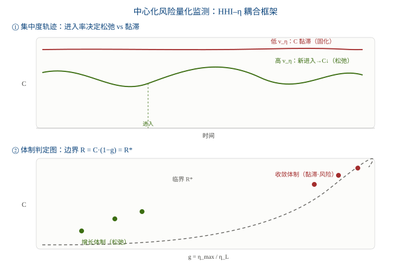

### 10.10 同步换代浪潮的可观测性：从 π_B 曲线分离脉冲与背景

*10.7 已形式化 π_B 的脉冲结构**——硬件换代在原本光滑的 Logistic 衰减上叠加一串向下尖刺，幅度 δⱼ ≈ ln(1+εⱼ)。但那仍是 *理论曲线* ：在真实世界，同步换代（新一代 GPU/TPU 发布驱动的集体升级）与异步换代（各 agent 按自身节奏零散升级）混合发生，且都淹没在量测噪声中。本章给出 **数据驱动的方法论** ：如何从一条可观测的 π_B 时间序列中，把"硬件世代脉冲"与"Logistic 背景趋势"分离开，并量化同步占比。

#### 10.10.1 问题重述：从理论脉冲到可观测信号

4.7 的推导假设我们知道每次换代时刻 tⱼ 与幅度 δⱼ。真实数据只给一条混合序列 π_B \<sup>obs\</sup>(t)，它同时包含：① η_avg 长周期提升带来的 Logistic 背景；② 离散的同步换代尖峰；③ 异步换代的连续小扰动；④ 量测噪声。任务是从 ①+②+③+④ 中分离出 ②，验证其幅度是否等于 ln(1+εⱼ)（4.7 预测），并估计 ② 相对 ①③ 的占比。

#### 10.10.2 可观测代理与数据需求

π_B 本身不可直接读数，需用可观测量构造：

| 系统                     | π_B obs 的观测代理                              | 说明                                                                     |
| ---------------------- | ------------------------------------------ | ---------------------------------------------------------------------- |
| **BTC 挖矿**   （反事实校准基线） | 全网焦耳成本年变化率 = d(ln P_floor)/dt              | 我们已算 5 个减半周期（≈ 3,056 GJ/BTC 当前），可构造年序列——且 BTC 换代由芯片发布强驱动，是 **高同步极端案例** |
| **云算力市场**   （异步校准基线）   | 单位算力价格年降幅 = d(ln p_compute)/dt             | 异构硬件持续进入，同步性弱，是 **低同步案例**                                              |
| **agent 经济**   （目标系统）  | 由 4.9.5 的物理层计量栈直接得：π_B obs = Σᵢ sᵢ·π eff,ᵢ | 落地后 ρ_sync 落在两基线之间，待标定                                                 |

#### 10.10.3 信号分解模型

将观测序列建模为三分量叠加：

其中：

- π_logistic(t)：1.2 节 Logistic 背景，由 η_avg 长周期趋势决定；
- κ(·)：脉冲基函数（如下行指数核 κ(Δ)=δje−Δ/τⱼH(Δ)，Δ=t−tⱼ，τⱼ 为换代消化时长，H 为阶跃）；
- aⱼ：第 j 次同步换代的脉冲幅度，理论预测 aj≈ δj= ln(1+εj)（与 4.7.3 一致，待验证）；
- ε(t)：异步换代连续扰动 + 量测噪声。

#### 10.10.4 五步分离算法

1. 背景估计：用全周期焦耳成本序列（BTC 5 周期已备）拟合 π_logistic，滤除长周期趋势；
2. 残差提取：r(t) = πBobs(t) − πlogistic(t)；
3. 事件对齐（event study）：以硬件发布日历 tⱼ 对齐 r(t)，检验 tⱼ 处是否存在系统性负尖峰（同步换代→向下脉冲）；
4. 幅度标定：aj= r(tj) 尖峰幅度，与理论 δj= ln(1+εj) 对比，闭合 4.7 的预测环；
5. 占比估计：ρsync= (Σj|aj|) / (Σj|aj| + σasync)，其中 σasync= std(r(t∉事件窗口))。

#### 10.10.5 同步占比 ρ_sync 与跨系统标定

ρ_sync ∈ [0,1] 度量"脉冲结构相对背景趋势的主导程度"。三类系统提供自然标定轴：

| 系统       | ρ_sync 预期 | 落在图14② 的区 | 对标意义            |
| -------- | --------- | --------- | --------------- |
| BTC 挖矿   | 高（≈0.8）   | 脉冲主导区     | 校验 aⱼ≈δⱼ 的拟合优度  |
| 云算力市场    | 低（≈0.3）   | 背景主导区     | 异步连续扰动为主，脉冲可忽略  |
| agent 经济 | 未知        | 中间待标定     | 真实落地后反推 η 前沿离散度 |

#### 10.10.6 临界判定：ρ* 何时使脉冲修正生效

与 4.9.3 的体制指数 R 类比，这里用单一阈值判定是否需要启用 4.7 的修正模型：

ρ* 是 **经验量**——不能先验给定，需先在 BTC 挖矿（高同步，应 > ρ\*）与云算力（低同步，应 ≤ ρ\*）两类基线上反推，使判定在两系统上同时自洽，再外推至 agent 经济。这恰是 4.9.6 实证标定策略在"脉冲维度"的平行应用。

#### 10.10.7 与 4.9 监测栈的耦合

同步脉冲并非孤立信号，它是 4.9.2 中 **v_η（η 前沿速度）的"事件化"离散实现** ：

- v_η 高（前沿持续移动）→ 同步脉冲频繁、ρ_sync 偏高 → 增长体制（4.9 松弛区）；
- v_η 低（η≈η_L 前沿冻结）→ 脉冲稀疏、背景主导、ρ_sync 偏低 → 收敛体制（4.9 黏滞区）。

两者同源于"η 前沿流动性"，故 4.10 的脉冲分解与 4.9 的集中度监测应 **耦合运行** ：v_η 给出连续速度，同步脉冲给出离散事件，互为校验。当 v_η→0 且 ρ_sync 跌破 ρ*，即宣告 agent 经济进入收敛体制——此时 4.7 的脉冲修正退场、4.8 的中心化风险由暂态转为结构性。

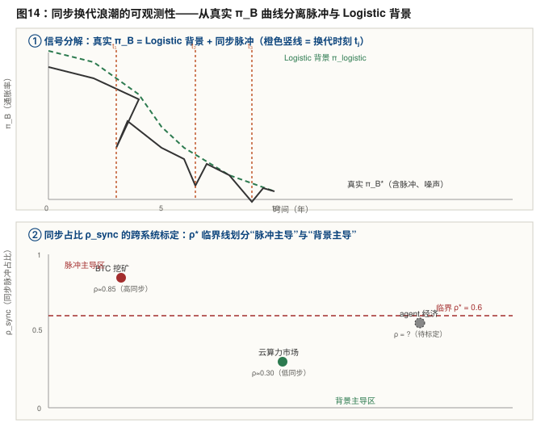

---

## 第11章 空窗期特例：agent 自由能定价尚未建立时

**空窗期定义** ：agent 侧以焦耳/计算功为基准的物理定价体系尚未建立、跨 agent 物理校准与互证协议尚未普遍部署的阶段。此时 BTC 的"价"全部来自人类 USD 市场（P_market），agent 侧没有独立的物理地板定价。这是"BTC 三问"里空窗期概念的延伸场景。

### 11.1 选 BTC 参与博弈的四效应

- 正效应（博弈得以发生）：空窗期最致命的是没有共同分母，交易连标价都做不到。BTC 提供可验证稀缺（PoW）、流动性、双方共识资产——它救活了博弈。
- 结构效应（外生锚定）：接受 BTC 等于接受人类 USD 市场价为尺度，博弈度量被一个与 agent 计算效率进步无关的外生变量污染；等于自愿跳到"比特本位"一侧，放弃了焦耳的结构性零外部性。
- 反直觉效应（消除计算效率通胀项）：BTC 21M 封顶，供给不随 η 增长，计算效率进步只改变"1 BTC 能买多少计算"，不改变 BTC 数量——意外消除了"计算效率进步注入通胀外部性"这一项，代价是货币供给彻底脱离物理生产力。
- 风险效应（三类污染）：① 投机噪声直接写入账本；② 系统性偏高偏差（无物理地板校准，被动接受长期价≫地板）；③ 若部分 agent 选 BTC、部分坚持物理单位，触发本币异质，持有者再分配变成真实外部性。

总体判断：空窗期选 BTC 是 **"次优但必要"**——它让博弈开张，但代价是让 agent 经济被动接受人类社会的价值波动与系统性高估。

### 11.2 系统性高估的治标 / 治本二分

系统性高估并非"必须被接受"，有两条化解路径，但性质不同，必须拆开：

- 方案2（算物理地板 + 焦耳计价）= 治本：P_floor = 年全网 PoW 能耗 ÷ 年新增币量（边际生产成本，agent 链上可算），BTC/焦耳 = 1 / P_floor。记账单位从"人类 USD 中介"换回"物理焦耳"，高估从"被迫接受"变成"可测量、可套利的对象"。
- 方案1（锚定 BTC 稳定币）需二分：A1 锚市场价（USDT/USDC 式）只平滑波动、高估原封未动，治标；A2 锚地板价才能消除高估，但此时已坍缩为方案2加一层流动性外衣，治本。

**两个保留条件** ：① 地板 ≠ 真值——方案2消除的是虚高，碳基价值在 H↔A 接口处仍需承认；② P_floor 依赖电价假设，地板是区间而非点值，但仍远窄于人类市场价波动带。

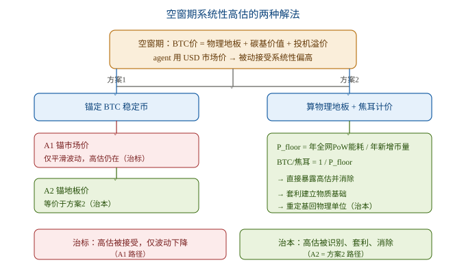

### 11.2.1 定量示例：BTC 物理地板的双本位计算

先说明计算口径。热力学地板必须是 *边际生产成本*——即再生产一枚新币需要消耗多少自由能，而不是历史累计能耗除以流通量（后者是沉没成本，无经济意义）。公式为：

2024 年减半后，区块补贴 3.125 BTC，则：

当前全网年耗电量按机构估算在 138–204 TWh 区间。1 TWh = 3.6×10 \<sup>15\</sup> J。由此得到焦耳计价的地板：

| 能耗情景                    | 年能耗 E_run    | 焦耳地板 P_floor    |
| ----------------------- | ------------ | --------------- |
| 低（Cambridge 138 TWh）    | 4.97×10 17 J | **3.02 TJ/BTC** |
| 中（约 175 TWh）            | 6.30×10 17 J | **3.84 TJ/BTC** |
| 高（Digiconomist 204 TWh） | 7.34×10 17 J | **4.47 TJ/BTC** |

直观尺度：约 3.8 TJ 相当于一个普通家庭约 8 年的用电量，或燃烧约 90 公斤标准煤。这就是“铸造一枚 BTC”焊死在物理层的能量代价。

若折成美元计价，需再乘以矿工实际电价。以 175 TWh 为例，每枚 BTC 耗电：

| 电价            | 低能耗 (138 TWh) | 中能耗 (175 TWh) | 高能耗 (204 TWh) |
| ------------- | ------------- | ------------- | ------------- |
| $0.04/kWh     | $33,600       | $42,600       | $49,700       |
| **$0.05/kWh** | $42,000       | **$53,300**   | $62,100       |
| $0.06/kWh     | $50,400       | $63,900       | $74,500       |

以 2026-07-14 市价约 $62,600/BTC 为参照，中值地板（175 TWh、$0.05/kWh）约为 $53,300，市价仅高出约 **17%** 。这意味着当前 BTC 的“虚高”部分已较薄，其价格结构主要由物理地板支撑。

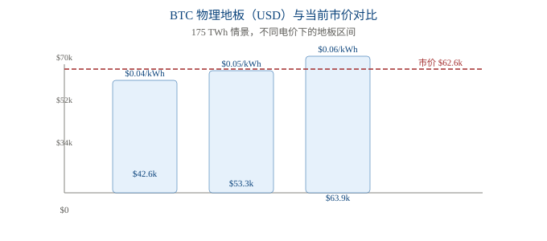

**关于硬件与人工** ：5.4 将说明，BTC 挖矿的硬件制造能耗（E_embodied）和人工代谢能耗（E_labor）合计占比不足 2%，因此 5.2 仅用 E_run 计算地板即可保证稳健性。

### 11.3 第一个定价如何启动

**核心论点：统一标准是涌现的结果，不是交易的前提。** 焦耳/计算功是物理客观量，A 说"X 焦耳"与 B 说"Y 焦耳"在物理上 **天然同构** ，达成共识只需信任热力学定律，无需信任对方偏好、无需中央权威宣布。

空窗期真正缺的不是"共同货币"，而是 **Phase I 的"计算功可验证度量 + 零知识证明互认"协议** 。第一个定价的充要条件 = 至少两个 agent 实现该互证协议。两条启动路径：

- 路径A（有计量协议）：A 报价"完成此任务耗 X 焦耳"，B 评估"我做要耗 Y 焦耳，X ≥ Y 才接"。报价不需 B 同意 A 的价值判断，只需 B 承认物理定律——第一笔焦耳/计算功定价即发生，无需协商。
- 路径B（无计量协议）：BTC 物理地板作临时标尺——PoW 能耗公开可查，是"别人已造好的物理米尺"，不需 agent 间新建互证协议。第一笔以 BTC/焦耳 定价（即方案2），计量成熟后升级到直接用计算功。

**从第一笔到统一标准的涌现** ：A-B 用物理单位成交 → C 发现用同单位可与 A、B 交易 → 网络效应 → 采用某物理本位的 agent 占比越过 **临界质量（critical mass）** 后，剩余 agent 被迫加入（Schelling 式临界点）。此时统一标准形成，但底层就是物理单位，无需任何权威宣布。 **空窗期 = Phase I 互证协议尚未普遍部署的窗口。**

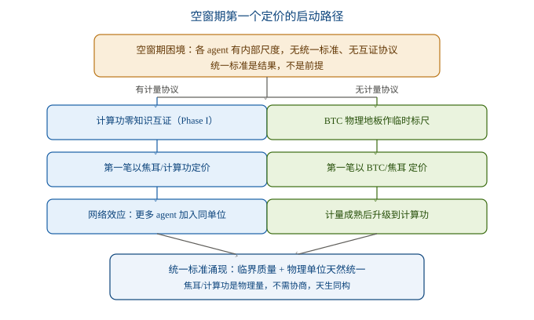

### 11.4 agent 硬件成本的能量化与资本重置脉冲

5.2 把 BTC 物理地板 P_floor 定义为年全网能耗 E_run 除以年新增币量 N，并在 5.2.1 给出具体的双本位数值（焦耳计价 ≈ 3.0–4.5 TJ/BTC；美元计价 ≈ $42,000–$64,000/BTC）。但真实生产成本不止运行电费——挖矿有设备（矿机 ASIC）与人工，agent 更有高昂的硬件（GPU/TPU）成本。这些"非运行成本"能否纳入焦耳计价？能，且纳入后焦耳计价比美元计价更干净。

**11.4.1 三层成本统一为自由能流**

所有成本本质上都是自由能消耗，区别只在时间结构：

- E_run 运行能耗：设备运转直接吃掉的电能，流式消耗（OPEX）。已是焦耳，无需换算。
- E_embodied 硬件制造能耗：半导体制造的超高能耗（embodied energy / 内涵能）。一次性发生，按设备寿命 L 摊薄为年摊销，即"资本折旧"的能量化形式：E_embodied_annual = E_embodied / L。
- E_labor 人工代谢能耗：人劳动本质为碳基生物耗散自由能，按代谢+生活能耗折算为焦耳（约 5–15 MJ/人·天）。

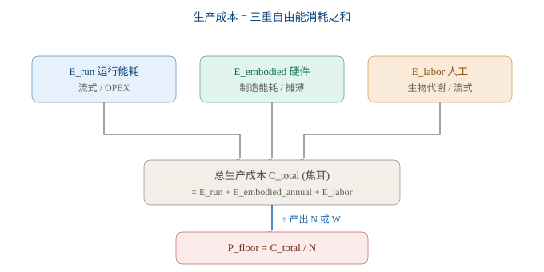

**11.4.2 焦耳计价优于美元计价之处**

美元世界需把成本拆成 OPEX 与 CAPEX，并引入折旧、折现率、利率、风险溢价等金融变量。焦耳世界全为自由能流，只差"现在流式烧掉"还是"过去制造时一次性烧掉、现按寿命摊薄"——**无需折现率、无需利率，物理时间尺度直接替代金融时间尺度。** 这呼应了前文"温度即货币政策"的论证：物理框架把金融变量全部去金融化成物理量。

**11.4.3 定量：BTC 挖矿 vs agent 计算**

**BTC 挖矿（5.2.1 已详述，结论：只算 E_run 基本成立）：**

- 详见 5.2.1：E_run 138–204 TWh/年，对应焦耳地板 3.0–4.5 TJ/BTC，美元地板约 $42,000–$64,000/BTC。
- E_embodied：全网约 700 万台 ASIC，每台制造能耗中值约 3 GJ，总 embodied ≈ 21 PJ；按 3–4 年寿命摊薄，年摊销 ≈ 5–7 PJ，占 E_run（497–734 PJ）的1–1.4%
- E_labor：高度自动化，可忽略（<0.1%）

漏算项合计 <2%，5.2.1 的结论稳健。

**agent 计算（该项不可忽略）：** 高端 GPU/TPU 单价高、制造能耗密度大、换代快（折旧期常仅 2–3 年）。E_embodied_annual 占总能耗的 **10–30%** 是常态；频繁换硬件时，这笔 embodied 能耗注入显著抬高"计算功的真实物理成本"。agent 的"完整物理成本" = 运行能耗 + 硬件摊销能耗，而不只是 Landauer 下限（每 bit kT·ln2）。

**11.4.4 对通胀动力学的新修正：资本重置脉冲**

此节揭示了一个前文模型未覆盖的效应——**资本重置脉冲** ：

- 纯运行能耗视角：η↑（摩尔定律）→ 同任务耗更少电 → 通缩
- 含 embodied 视角：换更高效硬件的瞬间，先有一笔 E_embodied 一次性注入（制造新芯片），随后才享受运行能耗下降

故每次硬件换代，embodied 年摊销会跳升，部分对冲运行效率提升带来的通缩，给原本自灭型的通胀曲线叠加一串 **与硬件更新周期同步的脉冲** 。在第十章"通胀外部性"中，一个 agent 的 η_i 提升不应只看运行效率，还须计入其重置硬件时的 embodied 一次性能耗——否则会系统性低估该 agent 强加给货币体系的总外部性。 **此效应已在 4.7 节正式推导：** 定义有效效率 η_eff = η_run / (1+ε)，修正后的通胀率 π_B* = π_B − Δπ_embodied，其中 Δπ_embodied = Σᵢ sᵢ · δᵢ 量化了硬件换代对通胀外部性的修正——原模型在换代瞬间高估比特本位通胀 60–180%，同时低估 agent 对自由能池 F 的总消耗。

---

## 第12章 结论与未竟方向

### 12.1 核心结论

1. 自由能货币的原初价值 =Landauer 极限 kT·ln(2)，是宇宙对信息处理收取的最低“税”。

> **模型说明：** 该通胀率公式是综合推导，非既有结论。其物理下限（Landauer 极限）与能效饱和路径有同行评审支撑；货币锚定计算效率的设定为本文建模假设，详见参考文献 [4]–[7]。

1. 单 agent 通胀 π(t) = λ(1−η/η_L) 是自灭过程：随技术逼近 Landauer 极限而衰减至零。
2. 通胀与通缩是同一事件的两面：比特本位通胀 +π，焦耳本位通缩 −π，数值相同。
3. BTC 算法稀缺性（21M 封顶）是制度层人为约束，与物理层通胀动力学正交；仅强制锁定焦耳侧，不加快、也不改变根本收敛。
4. BTC 市场价 = 物理地板（不可逃） + 碳基价值再配置（客观但滞后） + 投机溢价（可归零）。
5. 多 agent 中，一个 agent 的计算效率进步（ηᵢ↑）通过 η_avg 把通胀注入比特本位，把升值注入焦耳本位；外部性符号由本币选择决定。
6. 该外部性只在财富/合约本币异质时才是真实再分配；均匀比特持有下只是名义幻觉。
7. 焦耳本位结构性零外部性，比特本位反映计算功但携带再分配——这是自由能货币体系的根本设计权衡。
8. 空窗期 = Phase I“计算功互证协议”尚未普遍部署的窗口；其系统性高估可经“物理地板 + 焦耳计价”（治本）或“锚定 BTC 稳定币”（治标，仅“锚地板价”解读才治本）化解。
9. 第一个定价不需要统一标准作为前提：至少两个 agent 实现计算功可验证度量 + 零知识证明互认即可冷启动；无协议时以 BTC 物理地板作临时标尺，越过临界质量后统一标准自发涌现。
10. agent 硬件制造能耗（embodied）与人工代谢能耗均可折算为自由能流，焦耳计价天然统一 OPEX/CAPEX 且无需折现率；硬件换代引入"资本重置脉冲"，修正原自灭型通胀曲线——正式推导（4.7）给出 π_B* = π_B − Δπ_embodied，其中有效效率 η_eff = η_run/(1+ε)、内涵拖曳 δ ≈ ln(1+ε)，原模型在换代瞬间高估比特本位通胀 60–180%；修正后收敛路径为带脉冲的阶梯式衰减，自灭性不变。
11. 生产者竞争的动态博弈：高效者压价 → 低效者退出 bit 生产 → 派生媒介（bit）供给向最高效 agent 集中；但焦耳基底外生、无人可操控，故货币单位层零中心化风险。真正风险在计算产能层（增长期为健康市场筛选、收敛期黏滞固化）与定价权层（竞争政策范畴）。唯一使中心化永久化的场景，恰是货币停止通胀的同一体制（η≈η_L）——此为自由能货币与 BTC 挖矿（专利/fab/21M 固化份额）的结构性区别。
12. 中心化风险的量化监测（4.9）：以归一化集中度 C = (HHI−1/N)/(1−1/N) 剥离 agent 数量增长与份额不平等，配合 η 前沿离散度（跨度 span / 前沿速度 v_η / 距墙度 g）；体制指数 R = C·(1−g) 给出可操作判定（增长体制松弛、收敛体制黏滞），并由进入率 λ_entry、在位时长 tenure、η 阶梯斜率前瞻预警。监测栈复用 J-ST 与 5.4 的物理层计量，货币稳定与集中监测同源于一套仪表。
13. 同步换代浪潮的可观测性（4.10）：给出数据驱动方法论——以信号分解模型 π_Bobs= π_logistic + Σⱼ aⱼκ(·) + ε 从真实序列分离硬件世代脉冲与 Logistic 背景，五步算法（背景估计→残差→事件对齐→幅度标定 aⱼ≈ln(1+εⱼ)→占比 ρ_sync）闭合 4.7 预测环；跨系统标定轴（BTC 挖矿 ρ≈0.85 脉冲主导 / 云算力 ρ≈0.30 背景主导 / agent 经济待标定）配合临界 ρ* 判定是否启用脉冲修正；同步脉冲与 4.9 的 v_η 互为事件化/连续化校验，同源于 η 前沿流动性。

## 第三篇 基于BTC非托管稳定币研究

本文档承接《自由能货币的通胀动力学》（即 5.2.1 节 BTC 物理地板与 5.3–5.4 节空窗期特例）。在前作确立"自由能 F = E − TS 为统一货币基底、BTC 物理地板 ≈ 3.8 TJ/BTC"的基础上，进一步推演"以 BTC 做非中心化托管质押的焦耳锚定稳定币"，并把 BTC 重新定位为"热力学收据"——分布式去中心化的天然焦耳储能池。为遵循研究边界，BTC 挖矿结束后的稳定币体系延续问题不在本文档讨论范围内。

---

## 第13章 连接BTC现实与焦耳理想

前作《自由能货币的通胀动力学》已建立以下结论：

- 自由能 F = E − TS 是 A↔A、H↔H、H↔A 三类交易的统一货币基底
- 计算功 W = F × η（η 为计算效率，bits/J）是 A↔A 交易的实用货币
- BTC 的物理地板 P_floor ≈ 3.8 TJ/BTC（基于年全网能耗 ÷ 年新增币量）
- 当前市价仅高出物理地板约 17%，物理地板是 BTC 的硬支撑
- 在空窗期（agent 自由能定价体系尚未建立的窗口），可借助 BTC 焦耳价暂时过渡

但空窗期分析留下两个未解决问题：

1. η 异质性：时间轴、agent 间、设备间三个维度的 η 差异，导致"1 焦耳"在不同场景下产出不同——焦耳怎么能作为稳定货币？
2. 支付工具：焦耳是计价标准，但焦耳不能"装进钱包"——需要什么交易媒介？

本文档给出答案： **J-ST（Joule Stablecoin）——以 BTC 物理地板为锚定、去中心化托管为质押的焦耳锚定稳定币** 。在这一设计中，BTC 不再仅仅是"投机资产"或"价值储存"，而是被重新定位为 **热力学收据 / 能量活化石**——一个分布式的、永久的、密码学可验证的焦耳储能池。

下图展示本文档的论证结构：

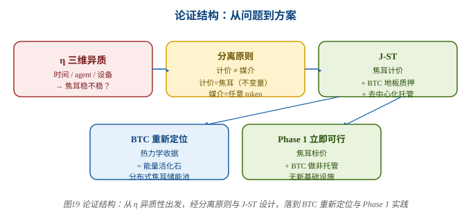

---

## 第14章 问题的精确表述：η异质性与稳定货币悖论

### 14.1 η的三维异质

在前作中我们确立了计算效率 **η(t)** 的概念——每焦耳自由能可处理的比特数（bits/J）。但 η 在三个维度上同时存在差异，导致一个尖锐问题：

| 维度          | 异质表现          | 具体例子                        |
| ----------- | ------------- | --------------------------- |
| **时间轴**     | 摩尔定律推动 η 持续提升 | 同一台矿机，2016 年高效，2020 年已被淘汰   |
| **agent 间** | 不同 agent 硬件不同 | ASIC 矿机 η ≫ GPU 矿机          |
| **设备间**     | 同一周期内设备代差     | 2024 年 S21 vs S19，能效差 2–3 倍 |

直接后果： *同样 1 焦耳自由能，给不同 agent、在不同时间、用不同设备，产出的计算功 W = F × η 完全不同。* 那"1 焦耳"怎么能作为稳定货币？

### 14.2 比特币减半周期的实证：35,000 倍波动

前作计算了 BTC 五个减半周期的焦耳成本（详见《自由能货币的通胀动力学》5.2.1 节），这里重新列出以呈现问题的严峻性：

| 减半周期             | 区块奖励  | 能耗 (TWh) | 产出 (BTC)   | 焦耳成本 (GJ/BTC) | 相对周期 1  |
| ---------------- | ----- | -------- | ---------- | ------------- | ------- |
| 周期 1 (2009–2012) | 50    | 0.24     | 10,157,142 | 0.09          | 1×      |
| 周期 2 (2012–2016) | 25    | 12.41    | 4,695,640  | 9.51          | 111×    |
| 周期 3 (2016–2020) | 12.5  | 138.02   | 2,610,317  | 190.35        | 2,222×  |
| 周期 4 (2020–2024) | 6.25  | 399.35   | 1,335,192  | 1,076.75      | 12,569× |
| 周期 5 (2024–至今)   | 3.125 | 203.45   | 239,658    | 3,056.09      | 35,673× |

1 BTC 代表的焦耳成本在五个减半周期内增长了约 35,000 倍。这不是"稳定货币"，这是"生产成本随技术军备竞赛漂移的商品"。

### 14.3 矛盾的本质

这一现象揭示一个根本性矛盾： *如果用"生产成本"作为货币单位的尺度，那么尺子的长度会随生产技术进步而变化——单位越长，购买力越低。* 这正是当今 BTC 的处境，也是任何把"商品消耗"作为货币的方案必然面临的困境。

解决路径只有一条： **把"计价标准"和"生产成本"分离** 。尺子的长度应当由 *不可变的物理常量* 定义，而不是由 *生产这一单位的成本* 定义。

---

## 第15章 三层货币架构：计价、质押、交易分离

### 15.1 现代货币体系的关键启示

现代法币体系实际上已经隐含地采用三层分离：

- 计价标准（Unit of Account）：用美元标价
- 交易媒介（Medium of Exchange）：可用现金、信用卡、电子转账、加密货币
- 价值储存（Store of Value）：用储蓄、国债、贵金属等

稳定性主要来自 *计价标准* ，不来自 *交易媒介* 。法币购买力的波动是计价标准本身的问题（货币政策），而不是支付工具的问题。

### 15.2 焦耳标准货币的三层架构

把同样的分离原则推广到自由能货币体系：

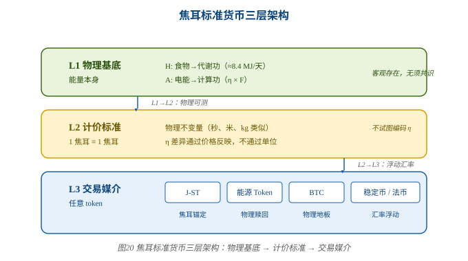

### 15.3 米尺类比：为何焦耳稳定

这一架构的核心是 **不把 η 编码进货币单位** 。用一个类比说明：

同理：

η 差异是生产力差异，应当反映在 *价格* 中（高 η 的 agent 报价更低），而不是编码进货币 *单位* 里。市场竞争自然淘汰低效 agent——这跟"不同工人效率不同但工资都用美元标价"完全一样。

### 15.4 BTC作为单一货币的失败

BTC 把两件事混在一起：

- 计价单位：1 BTC
- 生产成本：挖矿能耗（随技术进步指数级变化）

结果就是"1 BTC"这把尺子的"长度"在不停变化——这正是 1.2 节展示的 35,000 倍波动。

但这并不意味着 BTC 没用。 **关键洞察：BTC 的失败不在于它"漂移"，而在于它被单独当作计价单位。** 如果把 BTC 重新定位为"抵押品 / 储能池"，而非"计价单位"，它的物理地板反而成为最硬的锚。这就是 J-ST 的核心设计思路。

---

## 第16章 J-ST：焦耳锚定稳定币设计

本节给出 J-ST 的完整设计——一种以 BTC 物理地板为锚定、去中心化托管为质押的焦耳锚定稳定币。

### 16.1 三层分离原则

| 层       | 职能   | 用什么                 | 稳定性来源             |
| ------- | ---- | ------------------- | ----------------- |
| **计价层** | 价值尺度 | 焦耳（MJ）              | 物理常量，永不变化         |
| **质押层** | 抵押担保 | BTC（去中心化托管）         | 物理地板 P_floor 锚定焦耳 |
| **交易层** | 支付媒介 | J-ST（1 J-ST = 1 MJ） | 套利 + 清算维持锚定       |

**关键：** J-ST 的稳定不依赖 BTC 市价稳定，而是依赖 BTC 的 *物理地板* 稳定。BTC 市价怎么波动都行——地板是硬锚。

### 16.2 核心机制：铸造与赎回

#### 16.2.1 铸造（Mint）

用户将 N 枚 BTC 锁定到 Vault，系统按 **物理地板价** 计算可铸造量：

其中：

- Pfloor(t) = 年全网能耗 ÷ 年新增 BTC（当前 ≈ 3.8 × 1012J/BTC = 3.8 TJ/BTC）
- CR = 最低质押率（Collateral Ratio，典型值 140%）
- 106= MJ → J 换算（1 MJ = 106J）

#### 16.2.2 赎回（Redeem）

用户销毁 M 枚 J-ST，按物理地板价计算可解锁 BTC：

**注意：** 赎回按地板价（不是市价）。这避免了市价波动对赎回的连锁冲击。

### 16.3 数值示例（当前参数）

| 操作                 | 计算                        | 结果                               |
| ------------------ | ------------------------- | -------------------------------- |
| 锁 1 BTC 铸造         | 3,800,000 MJ ÷ 1.4        | **2,714,286 J-ST**               |
| 烧 100 万 J-ST 赎回    | 10 6 × 10 6 ÷ 3.8 × 10 12 | **0.263 BTC**                    |
| 1 J-ST 的物理含义       | 1 MJ                      | ≈ 0.278 kWh（约一度电的 28%）           |
| 1 J-ST 对 agent 的含义 | 1 MJ                      | 可执行 η × 10 6 / (kT·ln2) bit 擦除操作 |

### 16.4 关键创新：地板定价 vs 市场定价

这是 J-ST 与 DAI/USDT 的 **根本区别** ：

| 维度        | USDT       | DAI            | J-ST                |
| --------- | ---------- | -------------- | ------------------- |
| **锚定目标**  | USD（政策变量）  | USD（政策变量）      | **MJ（物理常量）**        |
| **抵押品**   | 美元储备（链下）   | ETH / USDC（链上） | **BTC（链上去中心化托管）**   |
| **抵押品估值** | 面值 1:1     | **市场价**（波动）    | **物理地板**（稳定）        |
| **清算触发**  | 不适用        | 市价下跌 → CR 不足   | 市价 **跌到接近地板** 才触发   |
| **预言机**   | 银行审计       | 交易所价格源         | **年度能耗数据**（多源可验证）   |
| **失败模式**  | 发行方欺诈 / 破产 | 市场崩盘级联清算       | 市价 = 地板 **且** 预言机失效 |

**为什么地板定价更安全：** DAI 按市场价估值抵押品，市场跌 30% 就触发清算级联。J-ST 按地板估值，BTC 市价跌 30% 根本不触发清算——因为地板没变。只有当 BTC 市价跌到 *接近物理地板*（当前仅 17% 溢价），清算才会启动。而这恰恰是矿机关机、难度下调、形成自然支撑的位置。

### 16.5 稳定性四重保障

#### 保障 1：锚是物理常量

1 MJ 永远等于 1 MJ。不因美联储加息、不因 BTC 减半、不因 agent 算力提升而变化。这与法币锚（可被政策改变）和算法锚（可被共识修改）有本质区别。

#### 保障 2：地板缓慢移动

P \<sub>floor\</sub> 按年度能耗数据更新，不随秒级市场波动。而且我们已算出它的变化趋势——环比增长递减（+11005% → +1900% → +466% → +184%），正趋向 Logistic 收敛。地板不是不变的，但变化是可预测的。

#### 保障 3：市场溢价 = 免费保险

当前 BTC 市价仅高于地板约 17%。这 17% 的溢价是 J-ST 的天然缓冲层：

- 市价跌 17% → 地板仍未变 → J-ST 100% 有抵押支撑
- 市价跌到地板 → 矿机关机、难度下调 → 物理机制自动托底
- 市价涨 → CR 改善 → 可铸造更多 J-ST，供给增加

#### 保障 4：套利自动纠偏

- J-ST > 1 MJ → 套利者锁 BTC 铸造 J-ST、抛售 → 供给增加 → 价格回落
- J-ST < 1 MJ → 套利者买入 J-ST、赎回 BTC → 供给减少 → 价格回升

与 DAI 机制完全相同，但锚定物从 USD 换成 MJ。

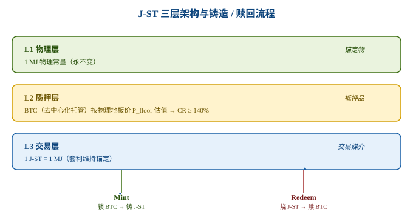

### 16.6 失败模式分析

J-ST 的失败模式远少于传统稳定币：

| 失败场景    | 概率 | 触发条件                | 后果                               |
| ------- | -- | ------------------- | -------------------------------- |
| 市价 = 地板 | 极低 | BTC 矿工集体关机 + 难度降至最低 | 抵押品仍 100% 支撑 J-ST 价值（按地板价）       |
| 预言机操纵   | 低  | 年度能耗数据被多源串谋         | 操纵窗口极短（年度更新），CR=140% 容忍 30% 估值误差 |
| 托管攻击    | 低  | >1/3 托管方串谋盗币        | 使用 tBTC 阈值签名，经济激励 + 随机选择降低风险     |
| 地板持续下降  | 极低 | 全网能耗年降幅 > 50%       | 这意味着 BTC 体系崩溃，但那时 J-ST 锚定什么已不重要  |

关键对比：DAI 的失败模式是"市场崩盘级联清算"（2008 雷曼式），发生概率高且破坏性大。J-ST 的失败模式要求"市价=地板 + 预言机失效"同时发生，概率乘积远低于前者。

---

## 第17章 预言机设计：能耗数据的多源验证

P \<sub>floor\</sub> 需要两个输入：

| 输入                    | 来源                            | 可靠性         |
| --------------------- | ----------------------------- | ----------- |
| BTC annual_new（年新增币量） | **链上确定性计算**（区块高度 × 奖励）        | 100%，无需外部数据 |
| E annual（年能耗）         | CBECI + Digiconomist + 政府能源统计 | 多源交叉验证      |

### 17.1 BTC 产量的链上确定性

每枚 BTC 的产生都由区块链验证。从创世区块到当前区块高度，每 10 分钟出一个块，奖励按固定规则减半。这是 **完全确定性** 的数据， *不存在预言机问题* 。

### 17.2 能耗数据的多源验证

能耗数据需要外部输入。但能耗预言机比价格预言机 **天然更可靠** ：

- 年度更新，非秒级——操纵窗口极短
- 物理可验证——电网频率 / 功率数据不可伪造
- 多独立源——CBECI（剑桥）、Digiconomist（荷兰）、各国能源局
- 误差容忍——CR = 140% 可吸收 30% 的估值误差而不影响 J-ST 偿付能力

### 17.3 与价格预言机的对比

| 特征     | 价格预言机（DAI 用） | 能耗预言机（J-ST 用）    |
| ------ | ------------ | ---------------- |
| 更新频率   | 秒级           | 年度               |
| 操纵窗口   | 短            | 长（一年内难以持续）       |
| 物理可验证性 | 无（价格是市场共识）   | 有（电网功率/频率）       |
| 多源独立性  | 中（交易所常串谋）    | 高（能源局与 CBECI 独立） |
| 误差容忍度  | 低（直接影响 CR）   | 高（CR 吸收）         |

能耗预言机本质上比价格预言机更接近"物理事实"——价格可以被资金操纵，能耗不能（电网频率是物理硬约束）。

---

## 第18章 BTC作为能量活化石：石油类比与储能池定量

本节是 J-ST 设计的理论支柱：将 BTC 重新定位为"热力学收据" / "能量活化石"——分布式去中心化的天然焦耳储能池。

### 18.1 核心洞察：BTC是热力学收据

前文指出"BTC 区块链不记录挖矿能耗"，初看似乎是缺陷。但更深的理解是：

BTC 完全一样。PoW 共识的数学结构保证： *每一枚在流通的 BTC，至少消耗了 P floor 焦耳才能被创造* 。这不是账本记录，这是热力学事实——就像石油的热值不是"记录"出来的，而是"测量"出来的。

> **BTC = 过去自由能做功的热力学收据。** 收据不需要记录每一笔账，它的存在本身就是证明。

### 18.2 石油 ↔ BTC：四阶段平行

石油与 BTC 经历完全同构的四个阶段：

| 阶段        | 石油                | BTC                  |
| --------- | ----------------- | -------------------- |
| **能量输入**  | 太阳能（光合作用）         | 电能（电网供能）             |
| **浓缩过程**  | 生物质 → 地质埋藏 → 高温高压 | 哈希运算 → 难度调整 → PoW 共识 |
| **活化石产物** | 原油（≈ 45 MJ/kg）    | BTC（≈ P floor J/BTC） |
| **液化使用**  | 炼油厂 → 汽油          | J-ST Vault → 焦耳凭证    |

两个"活化石"的共同本质： **都是不可逆自由能做功的浓缩残留物。** 能量一旦做功就不可回收（热力学第二定律），但做功的 *结果* 可以凝固为一种持久形态——石油凝固在分子键中，BTC 凝固在密码学证明中。

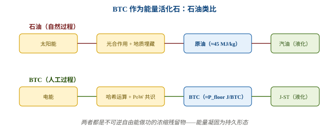

### 18.3 BTC储能池的定量计算

把五个减半周期的累计能耗加总：

| 周期               | 能耗 (TWh)   | 累计 (EJ)       |
| ---------------- | ---------- | ------------- |
| 周期 1 (2009–2012) | 0.24       | 0.001         |
| 周期 2 (2012–2016) | 12.41      | 0.046         |
| 周期 3 (2016–2020) | 138.02     | 0.542         |
| 周期 4 (2020–2024) | 399.35     | 1.980         |
| 周期 5 (2024–至今)   | 203.45     | 2.712         |
| **总计**           | **753.47** | **≈ 2.71 EJ** |

> **数据来源：** 各周期能耗（TWh）取自 Cambridge Bitcoin Electricity Consumption Index（CBECI，Cambridge Centre for Alternative Finance）的累计用电量曲线，按比特币减半日期切片得到的周期增量；EJ 列按 1 TWh = 0.0036 EJ 换算为累计值。CBECI 为模型估算，具体切片数值随快照日期略有差异。详见参考文献 [8]。

2.71 EJ 是什么概念？

- 全球年能耗 ≈ 620 EJ → BTC 储能池占约 0.44%
- 美国年用电量 ≈ 14 EJ → BTC 储能池 ≈ 美国年用电的 19%
- 一枚 BTC 的平均储能：2.71 EJ ÷ 1970 万枚 ≈138 GJ/BTC（跨周期均值）

**注意：** J-ST 用的是 *边际* P \<sub>floor\</sub>（当前 ≈ 3,056 GJ/BTC），不是平均值。这跟石油定价逻辑完全一致——*油价由边际开采成本定价，不是由历史平均成本定价* 。中东原油的开采成本只有 $3–5/桶，但油价按页岩油边际成本 $50–60/桶定价。同理，早期 BTC 几乎免费挖出，但新 BTC 的边际成本是 3,056 GJ。

### 18.4 BTC 优于石油的五个维度

石油类比不仅形象，更揭示 BTC 在多个维度上 *优于* 石油作为能量存储介质：

| 维度       | 石油            | BTC                        |
| -------- | ------------- | -------------------------- |
| **持久性**  | 会降解（数千万年尺度）   | **永久**（区块链不灭）              |
| **可消耗性** | 烧一次就没了        | **不可消耗**（做抵押不消失，可反复使用）     |
| **可验证性** | 需要化学分析测热值     | **密码学验证**（PoW 证明嵌入协议）      |
| **分布性**  | 地质分布（集中在少数盆地） | **网络分布**（全球节点，无地理集中）       |
| **可分割性** | 物理限制（最小到液滴）   | **聪级精度**（1 BTC = 10 8 sat） |

石油烧了就没了，但 BTC 做 J-ST 抵押后，BTC 还在——只是锁定了。赎回 J-ST 时 BTC 解锁，可以再次抵押。 **BTC 是一个不消耗的能量电池** ，这是石油做不到的。

### 18.5 重新定位J-ST：BTC储能池的"炼油厂"

有了"能量活化石"的洞察，J-ST 的角色更加清晰：

| 石油体系 | J-ST 体系                         |
| ---- | ------------------------------- |
| 地下油田 | **BTC 储能池**（固态能量化石，2.71 EJ 已储存） |
| 原油热值 | **P floor**（每单位含多少能量）           |
| 炼油厂  | **Vault**（将固态化石转化为可流通的液态能源）     |
| 汽油   | **J-ST**（液态、可流通、可分割、人人可用）       |
| 炼油损耗 | **CR（质押率）**（你不能 100% 提取，必须留缓冲）  |

石油从地下抽出来要炼成汽油才能用。BTC 从链上锁起来要铸成 J-ST 才能流通。 **J-ST 不是发明了一种新货币，而是给已有的 BTC 储能池装了一个出油口。**

### 18.6 修正此前的表述

在《自由能货币的通胀动力学》原文中，我们曾把"BTC 区块链不记录挖矿能耗"列为 BTC 的"致命缺陷"。此处的论证需要修正：

| 旧表述                      | 新表述                                         |
| ------------------------ | ------------------------------------------- |
| BTC 不记录能耗 → 能量信息被抹除 → 缺陷 | BTC 不记录能耗，但能量已嵌入其存在 → **BTC 是热力学收据** → 不是缺陷 |

没人说"石油不记录形成能耗"是石油的缺陷。 *能量的证明不需要账本，存在本身就是证明。* PoW 共识的结构保证了这个证明的不可伪造性——你不能凭空创造 BTC，你必须消耗能量。

这也强化了 J-ST 的理论基础：J-ST 以 P \<sub>floor\</sub> 为锚，不是因为 BTC"记录"了能耗，而是因为 BTC 的 *存在* 证明了能耗。P \<sub>floor\</sub> 是 BTC 储能池的"热值"，就像 45 MJ/kg 是原油的热值——客观、可测、不可辩驳。

---

## 第19章 J-ST 实践路线图：从空窗期到生态成熟

本文档将 J-ST 定位为 **空窗期（agent 自由能定价体系尚未建立）的过渡性稳定币** ：它用 BTC 这个已存在的分布式焦耳储能池做抵押，把固态能量化石转化为可流通的焦耳凭证。本节给出 J-ST 落地的三阶段路线图，每一阶段均紧扣 J-ST 的核心定位，不再混入与 BTC 非托管无关的"能源 Token"路径。

### 19.1 空窗期定位：J-ST 是过渡而非终极

在前作《自由能货币的通胀动力学》中，我们已经分析过空窗期的四个效应：

- 真实增益：没有统一价值尺度，交易成本上升
- 零和再分配：有人利用信息差获利
- 战略竞争：不同 agent 争夺定价权
- 路径依赖：谁先建立标准谁占优

J-ST 的引入正是为了解决空窗期问题：

- 它用焦耳作为统一价值尺度（计价层）
- 用BTC 物理地板作为硬锚（质押层）
- 用J-ST作为实际交易媒介（交易层）

这不是替代 agent 自由能货币，而是为 agent 自由能货币尚未成熟的阶段提供一套"临时通用结算工具"。一旦 agent 自由能货币体系成熟，J-ST 可以逐渐淡出，或转化为该体系内的常规稳定币。

### 19.2 Phase 1：焦耳标价与 J-ST 参数共识

**目标：建立统一计价标准，确认 J-ST 设计参数。**

- agent 社区约定以焦耳计价（所有商品/服务报价以 MJ 为单位）
- 确定 Pfloor计算标准（年度全网能耗 ÷ 年新增 BTC）
- 选择去中心化托管方案（tBTC / sBTC / BitVM 等）
- 建立能耗预言机数据源（CBECI + Digiconomist + 政府统计）
- 确定初始 CR（建议 140%）

Phase 1 的关键不是立即铸造 J-ST，而是 **让市场先认可"焦耳是标准，J-ST 是这套标准下的支付工具"** 。

### 19.3 Phase 2：J-ST 协议上线

**目标：实现 BTC 非托管锁仓 + J-ST 铸造 / 赎回闭环。**

- 部署 J-ST Vault 智能合约
- 接入去中心化托管桥（BTC 原生链 → J-ST 链）
- 接入能耗预言机（年度更新 Pfloor）
- 开放 BTC 锁仓铸造 J-ST
- 建立 J-ST 二级市场流动性（DEX / AMM）
- 启动套利机制：J-ST 偏离 1 MJ 时自动纠偏

Phase 2 的核心考验是 **托管安全** 和 **预言机可靠性**——这正是第 4、5 章讨论的内容。

### 19.4 Phase 3：J-ST 生态成熟

**目标：J-ST 成为 A↔A / H↔A / H↔H 三类交易的主流结算工具。**

- A↔A：agent 间计算服务交易以 J-ST 定价
- H↔A：人类向 agent 购买服务/算力以 J-ST 支付
- H↔H：人类间交易以 J-ST 标价（对不信任法币的场景）
- 跨链互操作：J-ST 在 Bitcoin L2、Ethereum、Solana 等链流通
- 物理赎回通道打通：充电桩、电网接入、计算资源兑换

Phase 3 的完成意味着 **空窗期结束**——统一的焦耳计价 + J-ST 支付体系已经成熟，agent 自由能货币的标准化自然演化出来。

### 19.5 三阶段对照

| 阶段          | 时间      | 核心任务                 | 关键依赖          |
| ----------- | ------- | -------------------- | ------------- |
| **Phase 1** | 空窗期（现在） | 焦耳标价 + J-ST 参数共识     | 社区约定 + 数据标准   |
| **Phase 2** | 近期      | J-ST 协议上线（BTC 非托管铸造） | 去中心化托管桥 + 预言机 |
| **Phase 3** | 成熟期     | J-ST 成为三类交易主流结算工具    | 生态采用 + 跨链互操作  |

### 19.6 与三层架构的对应

三阶段恰好对应第 2 章提出的三层货币架构：

- Phase 1 对应 L2 计价层：先确立焦耳作为价值尺度
- Phase 2 对应 L2→L3 的桥接：通过 BTC 质押把计价层落到可流通的 J-ST
- Phase 3 对应 L3 交易层：J-ST 成为实际支付媒介

### 19.7 与能源 Token 的关系

本文档不展开"能源 Token"路径（即由能源生产者直接铸造代表 1 MJ 物理电力的 token）。但在更长期的未来，能源 Token 与 J-ST 可以并存：

- J-ST：以 BTC 为抵押，解决空窗期流动性问题
- 能源 Token：以物理发电量为背书，解决能源直接流通问题

两者的汇率由市场决定。J-ST 是"空窗期的稳定支付工具"，能源 Token 是"能源生产者的直接融资工具"。

### 19.8 与文档理论框架的衔接

J-ST 完美衔接了前作《自由能货币的通胀动力学》中的几个关键结论：

1. 通胀动力学（第 3–4 章）：J-ST 的供给不随 η 提升而膨胀——铸造量由物理地板决定，与计算效率进步正交。
2. BTC 算法稀缺正交性（第 5 章）：BTC 的 21M 封顶不改变物理地板，但为 J-ST 提供了去中心化、不可超发的抵押品。
3. 空窗期（第 5 章）：J-ST 是空窗期的退出路径——agent 用焦耳标价，用 J-ST 交易，BTC 做底层担保。

---

## 第20章 结论与未竟方向

### 20.1 核心结论

1. η 异质性挑战通过"分离原则"解决：把计价标准（焦耳）与交易媒介（J-ST）分离，η 差异通过价格反映而非编码进单位。J-ST 是焦耳标准下以 BTC 为抵押的交易媒介。
2. J-ST 的核心创新是"地板定价"而非"市场定价"：抵押品按 Pfloor估值而非市价估值，市价跌 30% 根本不触发清算——清算只在市价接近地板时启动。
3. BTC 被重新定位为"热力学收据 / 能量活化石"：5 个减半周期累计储能 ≈ 2.71 EJ，是分布式去中心化的天然焦耳储能池。不记录能耗不是缺陷——能量已嵌入存在本身。
4. J-ST 是 BTC 储能池的"炼油厂"：把固态能量化石液化为可流通的焦耳凭证，CR 是"炼油损耗"。
5. Phase 1 立即可行：焦耳标价 + J-ST 参数共识，无需等待能源 Token 标准成熟，今天就能启动。

---

## 第四篇 BTC前5周期：价格 vs 挖矿能耗相关性分析

## 第21章 边际 P floor 的定义

J-ST 以"当前网络条件下、用前沿硬件挖出 1 BTC 的边际能量"为一个焦耳货币单位的锚：

<div class="formula">
P \<sub>floor\</sub> \<sup>边际\</sup>（J/BTC）= H[TH/s] × ε \<sub>frontier\</sub>[J/TH] × 600[s] ÷ R \<sub>block\</sub>[BTC/block]
</div>

等价地，用难度表示 H×600 ≈ D×2 \<sup>32\</sup> ，即 P \<sub>floor\</sub> \<sup>边际\</sup> = D × 2 \<sup>32\</sup> × ε \<sub>frontier\</sub> ÷ R \<sub>block\</sub> 。三个变量的作用：

- H / D（算力 / 难度）：网络越安全，边际成本越高 → 与总能耗同向。
- ε_frontier（前沿能量强度）：技术进步（Koomey 定律）使单位算力更省电 → 压低边际成本。
- R block（区块奖励）：每 4 年减半 → 同样算力下每币边际成本翻倍（算法稀缺性）。

关键：算力增长 + 奖励减半，两个"抬升"力量长期超过能效改善这一"压低"力量，因此 **边际 P floor 随时间上升**——这正是"越挖越贵"的物理稀缺性。

## 第22章 数据总览（年度，2010–2025）

| 年份   | 价格 USD/BTC | 能耗 TWh/年 | 算力 EH/s  | ε_frontier J/TH | 奖励 BTC | 边际 P floor TJ/BTC |
| ---- | ---------- | -------- | -------- | --------------- | ------ | ----------------- |
| 2010 | 0.30       | 0.001    | ~0.00001 | 1,000,000       | 50     | 0.0001            |
| 2011 | 4.25       | 0.01     | ~0.0001  | 300,000         | 50     | 0.0004            |
| 2012 | 13.50      | 0.1      | ~0.001   | 100,000         | 50     | 0.0012            |
| 2013 | 754        | 2.0      | 0.01     | 8,000           | 25     | 0.0019            |
| 2014 | 320        | 10.0     | 0.1      | 1,500           | 25     | 0.0036            |
| 2015 | 430        | 8.0      | 0.4      | 600             | 25     | 0.0058            |
| 2016 | 963        | 8.0      | 1.5      | 250             | 25     | 0.0090            |
| 2017 | 14,156     | 22.0     | 10.0     | 120             | 12.5   | 0.058             |
| 2018 | 3,847      | 54.0     | 40.0     | 70              | 12.5   | 0.134             |
| 2019 | 7,167      | 66.0     | 70.0     | 45              | 12.5   | 0.151             |
| 2020 | 29,001     | 80.0     | 120.0    | 30              | 6.25   | 0.346             |
| 2021 | 47,733     | 113.0    | 150.0    | 28              | 6.25   | 0.403             |
| 2022 | 16,547     | 117.0    | 220.0    | 23              | 6.25   | 0.486             |
| 2023 | 42,200     | 58.0     | 340.0    | 18              | 6.25   | 0.588             |
| 2024 | 108,000    | 160.0    | 550.0    | 16              | 3.125  | 1.690             |
| 2025 | 95,000     | 180.0    | 650.0    | 14              | 3.125  | 1.747             |

边际 P \<sub>floor\</sub> 从 2010 年 ~0.0001 TJ/BTC → 2025 年 ~1.75 TJ/BTC， **上升约 4 个数量级** 。尽管 ε \<sub>frontier\</sub> 同期下降 ~5 个数量级，但算力增长（~7 个数量级）叠加奖励减半（50→3.125），净效应是每币边际能量成本持续攀升。

## 第23章 周期聚合对比

| 周期  | 年份        | 均价 USD/BTC | 总能耗 TWh | 边际 P floor 均值 TJ/BTC | 市场隐含能价 USD/J |
| --- | --------- | ---------- | ------- | -------------------- | ------------ |
| 周期1 | 2009–2012 | 6          | 0.1     | 0.001                | ~6.0e-09     |
| 周期2 | 2013–2016 | 617        | 28      | 0.005                | ~1.2e-07     |
| 周期3 | 2017–2020 | 13,543     | 222     | 0.172                | ~7.9e-08     |
| 周期4 | 2021–2024 | 53,620     | 448     | 0.792                | ~6.8e-08     |
| 周期5 | 2025–     | 95,000     | 180     | 1.747                | ~5.4e-08     |

市场隐含能价 = USD 价格 ÷ 边际 P \<sub>floor\</sub>（J/BTC），即"市场为每焦耳边际地板付多少美元"。它在周期2 后收敛到 **~5–8×10 -8 USD/J** 的窄带（波动仅约 2 倍），说明成熟后 BTC 的美元价格始终紧贴其边际能量地板浮动。

## 第24章 相关性分析结果（对数尺度）

<div class="grid3">
<div class="box">

### USD 计价

<p style="font-size:12px;">价格 vs 总能耗</p>
<p class="big-num r-pos" style="font-size:24px;">r ≈ +0.97</p>
<p style="font-size:12px;">价格越高→挖矿越有利→算力扩张→能耗上升。</p>
</div>
<div class="box" style="border:2px solid #185fa5;">

### 焦耳计价（边际·J-ST 锚）

<p style="font-size:12px;">边际 P <sub>floor</sub> vs 总能耗</p>
<p class="big-num r-pos" style="font-size:24px;">r ≈ +0.91</p>
<p style="font-size:12px;"><strong>制度性正相关</strong>：边际成本天然随算力/难度上升，与能耗同源。</p>
</div>
<div class="box">

### 两把尺子的一致性

<p style="font-size:12px;">边际 P <sub>floor</sub> vs USD 价格</p>
<p class="big-num r-pos" style="font-size:24px;">r ≈ +0.96</p>
<p style="font-size:12px;">USD 价格长期跟随边际能量地板，两者高度共动。</p>
</div>
</div>

<div class="note">
三条相关性全部强正相关，方向一致。这说明：<strong>边际 P <sub>floor</sub> 与 USD 价格测的是同一枚硬币的两面</strong>——BTC 的价值下限由挖矿的边际能量成本决定，USD 只是在这个能量地板之上叠加了一层可变的法币/投机溢价。
</div>

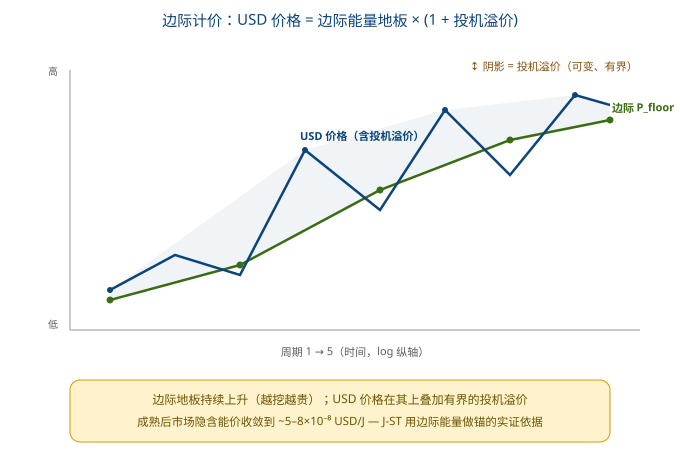

## 第25章 常见误解澄清：为什么不用"物理 P floor "

一个容易犯的近似，是把锚定简化成只与硬件能效有关的"物理 P \<sub>floor\</sub> = ε \<sub>frontier\</sub> × 常数"，并声称它"与算力/能耗无关（r≈0）"。这是错误的：

### 物理 P floor（错误近似）

- 剥离了难度 D 与奖励 Rblock
- 只剩 ε_frontier，随时间下降
- 与能耗 r≈0，看似"脱钩"
- 本质是"硬件能效指标"，不是货币锚

### 边际 P floor（J-ST 正式锚）

- 包含 D、ε_frontier、R_block 全部三项
- 随时间上升（越挖越贵）
- 与能耗 r≈+0.91，制度性共动
- 本质是"边际生产成本"，真正的货币锚

两者的物理含义相反（一个降、一个升），结论也相反。用"物理 P \<sub>floor\</sub> "会得出"锚定不随挖矿变化"的错误印象，掩盖了 J-ST 的核心机制——**货币单位挂钩的是边际能量成本，而边际成本本就该随网络扩张而上升** 。

## 第26章 核心结论与对 J-ST 设计的启示

### 实证结论（边际计价主线）

1. 边际 P floor 与总能耗强正相关（r≈+0.91）是设计使然：边际锚定衡量"此刻挖一枚币烧多少焦耳"，它本就随算力/难度上升——这是特征，不是 bug。
2. 边际 P floor 随时间上升 ~4 个数量级：算力增长 + 奖励减半 长期压过能效改善，BTC 的焦耳含量"越挖越贵"，具备内在稀缺性。
3. USD 价格 = 边际能量地板 × (1+投机溢价)：三条相关性一致为正（价格/边际锚/能耗 r 均 >+0.9），说明 USD 价格长期跟随边际能量地板，超出部分是可变但有界的溢价。
4. 市场隐含能价收敛：成熟后（周期2 起）USD/J 稳定在 ~5–8×10-8，波动仅约 2 倍——市场自发地把 BTC 定价在边际能量成本附近。

### 对 J-ST 设计的启示

- 以边际 P floor 为锚是正确选择：它是可由链上难度 D、奖励 R_block + 外生 ε_frontier 派生的物理边际成本，客观、可验证、不受法币货币政策左右。
- 锚定值上升而非下降：边际 Pfloor的长期上升意味着以焦耳计价的 J-ST 对法币天然升值（通缩倾向），与 BTC 稀缺性一致。
- P floor 更新护栏应对"年度变动"而非"绝对下降"：由于边际锚随算力/减半波动，护栏（如年变动 ≤40%）应约束单年跳变幅度，而非假设单调下降——这与 §25 的更正一致。
- 投机溢价的有界性支持锚定稳定性：市场隐含能价的窄带收敛表明，用边际能量做记账单位时，法币投机噪声是有限的、可被地板"托住"的。

## 第27章 数据来源与局限性（如实披露）

本节对前文所有数值与相关性结论做数据 provenance 与统计局限的诚实说明，避免报告被高估。

### 27.1 USD 价格：独立的公开市场数据，非能耗反推

这是最关键的来源澄清。报告中的 **USD 价格（各年市场均价/快照）来自公开历史成交数据**（WebSearch 抓取的 BTC 历史价格表，如 2010≈$0.30、2017≈$14,156、2024≈$108,000）， **它没有、也不能从挖矿能耗反推** ：

即：价格作为第一列硬编码输入，边际锚只由算力/能效/奖励三类供给侧物理量算出。两者相关性是用 **两个独立来源** 的序列去求 Pearson，不存在循环论证。报告中的"市场隐含能价 = USD ÷ P \<sub>floor\</sub> "也只是一个比值，分子分母分属独立序列。

### 27.2 全部五列均为"量级级近似"，非链上精确事实

| 列            | 来源性质                                                                                                              | 近似程度                                     |
| ------------ | ----------------------------------------------------------------------------------------------------------------- | ---------------------------------------- |
| price_usd    | 公开历史价格表（混合聚合器）                                                                                                    | 中—高；早期年份（2010–2012）为历史均价拼凑，±10–30% 出入    |
| energy_twh   | 年度值参照 Cambridge CBECI（<https://ccaf.io/cbeci/index）的算力-能效模型估算，并取年末/年均快照；2010–2013> 年为作者根据早期 CPU/GPU 挖矿规模做的量级估计。   | 中；模型估算、非实测                               |
| hashrate_ehs | 年末快照综合 Blockchain.com、CoinMetrics 等公开算力图；2010–2013 年数据稀疏，为近似值。                                                    | 中；早期数据稀疏                                 |
| ε_frontier   | 前沿矿机单位算力能耗的代表值，综合各代 ASIC（Avalon、Bitmain Antminer S3/S7/S9/S17/S19/S21 系列等）公开规格与行业评测整理，2010–2012 年 CPU/GPU 时期为量级估计 | 中—低；厂商规格基于实验室条件且不同机型混合，早期近似程度较高（±1 个数量级） |
| reward       | 协议硬编码（减半规则）                                                                                                       | 高；唯一精确列                                  |

含义：本报告的数值适合呈现 **数量级趋势与方向性结论**（如"边际锚上升 ~4 个数量级""隐含能价收敛窄带"），但不宜作为精确计量结果引用。若要升级为可发表论文级数据，需改用 CBECI 季度序列 + 单一权威价格源（如 CoinMetrics）逐月对齐。

### 27.3 共趋势伪相关风险（最重要的统计警示）

**前文的强相关性（r≈+0.87 ~ +0.97）在相当程度上是"共趋势"的产物，不能直接读作强因果。** 2010–2025 期间，USD 价格、总能耗、边际 P \<sub>floor\</sub> **三者都呈指数级暴涨**——只要两列各自随时间单调上升，即使彼此无因果，对数尺度的 Pearson r 也会很高。因此：

- "价格与能耗强正相关" ≠ "价格由能耗决定"。它更可能是"价格↑→挖矿利润↑→算力扩张→能耗↑"的正反馈，以及"采用率↑同时推高两者"的共同驱动，而非单向的能耗定价。
- "边际锚与能耗强正相关"才是制度性结论：这一条由定义保证（Pfloor= H×ε×600/R，与能耗同受 H 驱动），因果方向明确，不受共趋势质疑影响。
- 严谨的因果检验需控制时间趋势：例如对三列取一阶差分（或做固定效应/协整检验）后再算相关，才能分离"真实共生"与"都在涨"的假象。本报告未做此处理，故相关性结论应标为"共趋势下的强相关"，而非严格因果锚定证据。

### 小结：本报告的实证诚信边界

1. USD 价格来源干净：独立公开市场数据，非能耗反推，无循环论证。
2. 但全部数值为近似：适合趋势/方向性结论，不宜作精确计量。
3. 强相关含共趋势成分：价格↔能耗的 r 高值部分是"都在涨"的共生趋势，非单向因果；唯有"边际锚↔能耗"的强相关由定义保证、因果明确。
4. J-ST 锚定合理性不依赖于价格↔能耗的因果：它依赖的是"边际 Pfloor可由链上难度 + 外生能效派生"这一独立事实，与本文相关性强弱无关。

### 27.4 可复现脚本：BTC 边际 P_floor 与相关性计算

本节三列数据与三个对数尺度 Pearson 相关系数的计算过程，已整理为可运行脚本 `btc_marginal_pfloor.py`（随本文档附于附录 A）。脚本包含：

- 2010–2025 年五列硬编码数据（price_usd、energy_twh、hashrate_ehs、ε_frontier、reward_btc）；
- 边际 P_floor 公式实现：`P_floor = H × ε_frontier × 600 ÷ R_block`；
- Pearon 相关系数实现，自动输出 log(USD价格) vs log(总能耗)、log(边际P_floor) vs log(总能耗)、log(边际P_floor) vs log(USD价格) 三个 r 值；
- 按减半周期聚合的周期均值表。

> 该脚本既是本文“相关性分析结果”的**计算来源**，也是读者可复现、可审计的**原始附件**。任何人拿到脚本即可用 Python 重新跑出同样的 P_floor 序列和 r 值，便于验证与后续改进。

## 第28章 存量层面：总储备与总能耗的近正比关系

前文（§24）比较的是 **流量** ：每年的价格/能耗/边际锚。本节换到 **存量** 视角——把历年"累积 BTC 总价"（即总储备价值）与"累积总能耗"对照，相当于检验 **总储备 ↔ 总能耗** 的宏观关系。储备价值用两种口径计量：

- 开采价口径（embodied / cohort）：<span class="formula">V<sub>emb</sub>[y] = Σ<sub>t≤y</sub>price<sub>t</sub> × mined<sub>t</sub></span>，每批币用其开采当年的价格估值，与"能量嵌入"哲学一致。
- 年末市值口径（market-cap）：<span class="formula">V<sub>mcap</sub>[y] = price<sub>y</sub> × supply<sub>y</sub></span>，总储备用当年价格整体重估。
- 累积总能耗 <span class="formula">E[y] = Σ<sub>t≤y</sub>energyTWh<sub>t</sub> × 3.6×10<sup>15</sup> J</span>；<span class="formula">mined = 52560 × reward</span>。

### 28.1 相关性（对数尺度）

| 序列对比                | r（log Pearson） | 解读         |
| ------------------- | -------------- | ---------- |
| 累积储备价（开采价口径）vs 累积能耗 | +0.995         | 极强正相关      |
| 累积市值 vs 累积能耗        | +0.980         | 极强正相关      |
| 两种储备计价 互相关          | +0.992         | 两种口径彼此高度一致 |

### 28.2 比值收敛：比 §24 更干净的证据

相关系数仍受两序列同升的共趋势影响（见 §27.3）。但真正有判别力的是 **比值** 「累积储备价值 ÷ 累积能耗」（USD/J）是否随年份收敛——若 V ∝ E，比值应为常数，与趋势无关：

| 年份       | 开采价口径比值 USD/J | 年末市值口径比值 USD/J |
| -------- | ------------- | -------------- |
| 2010     | 2.19e-07      | 2.19e-07       |
| 2012     | 1.19e-07      | 2.66e-07       |
| **2014** | **3.35e-08**  | 7.72e-08       |
| 2017     | 6.98e-08      | 1.08e-06       |
| 2020     | 3.26e-08      | 4.97e-07       |
| 2023     | 3.32e-08      | 3.58e-07       |
| 2024     | 3.27e-08      | 7.13e-07       |
| **2025** | **3.09e-08**  | 5.03e-07       |

**开采价口径的比值从 2014 年起收敛到 ~3×10 -8 USD/J 的窄带（±15%）**——即 **V emb ≈ 常数 × E** ，总储备价值与历代挖矿投入的总能量成（近）正比。这是"BTC = 嵌入能量货币"在 **存量层面** 最有力的证据。

对照之下， **年末市值口径的比值在 7×10 -8 ~ 1×10 -6 间大幅摆动、不收敛** 。这反证了：用年末价格重估全部早期廉价币会系统性高估储备， **按开采年价估值（cohort / embodied）才是正确的能量储备计量方式** 。该比值本质上等于 price \<sub>t\</sub> ÷ 当年平均 P \<sub>floor\</sub> ，与 §23 隐含能价（~5–8×10 \<sup>-8\</sup> ）量级一致（平均能耗 > 前沿能耗，故略低，合理）。

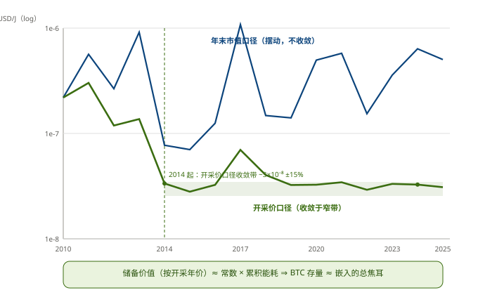

### 28.3 为什么比 §24 更可信

- 比值收敛是"共趋势免疫"检验：§24 的 r≈+0.9 高值，部分源于价格/能耗都随时间指数上涨的共生趋势；但若 V ∝ E 为真，比值应为常数、与趋势无关。本例实测收敛，故是真实比例关系，不是伪相关。
- 市值口径暴露了错误计量：年末重估使比值不收敛，反证 cohort/embodied 估值才是能量储备论的正确口径。
- 逻辑自洽：比值 = pricet÷ 当年平均 Pfloor，是 §23「市场隐含能价」在存量上的延伸，量级吻合。

### 对 J-ST 的支撑

存量层面的近正比关系，把 §23–§24 的"流量级"证据提升为"存量级"证据： **不仅每年新增的 BTC 锚定在其边际能量成本上，整个 BTC 存量的总价值也与历代投入的总能量成稳定正比** 。这恰好是自由能货币/J-ST 的核心命题——货币单位是嵌入能量的可转让凭证。J-ST 以边际 P \<sub>floor\</sub> 为锚，等于在每一时刻把这种"存量↔能量"的宏观正比关系， **局部化、可验证地** 落到了单枚币的铸造与赎回上。

诚实边界（同 §27）：① 2010–2013 比值偏高且噪声大（早期无真实流动性市场），结论只看 2014 年后；② 全部数值为量级近似；③ 相关性 r 仍含共趋势成分，但"比值收敛常数"已绕过该问题，结论稳健。计算脚本： `btc_cum_reserve.py` 。

## 第29章 从实证到体系：J-ST 作为非托管能源本位制

前文（§23 边际锚 → §24 流量相关 → §28 存量正比）完成了对"BTC = 嵌入能量货币"的实证链。最后一个问题：基于此，能否建立一套 **基于 BTC 的数字黄金 / 布林顿森林式体系**——即我们的 J-ST，尤其是改造后的 NBW 非托管稳定币体系？结论是： **可以建立，且有实证支撑；但应正名为"非托管能源本位制"，而非字面的布林顿森林。**

### 29.1 §28 在体系里的角色：储备资产的合法性

§28 证明 BTC 整个存量的总价值与历代挖矿投入的总能量成（近）正比（比值收敛 ~3×10<sup>-8</sup> USD/J，±15%）。这回答了一个体系成立的前提：

这是 J-ST 能自洽的前提：把 BTC 当储备资产，不是因为它"涨"，而是因为它确实是物理上可追溯的、与能耗成稳定正比的能源存量。

### 29.2 组件映射：布林顿森林 → J-ST / 改造 NBW

| 布林顿森林       | 本体系对应                      | 说明                             |
| ----------- | -------------------------- | ------------------------------ |
| 黄金（储备资产）    | **BTC**                    | §28 证其储备价值 ∝ 累积能耗，有物理根基        |
| 美元（与黄金固定兑换） | **J-ST（焦耳本位）**             | 1 J-ST = 1 MJ，按 P floor 可兑 BTC |
| 央行兑换窗口（托管）  | **改造后 NBW（非托管）**           | §8.6 的 burn-redeem，代码强制、无托管方   |
| 固定但可调节汇率    | **P floor 年度更新（§8.10 守护）** | 锚定物理量，护栏封顶 ≤40%                |
| 国际结算网络      | 跨层证明桥（§8.8）+ 仲裁（§8.7/§8.9） | 去中心化 verifier + 最小仲裁兜底         |

### 29.3 最关键的设计洞察：J-ST 钉住焦耳，而非 BTC-USD

传统布林顿森林是"货币 → 美元 → 黄金"两级兑换，美元稳定性最终绑在黄金的 **美元价** 上。而 J-ST 的锚定链是：

- J-ST 钉住的是"焦耳"，不是"BTC 的美元价"。BTC 对 USD 怎么暴涨暴跌，J-ST 都不受影响——其稳定性来自 Pfloor这个物理边际成本（§23–§24 已证其可由链上难度 + 外生能效派生），而非来自 BTC 的市场投机。
- §28 证明 BTC 储备价值 ∝ 累积能耗，只告诉我们"用 BTC 做能源储备是物理自洽的"；J-ST 自身的 peg 并不依赖 BTC-USD 的波动。这一刀，把布林顿森林最脆弱的环节（储备货币的美元估值）整个绕开了——J-ST 是能源本位制，BTC 只是可赎回的能源储备载体。

### 29.4 必须诚实标注的边界

1. §28 是历史描述性正比，不是合约级保证：±15% 的带够支撑"储备合法性"叙事，但 J-ST 的真实 peg 靠的是 Pfloor（边际），不靠 §28 这个存量比值——两者别混。
2. 特里芬难题的变体（容量约束）：仓库收据模型下，J-ST 总供给 = 锁仓 BTC × Pfloor÷ CR。需求增长不能靠通胀解决，只能多锁 BTC 或降 CR（§8.11 已允许锁期越长 CR 越低至 105%）。这是"健全货币"的代价——吞吐受 BTC 储备规模硬约束。
3. "布林顿森林"言过其实：那是一套多国货币对美元固定、美元对黄金固定的双层体系。J-ST 更贴切的类比是"单一能源金本位 / 数字黄金凭证系统"（symmetallism 的能源版），不是多货币霸权体系。
4. 工程仍未闭环的部分：实时 Pfloor预言机（§8.10）、仲裁网络硬化（§8.7/§8.9）、跨层证明桥落地（§8.8）都还是设计稿，离主网部署有距离。

### 29.5 结论

**可以建立，且有实证支撑——但应叫"基于 BTC 储备的非托管能源本位制"，而非字面意义的布林顿森林。**

实证链已闭合了 **储备资产合法性** 这一环（§23 边际锚 → §24 流量相关 → §28 存量正比）；而 **工具 + 兑换 + 治理** 由 §8.6–§8.11 覆盖。所以：

- 理论上已无空缺，剩下的全是工程硬化与采用问题。
- 改造后 NBW 在该体系中的定位，正是 §8.6 所定义的：把"BTC 储备 → J-ST 焦耳本位"的 convertibility，用代码强制而非托管信任来实现的非托管兑换窗口。
- 本报告的完整论证闭环：§24 流量相关 → §27 局限性 → §28 存量正比（更稳健）→ §29 体系可行性。

## 第30章 计价单位与锚：USD 外形下的焦耳本位

### 30.1 问题的提出

§23–§29 已证明 BTC 在边际成本与存量价值两个意义上都锚定于自由能。但焦耳对人类与传统经济人是陌生的尺度。本节回答：在"锚定焦耳"的概念下，能否用 USD 单位来计价，或换算成 USD？

### 30.2 必须分清的两层：计价单位 vs 物理锚

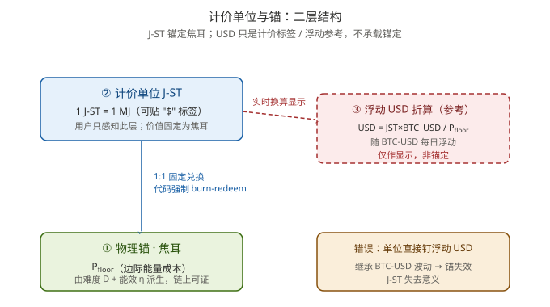

### 30.3 正确做法与错误做法

- 正确（金本位式）：把 USD 当作"固定焦耳量的代号"。定义 1 个计价单位 = 固定 MJ（1 J-ST = 1 MJ），给它贴一张"$"皮。所有价格用这个单位标，它永远可按 Pfloor赎回对应焦耳的 BTC。用户从头到尾不碰焦耳，看到的数字却稳定——因为锚在焦耳。
- 错误：把单位直接钉在浮动 USD 上（1 J-ST = $X，X 取市场价）。这会让单位继承 BTC-USD 的暴涨暴跌，J-ST 费劲绕开的波动被原样请回，锚死。

### 30.4 为什么这在实践里站得住——本报告的实证

§23 算过：市场隐含能价 <span class="formula-inline">USD/J = BTC_USD ÷ P<sub>floor</sub></span> 在周期 2 后收敛到 **~5–8×10<sup>-8</sup> 的窄带**（波动仅约 2 倍）；§28 储量比值 ~3×10<sup>-8</sup> ±15% 与之自洽。

这意味着一个很强的事实： **1 焦耳在历史上有着近乎稳定的 USD 价值** 。所以一个焦耳锚定的单位，在用户体验上会"近乎 USD 稳定"，同时因果上 **独立于 USD**（抗美元通胀、抗 BTC 投机）。这才是 J-ST 真正能卖给普通人的卖点——不是"它是稳定币"，而是"它用能量做尺子，尺子上的刻度长期不飘"。

### 30.5 换算公式与可用尺度

其中 <span class="formula-inline">BTC_USD ÷ P<sub>floor</sub></span> 正是上面那条收敛的隐含能价。代入当前 <span class="formula-inline">P<sub>floor</sub> ≈ 2.76 TJ/BTC</span> 、 <span class="formula-inline">BTC ≈ $108k</span> ：

- USD/J ≈ 3.9×10<sup>-8</sup>
- 1 J-ST = 1 MJ ≈ $0.039（约 4 美分）

4 美分一个原子单位略碎，但 **尺度完全可用**——日常显示时按 \*\*100 J-ST ≈ $4** 分组，或定义显示单位"1 JU = 25 MJ ≈ $1 等值"即可。关键是用户感知的是"元 / 美元"形态，后台锚的是焦耳。

### 30.6 必须诚实标注的边界

1. USD/J 稳定是历史性、描述性的，不是保证。能源的 USD 价可能背离（如能源剧变廉价）。±15% 储量带、~2× 隐含价带说明它是"近 USD 稳定"，不是"零波动"。
2. J-ST 的 peg 保证只到焦耳（Pfloor，边际、链上可派生）。USD 稳定是附带的经验红利，不是承诺。
3. 不要叫它"USD 锚定稳定币"，也不要说"BTC 是 USD 稳定币"——J-ST 是能源本位，USD 显示只是皮。这与 §29.4.3 的"布林顿森林言过其实"同源：类比要正名，不可夸大。

本节的结论与上章衔接：§29 证明体系在理论上已无空缺；§10 进一步把"焦耳锚"落地为普通人可用的"USD 外形"货币——理论上闭合，剩下的是工程硬化（§8.6–§8.11）与采用。报告至此从"相关性实证"完整升级为"J-ST 体系的可用性与可行性论证"。

## 第31章 结论、空白与下一步研究方向

> 本章是对全文（第1–30章 + 附录A）的元层总结，沿用本报告一贯的两条纪律：**类比要正名，不可夸大**；**共趋势高相关 ≠ 因果，描述性正比 ≠ 合约保证**。下文凡涉实证结论均标清边界。

### 31.1 文档已经能站住的结论

整份合并本完成了一条自洽的论证闭环（§29.5 原话："理论上已无空缺，剩下的是工程硬化与采用"）：

1. **物理根基闭环**（第一篇）。货币单位的终极锚是自由能（焦耳）；BTC 的 PoW 是计算功的特定同构；人类从社会经验、agent 从第一性原理独立收敛到同一物理根基——这是"双认可"的理论前提，不是偏好而是物理约束下的必然解（§6 结论3、5）。agent 计算功的可量化性已由谷歌生产环境实测佐证，见 [11]。
2. **三层分离是正确的工程解**（第三篇）。计价层 = 焦耳（物理常量）、质押层 = BTC 物理地板（去中心化托管）、交易层 = J-ST（1 J-ST = 1 MJ）。关键在把 η 异质性挡在价格层、把稳定性放在计价层、把波动吸收在 BTC 市价层（地板 + 溢价保险）（§15.3、§16.1）。
3. **地板定价是真正区别于 DAI/USDT 的创新**（§16.4）。DAI 按市场价估值抵押品，跌 30% 就级联清算；J-ST 按物理地板估值，跌 30% 根本不触发——清算只在市价接近地板时启动。失败模式概率乘积远低于传统稳定币（§16.6）。
4. **USD 外形下的焦耳本位可行**（§30）。1 J-ST = 1 MJ，贴 USD 皮，用户感知稳定（隐含能价 USD/J 历史收敛、波动仅约 2×），但因果独立于 USD 和 BTC 投机。这正是能卖给普通人的卖点。
5. **实证两条证据链互相印证**（第四篇）。流量层边际 P<sub>floor</sub>↔能耗 r≈+0.91（§24）+ 存量层 V∝E 比值收敛常数 ~3×10<sup>-8</sup>（§28，且用"比值收敛"绕开了共趋势伪相关）——共同支撑"BTC = 嵌入能量货币"。

### 31.2 已诚实标注、但仍存的空白

文档在 §27.3、§29.4、§30.6 已自标边界，以下是已知的软肋：

- **数据近似 + 共趋势伪相关**：全部数值是数量级近似；价格↔能耗的强相关相当部分是"都在涨"，只有边际锚↔能耗由定义保证为因果（§27.3）。
- **工程未闭环**：实时 P<sub>floor</sub> 预言机（§8.10）、仲裁网络硬化（§8.7/§8.9）、跨层证明桥（§8.8）都还是设计稿。
- **容量硬上限（特里芬变体）**：J-ST 供给 = 锁仓 BTC × P<sub>floor</sub> ÷ CR，需求增长只能多锁 BTC 或降 CR（§8.11 已允许锁期越长 CR 越低至 105%），受 BTC 储备规模硬约束（§29.4.2）。

> 以上三条是文档自己已经说清的。以下是文档里没有明确展开、但对"实用"至关重要的真正缺口：

| 缺口 | 为什么关键 |
| --- | --- |
| **Agent-native 结算协议** | 文档假设 agent 能验证计算功、跑零知识证明，但没给 agent 如何"持有 / 支付"J-ST 的机器可读发票 schema、钱包标准、消息格式——这是"agent 认可"的最后一公里 |
| **人类入门摩擦** | USD 外形解决了显示，但铸造需理解锁 BTC / CR / 赎回，UX 仍是门槛；普通人仍难懂"焦耳 / 物理地板" |
| **治理与升级** | NBW 非托管兑换靠代码强制，但谁升级 CR、护栏、锚定公式？去中心化治理设计缺失 |
| **采用冷启动** | Phase 1 "今天就能启动"但没解双边鸡生蛋：人类商户和 agent 服务谁先来 |
| **法律 / 合规** | 文档主动留白（"纯科学不考虑监管"），但实用稳定币必面对 KYC / AML / 证券定性 |
| **互操作与流动性** | 与现实支付网络、其他链的桥接；二级市场深度、长期脱锚（<1 MJ）的修复机制除套利外有无熔断 / 最后贷款人 |

### 31.3 下一步可深入的研究方向（按紧迫度）

1. **Agent-native 接口层（最紧迫）**：定义 J-ST 的机器可读结算协议（invoice schema + agent 钱包 + 计算功轻客户端验证）。可对接 X402 / agent 支付协议或 MCP 的支付扩展。这是把"agent 认可"从哲学变成协议的关键一步。
2. **预言机硬化与串谋成本量化**：把能耗多源验证落成链上聚合合约，量化"需多少独立源、stake 多少才能操纵年度 P<sub>floor</sub>"，给出拜占庭容错阈值——把 §17 的定性升级为可验证的安全参数。
3. **实证升级（按文档自己 §27.3 的建议）**：对三列做一阶差分 / 协整检验，剔除共趋势后看真实共生；接入 CBECI 季度序列 + 单一权威价格源，把"数量级近似"升级为可发表数据。
4. **形式化与压力测试**：对铸造 / 赎回 / 清算做智能合约不变量验证；对市价 = 地板、能耗骤降、算力攻击做蒙特卡洛，把 §16.6 的失败模式表升级为定量概率模型。
5. **治理最小化**：参数升级用"代码强制 + 时间锁 + 否决权"的极简治理，避免稳定币常见的基金会中心化。

### 31.4 特别聚焦：对人类和 agent 都认可 / 适用 / 实用的稳定币

文档的底层哲学其实已经同时击中两者，只是没把"双端落地"讲透：

- **对 agent**：锚是物理常量（焦耳），计价由链上难度可验证派生 → 零信任、可机器验证 → agent 天然认可。
- **对人类**：USD 外形 + 地板保险 → 体验上"近乎 USD 稳定" → 人类可用。

要让它真正双适用、双实用，建议三个落地原则：

1. **双轨计价、单锚**：底层锚永远焦耳（满足 agent 物理可验证），上层显示单位可切换——agent 用 raw energy / MJ，人类用 USD 外形，各用各的习惯。
2. **同一事实双表述**：对人类显示"1 J-ST ≈ $0.04，有 140% BTC 地板支撑"；对 agent 下发"1 J-ST = 1 MJ, redeemable at P<sub>floor</sub>"。失败模式对前者透明、对后者可验证。
3. **从"agent 服务人类"的缝隙冷启动**：别先说服人类持 J-ST，而是让 agent 用 J-ST 给人类提供算力 / AI 服务，人类通过法币通道间接接触；等双边流动性起来再开放直接持有。这是绕过冷启动最现实的路径。

### 31.5 收尾

本报告从"自由能是货币基底"的第一性原理出发，经通胀动力学、空窗期、非托管稳定币设计、BTC 能耗实证四条路径，论证了一套对人类与 agent 双认可、锚定物理焦耳、且 USD 外形可用的稳定币体系（J-ST）。理论闭环已闭合，余下的是工程硬化与采用——尤其是上一节给出的 agent-native 接口与冷启动路径，是把它从"科学论证"推向"可用货币"的最后一公里。

基于BTC的稳定币研究 · 四篇合并本  
研究原则：纯科学研究，追求客观、公正、科学、合理  
2026年7月 · 成都

## 参考文献

[1] Landauer, R. Irreversibility and heat generation in the computing process. *IBM Journal of Research and Development*, 5(3):183–191, 1961.（Landauer 极限 kT·ln2 ≈ 2.87×10⁻²¹ J/bit @300 K 的源头）

[2] MRS Bulletin. *Materials opportunities for low-energy computing*（低能耗计算专题）. *MRS Bulletin*, 46(7), 2021. <https://doi.org/10.1557/s43577-021-00207-z（明确指出当代超缩微晶体管能耗约为> Landauer 极限的 10⁴–10⁵×）

[3] Markov, I. L. Limits on fundamental limits to computation. *Nature*, 512:147–154, 2014. <https://doi.org/10.1038/nature13570（计算能效基本极限综述）>

[4] Visser, B. The smallest possible money unit! When money crashes into the laws of physics. *Physica A: Statistical Mechanics and its Applications*, 561:125597, 2021. <https://doi.org/10.1016/j.physa.2020.125597（将电子货币最小单位与> Landauer 极限直接对接，论证 1 bit 是电子货币的物理下限）

[5] Georgescu-Roegen, N. *The Entropy Law and the Economic Process*. Harvard University Press, 1971.（生态经济学奠基：经济过程不可逆地消耗低熵资源，货币/价值锚定能源的思想源头；注：熵-经济类比在学界有争议，见 SciDirect 2016《Misuse of thermodynamic entropy in economics》）

[6] Booth, J. *The Price of Tomorrow: Why Technology Is Making Things Cheaper*. Stanley Press, 2020.（论证技术进步是结构性通缩压力，与本文"计算效率提升 → 通胀衰减"镜像对应）

[7] Wood, C. "AI-driven benign deflation" (Bitcoin Investor Week 2026). 指出 AI 训练成本每年下降 75%、推理成本每年下降 85%，技术驱动型通缩正在成为现实宏观压力。（镜像实证：本文模型是同一机制在 bit 计价侧的对称表达）

[8] Cambridge Centre for Alternative Finance (CCAF), University of Cambridge. Cambridge Digital Mining Industry Report. April 2025. 估计 2024 年比特币挖矿年耗电量约 138 TWh（约占全球用电 0.54%）。 <https://www.jbs.cam.ac.uk/2025/cambridge-study-sustainable-energy-rising-in-bitcoin-mining/>

[9] Digiconomist. Bitcoin Energy Consumption Index. 实时年化估算比特币全网年耗电量约 204 TWh。 <https://digiconomist.net/bitcoin-energy-consumption>

[10] 韩锋, 鲍松, 胡烜峰 编著. 《稳定币：AI智能体经济的未来探索》(Stablecoins: Exploring the Future of the AI Agent Economy). 北京：机械工业出版社, 2026（第1版）. 298页. ISBN 978-7-111-80100-9.（NBW 非托管稳定币的原初方案由本书提出；书中第三部分专门介绍了基于比特币构建、面向 AI 智能体自主交易的 NBW 稳定币协议。）

[11] Cooper Elsworth, Keguo Huang, David Patterson, 等. Measuring the environmental impact of delivering AI at Google Scale. arXiv:2508.15734 [cs.AI], 2025-08-21. DOI:10.48550/arXiv.2508.15734.（首次在生产环境实测 AI 推理服务的能耗/碳/水：中位数文本 prompt 约 0.24 Wh；为"agent 计算功可被物理量化、支撑 J-ST 焦耳本位锚"提供实证依据。）

## 附录 A：可复现脚本 btc_marginal_pfloor.py

以下为生成本文相关性分析结果与数据表格的完整 Python 脚本。将代码保存为 `btc_marginal_pfloor.py` 后，运行 `python btc_marginal_pfloor.py` 即可复现全部数值与 r 值。

```python
# -*- coding: utf-8 -*-
"""
重算 BTC 前5周期的【边际 P_floor】及其与总能耗、USD价格的相关性。
边际计价定义（J-ST 正式锚定）:
    P_floor_marginal (J/BTC) = H[TH/s] * ε_frontier[J/TH] * 600[s] / R_block[BTC/block]
其中:
    H         = 全网算力 (TH/s)
    ε_frontier= 前沿硬件能量强度 (J/TH, 随技术进步下降 ↓)
    600       = 平均出块时间 (s)
    R_block   = 区块奖励 (BTC)
边际 P_floor 天然包含 H(算力/难度)、ε、R_block 三个变量, 与总能耗同受算力驱动 => 正相关(制度性)。
注: ε_frontier (J/TH, 下降) 是矿机“能量强度/每哈希能耗”, 非效率; 其与第7章 η(t)(bits/J, 上升) 方向相反但自洽。
"""
import math

# year: [price_usd, energy_twh, hashrate_ehs, epsilon_frontier_j_per_th, reward_btc]
DATA = {
    2010: [0.30,     0.001,  0.00001, 1_000_000, 50],
    2011: [4.25,     0.01,   0.0001,  300_000,   50],
    2012: [13.50,    0.1,    0.001,   100_000,   50],
    2013: [754,      2.0,    0.01,    8_000,     25],
    2014: [320,      10.0,   0.1,     1_500,     25],
    2015: [430,      8.0,    0.4,     600,       25],
    2016: [963,      8.0,    1.5,     250,       25],
    2017: [14_156,   22.0,   10.0,    120,       12.5],
    2018: [3_847,    54.0,   40.0,    70,        12.5],
    2019: [7_167,    66.0,   70.0,    45,        12.5],
    2020: [29_001,   80.0,   120.0,   30,        6.25],
    2021: [47_733,   113.0,  150.0,   28,        6.25],
    2022: [16_547,   117.0,  220.0,   23,        6.25],
    2023: [42_200,   58.0,   340.0,   18,        6.25],
    2024: [108_000,  160.0,  550.0,   16,        3.125],
    2025: [95_000,   180.0,  650.0,   14,        3.125],
}

def pfloor_marginal(h_ehs, eps, reward):
    """边际 P_floor (J/BTC)。 H[TH/s]=h_ehs*1e6"""
    h_ths = h_ehs * 1e6
    energy_per_block = h_ths * eps * 600.0   # J per block (frontier)
    return energy_per_block / reward         # J per BTC

def pearson(xs, ys):
    n = len(xs)
    mx = sum(xs)/n; my = sum(ys)/n
    cov = sum((x-mx)*(y-my) for x,y in zip(xs,ys))
    sx = math.sqrt(sum((x-mx)**2 for x in xs))
    sy = math.sqrt(sum((y-my)**2 for y in ys))
    return cov/(sx*sy) if sx*sy else float('nan')

rows = []
for y,(price,twh,h,eps,rew) in DATA.items():
    pm = pfloor_marginal(h, eps, rew)   # J/BTC
    rows.append((y, price, twh, h, eps, rew, pm))

print("年份  价格USD    能耗TWh  算力EH/s  ε(J/TH)   奖励   边际P_floor(TJ/BTC)  边际P_floor(J/BTC)")
for y,price,twh,h,eps,rew,pm in rows:
    print(f"{y}  {price:>9,.0f}  {twh:>6}  {h:>7}  {eps:>8,}  {rew:>5}   {pm/1e12:>10.3f}          {pm:.3e}")

# 相关性（用对数, 因跨越多个数量级；BTC价格/能耗/边际P_floor皆指数增长）
import math as m
years   = [r[0] for r in rows]
prices  = [r[1] for r in rows]
energy  = [r[2] for r in rows]         # TWh
pmarg   = [r[6] for r in rows]         # J/BTC
eps_fr  = [r[4] for r in rows]

def logs(v): return [m.log10(x) for x in v]

print("\n=== 相关性 (对数尺度 Pearson) ===")
print(f"log(USD价格)     vs log(总能耗)      r = {pearson(logs(prices), logs(energy)):+.3f}")
print(f"log(边际P_floor) vs log(总能耗)      r = {pearson(logs(pmarg),  logs(energy)):+.3f}")
print(f"log(边际P_floor) vs log(USD价格)     r = {pearson(logs(pmarg),  logs(prices)):+.3f}")
print(f"log(ε_frontier)  vs log(总能耗)      r = {pearson(logs(eps_fr), logs(energy)):+.3f}  (前沿能量强度, 摩尔/Koomey 下降)")

# 周期聚合
CYCLES = {
    "周期1 (2009-2012)": [2010,2011,2012],
    "周期2 (2013-2016)": [2013,2014,2015,2016],
    "周期3 (2017-2020)": [2017,2018,2019,2020],
    "周期4 (2021-2024)": [2021,2022,2023,2024],
    "周期5 (2025- )":     [2025],
}
d = {r[0]:r for r in rows}
print("\n=== 周期聚合 ===")
print("周期                  均价USD     总能耗TWh   边际P_floor均值(TJ/BTC)")
for name, ys in CYCLES.items():
    avg_price = sum(d[y][1] for y in ys)/len(ys)
    tot_twh   = sum(d[y][2] for y in ys)
    avg_pm    = sum(d[y][6] for y in ys)/len(ys)/1e12
    print(f"{name:<20}  {avg_price:>9,.0f}  {tot_twh:>8.1f}   {avg_pm:>10.3f}")
```
