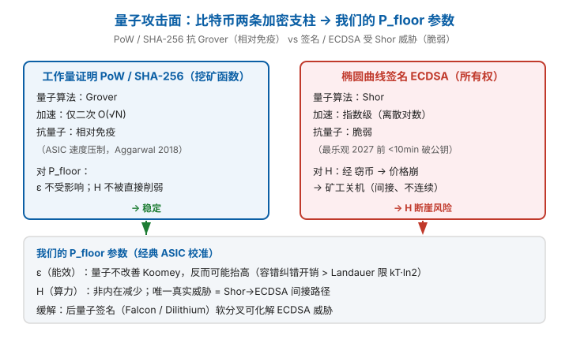
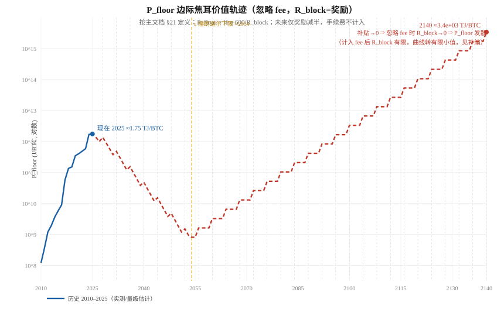
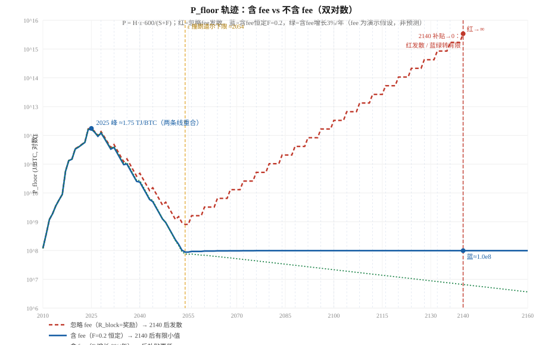
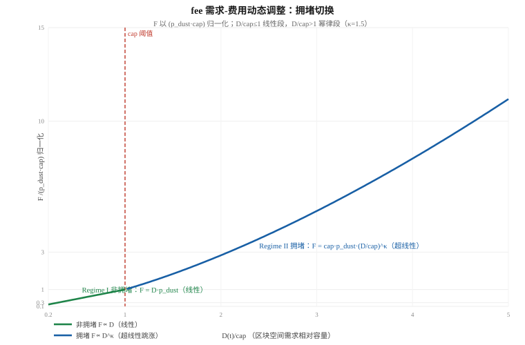
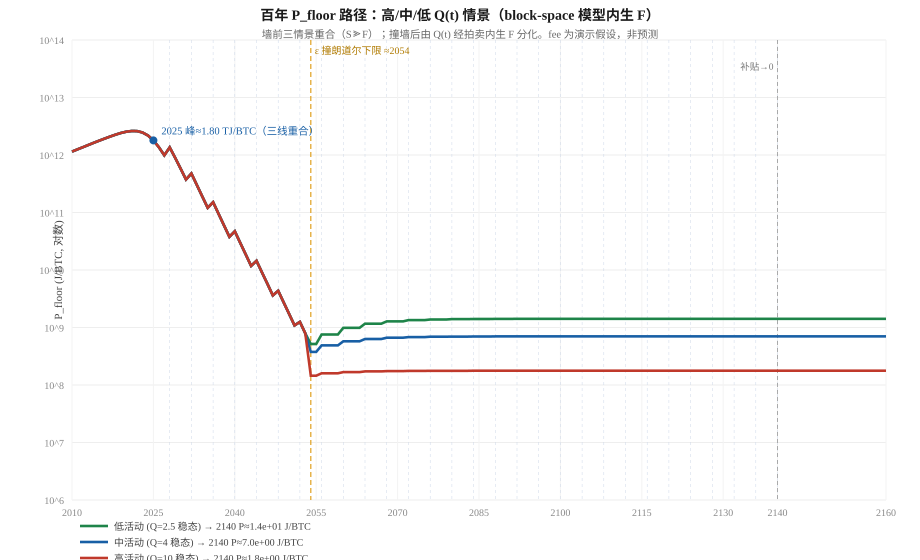
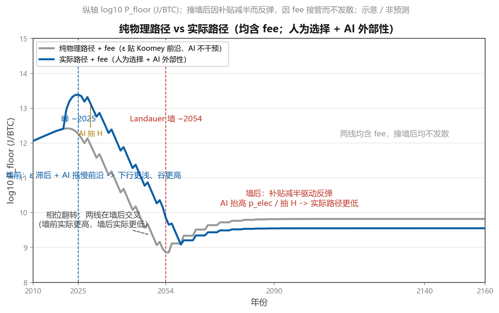
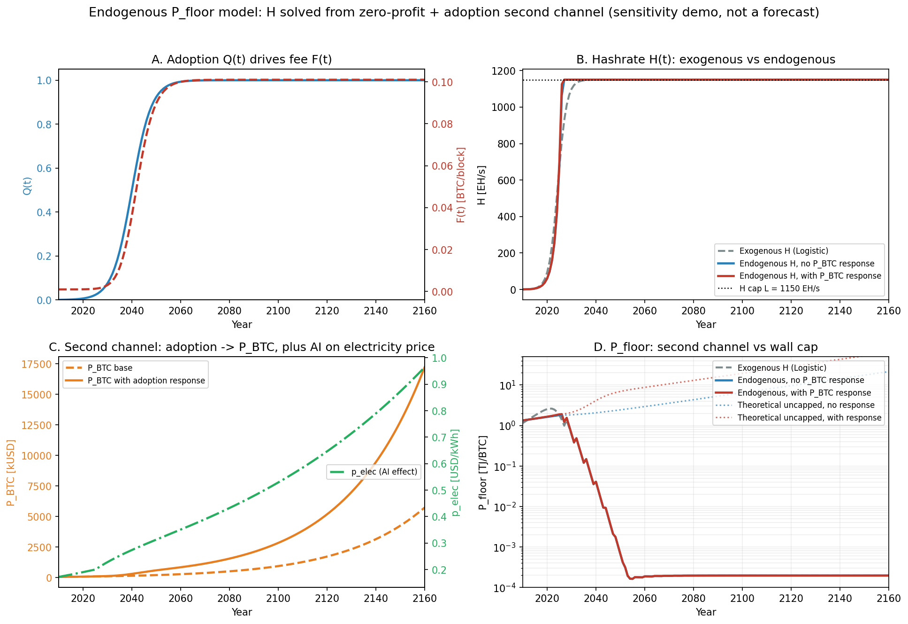
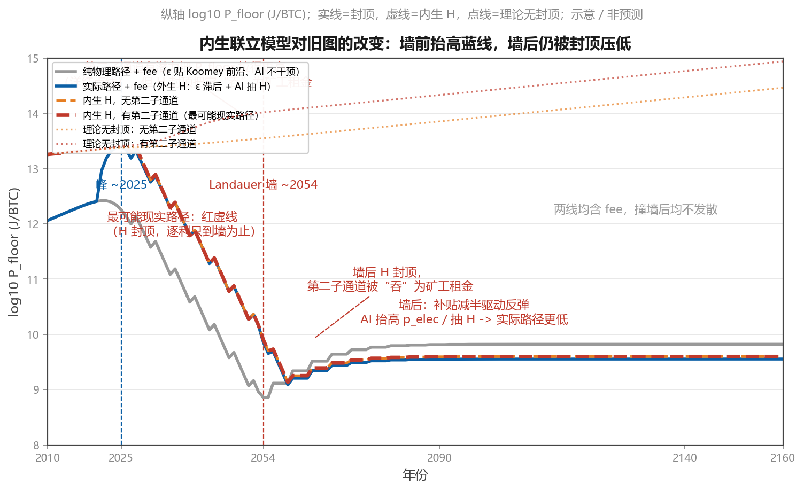

# 基于自由能 BTC 的安全路径分析

> 依据：① `P_floor_解析极值分析.md`（忽略 fee 的纯物理骨架，**核心内容已汇编于第一章 §1.1–§1.9**）；② `P_floor的fee影响分析.md`（fee 单独分析，**核心内容已汇编于第一章 §1.10–§1.13**）；③ 基础文档《基于 BTC 的稳定币研究》**第9–11章**（三层价格分解 / 多 agent 通胀外部性 / 空窗期与物理地板双本位）。
>
> 本文把"**纯物理外推的 P_floor**"与"**实际 P_floor**"严格区分，重点分析两件事：① 能效 `ε(t)` 不是外生物理律，而是**人为利润最大化选择**的结果——这正是基础文档第10章所说的"外部性"；② AI 发展对 BTC 挖矿构成**真实、正在发生的外部冲击**。最后刻画实际 P_floor 如何偏离纯物理路径。
>
> *纪律标注：本文为**定性 / 机制分析**，非数值预测。我们不建模 `p_elec(t)`、`P_BTC(t)`、`Q(t)` 的定量路径（那需要宏观经济 + 链上数据外生输入）；本文只刻画**方向与机制**。所有未来段均为概念解析与敏感性演示。*

---

## 1. 起点：纯物理 P_floor 路径（已证的骨架）

> 本章把两篇前置研究的**核心内容**汇编于此，作为后续"人为选择 + AI 外部性"分析的**纯物理参考包络**：
> ① `P_floor_解析极值分析.md`（忽略 fee 的解析极值，本章 §1.1–§1.9）；
> ② `P_floor的fee影响分析.md`（fee 单独分析，本章 §1.10–§1.13）。
> 二者共同回答：*若 humanity 始终把矿机能效推到物理前沿、且 AI 不插手，P_floor 会怎样。*

骨架（两篇口径一致）：

```
P_floor(t) = H(t) · ε(t) · 600 / R_block(t)          [J/BTC]
H : Logistic 饱和，L=1150 EH/s，k=0.55，t0=2024.4
ε : Koomey 衰减，每 1.5 年减半 ⇒ d/dt ln ε = −c，c≈0.462 yr^{-1}
R_block : 区块补贴（忽略 fee）或 S+F（含 fee）
```

其数值轨迹（本章 §1.9 口径）：极大值 ~2021–2024（投影 2025，P_floor≈1.747 TJ/BTC）→ 下行 → Landauer 墙极小值 ≈2054（P_floor≈0.00081 TJ/BTC）→ 反弹；忽略 fee 时 2140 后随补贴归零发散，含 fee 时收敛有限。

### 1.1 公式与对数化

```
P(t) = H(t) · ε(t) · 600 / R_block(t)          [J/BTC]
ln P(t) = ln H(t) + ln ε(t) + ln 600 − ln R_block(t)
```

取时间导数（逐项）：

```
d/dt ln P = d/dt ln H  +  d/dt ln ε  −  d/dt ln R
```

### 1.2 三个分量的时间导数

> *基准年正名*：下文 "2024" 是数据对齐基准（R 取 2024-04 减半 `R₀=3.125`；Logistic `t₀=2024.4` 由 2016–2025 拟合）。换基准年或数据区间，数学结构不变、极值存在性不变，仅年份漂移。

**① 算力 H —— Logistic 饱和**（`H(t)=L/(1+e^{−k(t−t0)})`，L=1150，k=0.55，t0=2024.4）：

```
d/dt ln H = k / (1 + e^{k(t−t0)})      ∈ (0, k)
```

t≪t0 → k=0.55（历史增速快）；t≫t0 → 0（饱和后几乎不涨）；严格单调递减（二阶导 < 0）。

**② 能效 ε —— Koomey 衰减**（每 1.5 年减半，`ε(t)=ε₀·2^{−(t−tε)/1.5}`）：

```
d/dt ln ε = −(ln 2)/1.5 = −c,   c≈0.4621 yr^{-1}
```

（`c` 为常数、恒负。）

**③ 减半 R_block —— 两种口径**（忽略 fee，R=补贴）：

| 口径 | R(t) 形式 | d/dt ln R |
|---|---|---|
| 连续减半 | `R₀·2^{−(t−2024)/4}` | `−(ln2)/4 ≈ −0.1733` |
| 离散减半 | 每 4 年台阶 ×½ | a.e. = 0（减半瞬间跳变 ×2） |

### 1.3 驻点方程与闭式解

**连续减半口径**：

```
d/dt ln P = k/(1+e^{k(t−t0)}) − c + 0.1733 = 0
         ⇒ k/(1+e^{k(t−t0)}) = c − 0.1733 = 0.2888
         ⇒ 1+e^{k(t−t0)} = k/0.2888 = 1.9045
         ⇒ e^{k(t−t0)} = 0.9045
         ⇒ t* = t0 + (1/k)·ln(0.9045) = 2024.4 − 0.183 = 2024.22
```

**离散减半口径**（忽略 R 阶梯导数）：

```
d/dt ln P = k/(1+e^{k(t−t0)}) − c = 0
         ⇒ k/(1+e^{k(t−t0)}) = 0.4621
         ⇒ 1+e^{k(t−t0)} = 1.1907
         ⇒ e^{k(t−t0)} = 0.1907
         ⇒ t* = 2024.4 + (1/0.55)·ln(0.1907) = 2024.4 − 3.01 = 2021.39
```

### 1.4 极值性质：唯一极大值

`d²/dt² ln H = −k²·e^{k(t−t0)} / (1+e^{k(t−t0)})² < 0`，故 `d/dt ln P` **严格单调递减**，从正过零到负，仅穿过 0 一次：

- t < t* ：`d/dt ln H > c`（甚至 > c−0.1733）⇒ `d/dt ln P > 0`，P **上升**
- t > t* ：`d/dt ln H < c` ⇒ `d/dt ln P < 0`，P **下降**

⇒ **t* 是连续代理下的唯一内点驻点且为全局极大值**。物理含义：当 `d/dt ln H`（随时间趋零）下降到等于 `|d/dt ln ε|`（常数）时，算力扩张这一抬升力量被能效改善完全抵消，P_floor 见顶；之后能效继续改善但 H 已饱和，P_floor 转跌。

### 1.5 与"2025 见顶"的对应

| 模型 | 解析峰值 t* | 说明 |
|---|---|---|
| 离散减半 + 平滑 H/ε | ≈2021.4（2020–2024 局部极大） | 但 2024 减半瞬间 R 减半 ⇒ P 跳升 ×2，真实峰值 ≈2024 |
| 连续减半 | ≈2024.22 | 与数值末年 2025 几乎重合 |

"2025 见顶"是 **2024 减半峰**在数值末年的投影；两种口径都落在 ~2021–2024，**远早于 Landauer 墙（≈2053–2054）**。此前"越挖越贵"只在 `t < t*` 成立，是一段历史经验律，不是永久趋势。

### 1.6 墙前的第二个极值：极小值（在墙边）

ε 撞 Landauer 墙后 `d/dt ln ε → 0`（ε 封顶）。此后：

```
d/dt ln P ≈ − d/dt ln R   ≤ 0 (a.e.)
```

（减半瞬间跳升，因子 ×2。）

⇒ P 在墙到达处（≈2054）触底后转升，**~2054 为全局最小（恰好在墙边）**；2140 补贴→0 ⇒ R→0 ⇒ P_floor 发散到 ∞（此即 fee 不可省的解析证据）。

### 1.7 H 饱和的四角度保证 + 公式正名

§1.4 的极值存在性**完全依赖"H 最终饱和"**。必须把前提摊开：**(A) H 必然有上限（饱和这个事实）** 有硬保证；**(B) H 恰好取 Logistic 形式（建模选择）** 是合理近似。

**① 物理 / 能量硬约束（最强，不依赖任何经济假设）**：全网做功率 `W_sec = H·ε`；即便 ε 触 Landauer 下限 ε_L，仍有 `H = W_sec / ε_L`。而 `W_sec` 受限于人类可投入 PoW 的能源总量——地球一次能源、或全球电力中可经济分配给挖矿的份额，都是有限预算。**总自由能预算封顶 ⇒ H 必有上限**，这是热力学 / 能量守恒的硬上限。

**② 经济均衡约束（次强）**：矿工是理性资本，单位算力边际收益 = 分得的新增区块奖励（补贴 + fee）现值，边际成本 = 硬件 + 电费。当全网 H 推高到边际收益 ≈ 边际成本（超额利润归零）时，资本停止涌入 ⇒ 增速 → 0。补贴固定且减半递减；fee 受链上真实经济活动天花板约束（结算量有上限 ⇒ 安全预算有上限）。二者共同决定一个可货币化的 H 上限——即使不计物理，纯经济学也给出上限。

**③ 经验观测（佐证，非独立保证）**：实际 H：2010–2015 超指数，2016 起增速逐年放缓，近年已贴近饱和区。Logistic 拟合是对已观测减速的外推。

**④ 数学结构（形式化，非独立保证）**：`H = L/(1+e^{−k(t−t0)})` 数学上保证 `lim H = L`（有限）且 `dH/dt > 0` 递减。但这是"我们选了饱和型函数"的结果，真正的保证来自 ①②。

> **关键反事实**：若改用指数 `H = H₀·e^{gt}`，则 `d/dt ln H = g` 为常数；若 `g > c`，则 P_floor **永远单调升、无极值、无回落**——这正是"越挖越贵永久成立"的隐含假设。我们选饱和，是因为 ①② 支持它。即"2025 后下跌"是否 artifact，完全取决于 H 是否饱和：H 饱和 ⇒ 下跌是结构性必然；H 不饱和对冲 ⇒ 下跌才是真 artifact。

> **正名边界**："H 有上限（饱和）"= 物理（①）+ 经济（②）**双重硬保证**，经验（③）佐证，数学（④）形式化；"H 精确服从此 Logistic、L=1150 / k=0.55 / t0=2024.4"= 经验拟合 + 建模选择，参数是外推不确定的。对应到极值：**极大值的"存在性"稳健**（只要 H 饱和），**极大值的"年份"随参数漂移**（L/k/t0 经验外推）。

### 1.8 量子计算冲击的边界分析

> 量子计算**不改变**本模型"趋势参数"的内禀结构，它改变的是"模型是否还适用"的前提条件——对 `ε` 无改善甚至可能抬高，对 `H` 无内在削减、唯一真实威胁经"信心 / 价格"间接且不连续。

**对 ε（能效）的边界：量子不改善 Koomey，反而可能抬高**。Koomey 规律是**经典 CMOS 半导体**的经验律，非普适物理定律：Koomey et al. (2011) 统计 1946–2009，得出"每千瓦时计算量约每 1.5 年翻一倍"；但该趋势在 2000 年后放缓到约每 2.6 年翻倍，原因是 Dennard 缩放（晶体管等功率密度微缩）约在 2005 年终结。真正的物理地板是 **Landauer 限**（Landauer 1961）：不可逆擦除每比特至少耗散 `kT·ln2`，室温下约 `2.8×10^{-21} J/bit`。容错量子计算热力学研究（surface code）表明量子纠错冗余使逻辑操作能耗**显著高于** Landauer 限（`E_cycle ≥ (N_phys/2)·kT·ln2`），且实际 FTQC 因有限时长、强耦合而远偏离理想 Landauer 限。

⇒ 一个"量子矿机"不是更接近 Landauer 墙，而是**站在 Landauer 墙之上更远的地方**：它不会拉低 `ε_L`，反而可能抬高有效 `ε`。正名：不能说"量子提升挖矿能效"；对 SHA-256 这一经典问题，Grover 仅给 `O(√N)` 二次加速，而每个量子门（Toffoli + 纠错）的能耗远高于一个经典 NAND；在我们至 2140 的计算窗口内它不会取代 ASIC，`ε` 仍沿经典 Koomey（已放缓）轨迹走，最终逼近 Landauer 墙。

**对 H（算力）的边界：非内在减少，唯一真实威胁是间接且不连续的**。`H` 是**经济量**而非物理量——`H(t)=L/(1+e^{−k(t−t0)})` 是经济部署的描述性饱和曲线（矿工在"边际收益=边际成本"处停止加机），不是物理定律。"量子改变 H"的机制只有两类：

- **机制 A（"量子挖矿更便宜 → 用更少算力维持安全 → H 下降"）**：逻辑反了。若量子挖矿真更省电，理性矿工会用同等电力部署更多算力，把 `H` 顶得更高或维持在经济上限，而非降低。便宜的挖矿 → `H` 升，不是降。
- **机制 B（真实威胁，但间接且不连续）**：量子威胁比特币的主战场是 **ECDSA 椭圆曲线签名**（被 **Shor 算法**攻破），而非 PoW/SHA-256 挖矿函数。攻击链条为 `Shor 破 ECDSA → 大量 UTXO 可被窃 → 链价值/信任崩溃 → P_BTC 暴跌 → 挖矿法币收益归零 → 理性矿工关机 → H 断崖式下跌`。关键点：**SHA-256 挖矿不受 Shor 影响，PoW 本身没被直接削弱**。Aggarwal et al. (2018) 明确指出，比特币 PoW 在可预见的 10 年内"对量子加速相对免疫"，主因是专用 ASIC 的时钟速度远超近期量子机；即便用 Grover 搜 SHA-256，也只是 `O(√N)` 二次加速；该文同时指出 ECDSA 受 Shor 威胁大得多，最乐观估计 2027 年前后即可在 <10 分钟内由公钥反推私钥。此威胁**可缓解**：经软分叉迁移到后量子签名（格基 Falcon / Dilithium）即可化解。



**情景分支 / 模型失效边界**：我们的 `ε`（Koomey）与 `H`（Logistic）均为经典 ASIC 挖矿校准的经验 / 描述曲线。量子计算引入的不是"可平滑纳入的参数微调"，而是情景分支 / 模型失效边界：

| 分支 | 触发条件 | 对 P_floor 参数的影响 | 性质 |
|---|---|---|---|
| **A（预期）** | 窗口内无成熟量子挖矿 / 攻击 | ε 沿 Koomey（已放缓）、H 沿 Logistic，模型成立 | 连续，正常外推 |
| **B（罕见）** | Grover 挖矿成熟并取代 ASIC | ε 进入非 Koomey 的新能效体制（大概率更高） | 体制切换，非参数微调 |
| **C（相变）** | Shor 破 ECDSA 且未缓解 | 链价值崩溃 → P_BTC→0 → H 断崖；P_floor 经济基底失效 | 相变式失效，超出平滑外推 |

> 简言之：**量子不改变我们模型的"趋势参数"，它改变的是"模型是否还适用"的前提**。这一点应作为"外部冲击边界"并列于 §1.7 严谨性边界，并呼应 §1.9–§1.13 的"未来段为延伸推算 / 敏感性演示，非预测"纪律。

### 1.9 数值轨迹：解析结论的图形印证

> 本节把核心数值轨迹并入本章，作为对前述解析推导的数值 / 可视化印证。模型口径完全一致：忽略 fee，`H` 取 Logistic 饱和，`ε` 取 Koomey 衰减封顶 Landauer 下限，`R_block` 仅取区块奖励。

**关键年份轨迹表**

| 年份 | H (EH/s) | ε (J/TH) | 奖励 (BTC) | P_floor (TJ/BTC) | 阶段 |
|---|---|---|---|---|---|
| 2010 | 1e-5 | 1,000,000 | 50 | 0.00012 | 历史 |
| 2021 | 150 | 28 | 6.25 | 0.40 | 历史 |
| 2024 | 550 | 16 | 3.125 | 1.69 | 历史（减半） |
| 2025 | 650 | 14 | 3.125 | **1.747** | **解析极大值投影** |
| 2030 | 1.1e3 | 1.39 | 1.5625 | 0.586 | 回落 |
| 2040 | 1.15e3 | 0.0137 | 0.195 | 0.0483 | 回落 |
| **2054** | 1.15e3 | 2.87e-5 | 0.0244 | **0.00081** | **Landauer墙见底** |
| 2140 | 1.15e3 | 2.87e-5 | 5.8e-9 | 3.4×10³ | 随补贴归零发散 |



与解析结论的对照：

1. §1.3–§1.4 的解析极大值（约 2021–2024，投影至 2025）与表中 2025 年 `P_floor ≈ 1.747 TJ/BTC·... ` 的峰值一致；峰值后曲线回落，对应解析上 `d/dt ln H < |d/dt ln ε|` 的区间。
2. §1.6 的 Landauer 墙（ε 触底 ≈2054）对应表中 2054 年 `P_floor ≈ 0.00081 TJ/BTC` 的谷值；墙后 ε 不再改善，P_floor 只能随减半单调回升。
3. §1.6 提到的发散在 2140 附近呈现：补贴→0 ⇒ `R_block→0` ⇒ `P_floor → ∞`。这正是"忽略 fee 时 P_floor 在 mining-end regime 发散"的数值体现。
4. 图形把「先升 → 见顶 → 回落 → 触底 → 再升 → 发散」这一完整结构可视化，与解析推导相互印证。

### 1.10 fee 的定义、决定参数与历史演变

**协议层定义**：一笔比特币交易的费用（单笔）`单笔 Fee = 交易大小(vBytes) × 费率(sat/vByte)`；一个区块打包的全部交易费之和，即**区块费收入**（本篇记为 `F(t)`，单位 BTC/block）：

```
F(t) = Σ_{tx ∈ block} Fee(tx) = Σ (vBytes_tx × fee_rate_tx) / 1e8   [BTC/block]
```

把 `F(t)` 加回 P_floor 公式的分母，得到完整形式（主文档 §21 原公式只用了 `R_block = 补贴`，这里把被忽略的 fee 显式补回）：

```
P_floor(t) = H(t) · ε(t) · 600  ÷  [ S(t) + F(t) ]
                                  ↑补贴↑   ↑fee↑
S(t) = 区块补贴 = 50 · 2^{−⌊(y−2008)/4⌋}   [BTC/block，协议确定；减半发生在 2012/2016/2020/2024…，故以 2008 为偏移使 2024 恰为 3.125 BTC，与 §1.9 数值表一致]
F(t) = 区块费收入                                 [BTC/block，市场机制]
```

**计量口径（拍卖机制）**：

- **费率单位**：sat/vByte（每虚拟字节聪）。虚拟字节对 SegWit/Taproot 的见证数据打 75% 权重折扣（见证 1 WU/byte，核心 4 WU/byte，vByte = WU/4）。
- **区块空间硬上限**：每 10 分钟一个区块，最多 **4,000,000 权重单位（≈1.5–2 MB 实际数据）**。这是共识层稀缺性来源，与需求无关。
- **出清机制**：矿工构造区块模板时按费率**降序贪心填充**至 4M WU —— 本质是**一级价格拍卖**（同一区块内所有交易按各自报价付费，非统一定价）。
- **排队**：未确认交易进入各节点的 mempool，拥堵时低费率交易被驱逐，自然形成**地板费率**随拥堵上浮。
- **结果**：`F_block = 平均费率 × 实际打包 vBytes`，二者都由供需 + 机制**内生决定**，没有中央定价。

**决定参数（供需两侧分解）**：

| 侧 | 参数 | 说明 |
|---|---|---|
| **需求侧**（用户愿付多少） | 结算笔数 / 链上活动量 `Q(t)` | 转账、交易所充值提现、L2 结算（Lightning/Spark 批处理进主网） |
| | 区块空间需求强度 `D(t)` | Ordinals / Inscriptions / BRC-20 / Runes 等新用例会瞬间拉满 4M WU |
| | 拥堵与不耐心 | 价格剧烈波动、牛市 FOMO、交易所黑客事件 → 用户抢确认、抬价 |
| **供给侧**（稀缺性从哪来） | 区块空间上限 `B`（~4M WU） | **共识硬上限**，不随需求变化 |
| | 脚本 / 见证折扣 | SegWit/Taproot 提升"有效吞吐"，但只降单价、不取消稀缺 |
| **机制** | 一级价格拍卖 + mempool 队列 + replace-by-fee | 把上述供需转化为 F_block |

> **客观性分级**（呼应补编 §3）：`ε_L`（Landauer 下限）纯物理、与人为无关；`ε(t)`（实际能效）半客观（物理必然，速率经验）；`H(t)`（算力）半客观（有上限保证，位置经验）；`F(t)`（fee）**最外生、假设最多、历史最波动**——它是四因素中唯一没有物理或协议下限背书的项，其未来水平纯粹由链上经济活动决定，不确定性最高。

**历史演变（量级近似，非链上精确序列）**：fee 占矿工收入比重随减半**单调上升**——补贴每 4 年减半，fee 占比分母缩小、且用例扩张使分子增大，二者叠加。

| 年份 | 补贴占比 | fee 占比 | 备注 |
|---|---|---|---|
| 2009 | 100% | 0.00% | 费用几乎为零 |
| 2010 | 100% | 0.00% | |
| 2011 | 99.90% | 0.10% | |
| 2017 | 87.45% | **12.55%** | 牛市拥堵 outlier |
| 2021 | 93.88% | 6.12% | |
| 2023 | 93.51% | 6.49% | Ordinals 拉动 |
| 2024–2028 | ~94%→ | 6%–50% | Runes 单日曾达 75% |
| ~2140+ | 0% | **100%** | 补贴归零，纯 fee 时代 |

**极端 spike 事件（肥尾分布的证据）**：2023-05 Ordinals 单日 68 万笔交易，mempool 膨胀至 500+ MB，高优先费率冲到 654 sat/vB，单块费收入首次超过 6.25 BTC 补贴；2024-04 Runes + 减半当日 fee 占矿工收入 **75%**（历史单日最高），该块收 37.7 BTC 手续费（$240 万）。**结构性趋势**：fee 占比随减半结构性上升；短期极波动、肥尾，由 Ordinals/Runes/牛市等偶发冲击主导；当前（2025–2026）均值低迷但随时可被新用例打断。自 2024 减半以来**前 1% 的块收取了 32% 的总费**（Gini≈0.68）——用"今天的低均值"外推未来会严重误判。⇒ fee **无法平滑外推**——这正是把它仅作"敏感性工具"而非"预测"的理由。此外，这一集中度（Gini≈0.68）不仅是"肥尾、不可外推"的证据，更是**现实的中心化风险信号**：少数大区块空间消费者主导费率，使墙后 regime（P_floor 由 fee 决定，§1.12、§4.7）的实际走向将由中心化主体的支付行为决定；其去中心化纪律见 §5.1。

### 1.11 把 fee 纳入 P 公式的解析分析

公式重写与对数化：

```
P(t) = H(t) · ε(t) · 600 / ( S(t) + F(t) )
ln P(t) = ln H + ln ε + ln 600 − ln( S(t) + F(t) )
```

对时间求导（与 §1.2 同法）：

```
d/dt ln P = d/dt ln H  +  d/dt ln ε  −  [ S·S' + F·F' ] / ( S + F )
                      ↑饱和穿越↑      ↑朗道尔常数↓      ↑新增 fee 项↑
```

其中 `S' = dS/dt`（补贴按减半确定性衰减），`F' = dF/dt`（fee 的市场导数，无解析形式，只能经验 / 假设）。

**两种 regime（核心解析结论）**：

| regime | 条件 | P 的近似 | 与"忽略 fee"对比 |
|---|---|---|---|
| **补贴主导期** | `S ≫ F`（当前及未来相当长一段时间） | `P ≈ H·ε·600 / S` | **完全相同**——§1.3–§1.4 的全部结论在此区间成立 |
| **费用主导期** | `S ≪ F`（尤其 2140 后 `S→0`） | `P ≈ H·ε·600 / F` | **根本不同**——消除了忽略 fee 时的发散 |

> **正名边界（fee 对墙内极大值并非"绝对零影响"）**：上表"完全相同"指在补贴主导期 (S≫F) 区间内，fee 对导数只贡献 O(F/S) 量级的微扰，极大值存在性与近似位置由 H/ε/S 决定。精确写出含 fee 的完整导数与无 fee 的差：`δ = [S·S' + F·F']/(S+F) − S'/S = F·(F'−S')/(S+F)`。因 `S' ≤ 0`（补贴不增）、`F' − S' > 0`，故 `δ > 0`：含 fee 时分母下降略快，`d/dt ln P` 略更负，极大值比忽略 fee 时**微向左移（提前见顶）**。但其量级受 `F/S` 压制——历史 fee 占比仅 1–2%，`δ ~ 0.003/年`，相对主导数斜率 `~0.55/年` 可忽略，极值位置偏移仅**天量级**（≪ 参数拟合误差）。因此"墙内极大值不受影响"是**解析近似成立**，而非绝对零影响；真正"解析确定、结构性"的是另一件事：**fee 改写的是 2140 后的发散行为（S→0 时 P 有限），而非墙内（2054 前）的 2025 峰**。若未来 fee 在墙内就反超补贴（费用主导期提前），极值结构方会被实质改写——但那已超出"忽略 fee"的设定前提。

**2140 发散的消除（最关键结论）**：

- **忽略 fee**：`S→0 ⇒ P = Hε600/S → ∞`。公式在挖矿结束时**爆掉**——这是该简化模型的致命缺陷。
- **含 fee**：`S→0` 时 `P → H·ε·600 / F`，只要存在**正 fee 市场**（`F>0`），P 取**有限值**。

这正是把锚重构为「**物理下限 ε_L·H_min + 安全预算（补贴 + fee）**」的底层动机：fee 让 P 在"后补贴时代"有有限、可货币化的下限，而不是数学上发散到无穷。

**数值模拟：含 fee vs 不含 fee 对比**（公式同 §1.1，复用 §1.2 完全一致的历史 / 未来 `H·ε·S` 外推，仅对分母叠加 fee 项；fee 取两个演示假设：`F_const = 0.2 BTC/block` 恒定，`F_grow = 0.10·1.03^(t−2025)` 温和增长 3%/年）：



**关键年份数值（J/BTC）**

| 年份 | 忽略 fee | 含 fee 恒定 (F=0.2) | 含 fee 增长 (3%/年) | 说明 |
|---|---|---|---|---|
| 2025 | 1.75×10¹² | 1.64×10¹² | 1.69×10¹² | 峰附近仍几乎重合（补贴主导） |
| 2054 | 8.11×10⁸ | 8.82×10⁷ | 7.61×10⁷ | Landauer墙：含 fee 已低约 1 个数量级 |
| 2140 | **3.40×10¹⁵** | **9.90×10⁷** | **6.61×10⁶** | **分化点**：忽略 fee 发散，含 fee 有限 |
| 2160 | 1.09×10¹⁷ | 9.90×10⁷ | 3.66×10⁶ | 忽略 fee 继续冲顶；含 fee 走平/缓降 |

图形印证的三点结论：

1. **墙内（2054 前）两条线几乎重合**——定量证实补贴主导期 fee 对 P 的影响被 `F/S` 压制到可忽略，极值结构与位置不变。
2. **2140 是真正的分化点**——忽略 fee 时 `S→0` 使 P 发散冲向图顶，含 fee 时 `P→Hε600/F` 收敛到有限小值，直观展示"发散消除"。
3. **fee 动力学决定后补贴时代量级**——恒定 fee 走平、增长 fee 更低；但无论 F 取何正形式，**发散被消除**这一结构性结论不变。

> 边界标注：本图与表中未来段、fee 假设均为**概念解析与敏感性演示，非预测**；若 `F(t)` 假设改变，后补贴时代 P 的具体数值随之改变，但"墙内重合、2140 分化、发散消除"三结论不依赖 F 的具体形式，只依赖 `F>0`。

### 1.12 撞墙后 regime：以微观闭合为唯一假设的 fee 动力学

前面（§1.11）已明确：fee 动力学主要在接近 Landauer 墙之后才成为 P 的主控项。本节能进一步收紧——在撞墙后 regime，H 已饱和、ε 已触 Landauer 下限，二者均可作**常数**处理；于是整个系统只剩 fee 一个动力学变量，而其演化可由"矿工均衡微观闭合"这**唯一假设**完全确定。

**前提：撞墙后双冻结**：

```
H(t) = L        （饱和，常数）
ε(t) = ε_L      （Landauer 下限，常数）
⇒ W_sec(t) = H·ε = L·ε_L ≡ W_wall   （防御性做功，常数）
```

`W_wall` 是撞墙后的恒定物理防御功率。注意其量级对后续结论有两层含义：在我们的模型口径下 `ε=ε_L≈2.87×10⁻⁵ J/TH`、`L=1150 EH/s`，得 `W_wall≈33 kW`（理论下限）；若用实际能效 ~15 J/TH 则 `W_wall≈17 GW`。**二者只影响 fee 地板的绝对量级，不影响本节的解析结构。**

**唯一假设：矿工均衡微观闭合**。矿工零利润均衡（收益=电费成本，每秒）：

```
R_block · P_BTC / 600  =  W_sec · p_elec
```

- 左：每秒安全支出（USD/s），`R_block = S + F` 为每块总奖励，`P_BTC` 为 BTC 美元价；
- 右：每秒防御做功的电费，`p_elec` 为电价（USD/J）。

移项：`R_block = 600·W_sec·p_elec / P_BTC`。此闭合是本节**唯一外生假设**；H、ε 已冻结，不再引入其他动态。

**fee 动力学的闭式**。代入 `R_block = S + F` 与 `W_sec = W_wall`：

```
F(t) = 600 · W_wall · p_elec(t) / P_BTC(t)  −  S(t)
```

- `S(t)`：补贴，由减半表确定性衰减，2140 后 `S=0`；
- `p_elec(t)`、`P_BTC(t)`：仍 exogenous，但**已是仅剩的两个外生输入**（H、ε 已退出）。
- 2140 后：`F(t) = 600·W_wall·p_elec(t)/P_BTC(t) ≡ F_wall(t)`，即"安全所需 fee 地板"。

若对二者取恒定增长率 `g_e`（电价）、`g_p`（BTC 价），则后补贴时代：

```
F(t) ≈ F_wall · exp((g_e − g_p)(t − 2140))
```

- `g_e > g_p`：能源相对 BTC 变贵 ⇒ fee（BTC 计价）**上升**；
- `g_e < g_p`：BTC 升值快于能源 ⇒ fee（BTC 计价）**下降**；
- `g_e = g_p`：fee 恒定。

**意外简化：P_floor 退化为纯货币比值**。将闭合代入 P_floor 定义：

```
P_floor = H·ε·600 / R_block = W_wall·600 / R_block
        = W_wall·600 / (600·W_wall·p_elec / P_BTC)
        = P_BTC / p_elec
```

**`W_wall`（即 H、ε）在整个推导中完全消去。** 结论：撞墙后 regime，P_floor（J/BTC）不再含任何物理量，退化为

```
P_floor = P_BTC / p_elec
```

即"每 BTC 能买到的能源焦耳数"——一个**纯货币 / 能源相对价格比值**。正名：`P_floor = P_BTC/p_elec` 是**物理约束与市场均衡交汇的恒等式**，也是全文档的核心公式；它不是"物理让位于货币"的宣告。在零利润竞争下，每 BTC 的物理成本与每 BTC 能购买的能源焦耳数被套利锁成同一值。撞墙后 `H`、`ε` 冻结，物理量从表达式中消去，但 `ε_L` 与 `L` 仍是该等式得以成立的**硬边界与背景条件**——没有它们，`P_BTC/p_elec` 只是一对无锚的价格。物理不是"过渡期的载体"，而是**长期锚定 P_BTC 的引力源**；`P_BTC/p_elec` 只是这一定价关系在货币 / 能源价格体系中的**瞬时读数**。先有物理可能性边界（`ε_L`、`L`、减半节奏），后有市场均衡读数；读数形成后又通过套利反向约束 P_BTC——"鸡与蛋"在此合为均衡的一体两面。

> 注：此恒等式 `P_floor = P_BTC/p_elec` 在竞争均衡下恒成立（由零利润条件直接推出，见 §4.4 ①）；本节强调"无物理量残留"是指撞墙后 `H,ε` 已冻结为已知常数，故表达式中不再含未知物理参数——而非该等式仅墙后成立。

> 边界标注：本节是**渐近 regime 模型**，非预测；前提"H、ε 撞墙后冻结"本身是对数外推（见 §1.7 四角度保证）。闭合给出的是**安全地板 fee**；实际需求侧冲击（Ordinals/Runes）可使瞬时 fee 高于地板，地板是均值回复中心。`p_elec`、`P_BTC` 仍 exogenous，故 fee 动力学并未被"完全解出"，而是**被约化为这两个变量的函数**——这是可做到的极致简化，剩余不确定性已不可再约（除非引入宏观经济模型）。

### 1.13 完整 block-space 动力学模型（有限供给 + 自由市场选择的统一框架）

§1.10、§1.11、§1.12 分别给出了 fee 的定义、解析扰动、以及撞墙后的微观闭合。本节把"有限供给 + 自由市场选择"这两个最底层的协议原语，形式化为一个可计算、可标定的 **block-space 排队 + 一级价格拍卖** 动力学模型，并把 §1.12 的微观闭合作为撞墙后 regime 的边界条件统一进来。

> **正名边界（模型来源）**：本模型不是中本聪白皮书里的明文规则，而是从两个中本聪确实设置的协议原语中**必然涌现（emerge）**的均衡性质——① 区块空间有限（中本聪 2010 年设 1 MB 上限，后由 BIP 141 改 4M WU）；② 矿工自由择优打包、理性最大化激励（白皮书 §6 的 incentive 设定）。"一级价格拍卖"是经济学家给这套涌现结构的命名，不是协议层写死的方程。

**核心变量与单位（本节口径）**：

| 符号 | 含义 | 单位 |
|---|---|---|
| Q(t) | 链上经济活动指数（归一化） | 无量纲 |
| D(t) | 潜在区块空间需求 | vBytes/block |
| M(t) | mempool 字节积压 | vBytes |
| p*(t) | 一级价格拍卖出清价 | sat/vByte |
| F(t) | 每区块矿工实际收到的 fee | sat/block |
| cap | 区块容量上限 | vBytes/block |
| p_dust | dust / relay fee 地板 | sat/vByte |

**需求侧：D(t) 由 Q(t) 驱动**（最简可标定形式，确定性均值）：

```
D(t) = α · Q(t)^β
```

- α：活动→字节的缩放系数；β：规模弹性，通常 β≈1（活动翻倍、需求约翻倍）。
- Q(t) 可用链上转账笔数、UTXO 变动、或 Ordinals/Runes 活动指数代理。

**供给侧：分段价格形成 p*(t)**（最关键的非线性开关）：

**Regime I（非拥堵，D(t) ≤ cap）**：容量过剩，矿工接受任何高于边际处理成本的交易：

```
p*(t) = p_dust
F(t)  = D(t) · p_dust
```

fee 与需求线性，数值很小。

**Regime II（拥堵，D(t) > cap）**：交易按费率降序贪心填充至 cap，前 cap 字节进块，边际交易出价即出清价。把 mempool 出价分布近似为尾部幂律，得：

```
p*(t) = p_dust · ( D(t) / cap )^κ
F(t)  = cap · p*(t) = p_dust · cap^(1−κ) · D(t)^κ
```

- κ：拥堵弹性，由历史数据估计，通常 1–2；κ>1 时 fee 对拥堵超线性跳涨，能解释 Ordinals/Runes 的 spike。

需求越过 cap 时，fee 从线性段直接跳入幂律段——这就是"活动越多 fee 越高"的涌现来源。



**与 P_floor 框架的联立（撞墙后退化）**。把 `F(t)` 代回 `P_floor` 定义，fee 从外生假设变为 `Q(t)` 的内生函数：

```
P_floor(t) = H(t)·ε(t)·600 / ( S(t) + F(Q(t))/1e8 )
```

在撞墙后 regime（H=L, ε=ε_L 冻结），结合 §1.12 微观闭合 `R_block·P_BTC/600 = W_wall·p_elec`，可解出：

```
P_BTC(t)   = W_wall · p_elec(t) · 600 / ( S(t) + F(Q(t))/1e8 )
P_floor(t) = P_BTC(t) / p_elec(t) = W_wall · 600 / ( S(t) + F(Q(t))/1e8 )
```

**结论**：撞墙后 `P_floor` 完全由链上经济活动 `Q(t)` 内生决定，外部输入只剩 `p_elec(t)`（电价）与 `Q(t)`（活动指数）；且始终满足 `P_floor = P_BTC / p_elec`，与 §1.12 的惊人简化完全一致。block-space 模型在这里的作用，是把 §1.12 中"任意外生 F"替换为"由 Q(t) 经拍卖内生决定"的 `F(Q(t))`。

**数值情景：高 / 中 / 低 Q(t) 下的百年 P_floor**（参数见标定法；具体数值为演示假设，非预测）：



- **墙前（2054 前）三情景几乎重合**：此时 `S ≫ F`，fee 占比 <1%，`P_floor ≈ H·ε·600/S`，与 §1.11 一致。
- **撞墙后分化由 `Q(t)` 内生驱动**：此时 `S→0`，`P_floor = W_wall·600/(S+F/1e8)` 的分母由 `F(Q)` 决定，与此前"外生 F 占位"本质相同，但此处 `F` 由拍卖从 `Q` 算出。
- **机制正名（反直觉但自洽）**：撞墙后 `P_floor` 是"每 BTC 的能源密度"。活动越强 → 拍卖推高 `F`（BTC/block）→ 分母越大 → `P_floor` **越低**；活动越弱 → `F` 越小 → `P_floor` 越高。这并非"高活动削弱安全"——等量防御功率 `W_wall` 不变，只是由更多 BTC 计价分摊时，单枚 BTC 所含焦耳被稀释。若改用货币视角 `P_floor = P_BTC/p_elec`，则 `P_BTC` 由微观闭合 `P_BTC=600·W_wall·p_elec/(S+F)` 联动，方向完全一致。该反直觉性正是"fee 属第二层人为 / 市场部分"在极限处的显现。

> 边界标注：本模型为基于"有限供给 + 自由市场选择"的**后人解释框架**，非中本聪设计；所有 Q(t) 情景与参数均为**概念解析与敏感性演示，非预测**。与 §1.11、§1.12 的关系：§1.11 用任意外生 F 占位、§1.12 用微观闭合锚定 F 地板，本节把二者统一为"由 Q(t) 经拍卖内生决定"的可计算模型，是 fee 动力学研究的完整形态。

### 1.14 纯物理起点小结：参考包络，而非轨迹

本章汇编的纯物理推导给出 P_floor 的**解析骨架与参考包络**：

- **拓扑**：上升 → 峰（~2025）→ 下行 → **Landauer 墙（极小值，~2054，硬地板不可逃）** → 反弹；含 fee 时 2140 后收敛有限而非发散。
- **极值存在性稳健**：只要 H 饱和（物理 + 经济双重硬保证，§1.7），极大值存在；年份随参数漂移。
- **fee 的角色**：墙内（S≫F）影响可忽略；墙后（S→0）接管 P_floor，消除发散，并使其退化为货币比值 `P_BTC/p_elec`（§1.11–§1.12）。
- **外部冲击**（量子，§1.8）只改变"模型是否适用"的前提，不改变趋势参数。

**关键认识**：这条路径把 `ε(t)` 当成**外生、确定的物理规律**，把 `H(t)` 当成**必然饱和的经济曲线**。它回答的是"*如果 humanity 始终把矿机能效推到物理前沿、且 AI 不插手*，P_floor 会怎样"——是一条**参考包络（envelope）**，不是实际轨迹。本文 §2–§4 的论点是：实际轨迹偏离这条包络，因为 `ε(t)` 与 `H(t)` 的**具体取值是人定的**，且正被 AI 这一外部部门持续干扰。

---


## 2. 第一个外部性：`ε(t)` 不是物理律，是人为选择（接基础文档第10章）

### 2.1 纯物理模型把 ε 当外生 —— 但第10章证明 η/ε 是内生的、带外部性

基础文档第10章的核心公式：

```
π_B = Σᵢ sᵢ · πᵢ ，  其中 πᵢ = (dηᵢ/dt)/ηᵢ 是 agent i 自身的效率增速
```

对 BTC 挖矿，"效率"就是 `ε` 的倒数（J/TH 越小越高效）。**全网实际 `ε(t)` = 在网矿机效率的 Fleet 加权平均，而不是 Koomey 前沿本身**。每一位矿工在 `t` 时刻部署哪一代矿机，是利润最大化决策：

```
矿工利润 = (区块奖励 + fee)·P_BTC  −  (新矿机 capex 摊销 + 电费)
```

只有当"换更高效新机省下的电费 > 新机 capex 摊销"时，矿工才会升级。因此：

- 在**低电价地区**，旧矿机（高 `ε`）可多跑很久，capex 不划算 → Fleet `ε` 居高 → `ε` 的**实际下降慢于 Koomey 前沿**。
- 在**高 BTC 价 / 高电价**地区，升级动力强 → `ε` 下降快。

→ 纯物理模型里的常数 `c≈0.462`（Koomey 速率）应替换为**有效速率**：

```
c_eff(t) = Σᵢ sᵢ · (π_run,i − δᵢ)
```

其中 `π_run,i` 是第 i 类矿工的运行效率增速（人为升级节奏），`δᵢ` 是第10.7节的**资本重置脉冲 / 内涵拖曳项**（换机瞬间一次性注入 embodied 能耗，暂时抬高有效成本，部分对冲运行效率增益）。这正是基础文档第10章把"效率通胀"从外生律改写为**内生、可博弈变量**的直接应用。

### 2.2 利润最大化 → ε 滞后于前沿 → 实际 P_floor 偏高（谷更浅）

由于实际 `ε` 滞后于 Koomey 前沿，`ε` 在 2025–2054 段**比纯物理假设更大**（J/TH 更高）。而 `P_floor ∝ ε`，故：

- **下行段更浅**：纯物理路径靠"ε 快速改善"把 P_floor 压向谷底；实际 ε 改善更慢，P_floor 下行更缓。
- **Landauer 墙处的谷更高、更晚**：实际矿机 Fleet 反映的是过去部署的机器，可近似为 `ε_actual(y) ≈ ε_Koomey(y − τ)`。图 1 取 τ≈6 年作敏感性演示，结果 2054 谷底从纯物理的 ~0.0007 TJ/BTC 抬高到 ~0.007 TJ/BTC（约 **1 个数量级**；此幅度为图示敏感性演示值，非精确推导，τ 仅作滞后量级示意）；actual 撞到 `ε_L` 的时间也后移。

> 正名：纯物理路径的"下行速率 `c`"是**下行速率的上界**——它假设 humanity 一路贴着能效前沿狂奔。实际的人为选择（尤其是低电价区的旧机续命、升级周期的人为节奏）会让实际 `ε` 改善更慢，从而让 P_floor 的下行更温和。这与"越挖越贵永久成立"的隐含假设正好相反：这里**人为保守反而让地板更难被压低**。

### 2.3 资本重置脉冲 → 阶梯而非光滑（基础文档第10.7 / 第10.10）

`ε(t)` 的实际演化不是光滑指数，而是**阶梯 + 脉冲**：

- 新芯片发布 → 矿工**同步换代浪潮**（第10.7.4 / 第10.10）→ `ε` 在换代窗口阶梯式跳降；
- 每次换代瞬间，embodied 能耗 `δᵢ` 注入一次**向下脉冲**（第10.7.2），短暂对冲运行效率增益。

对 BTC 而言，第11.4.3 已证 `E_embodied` 占比仅 ~1%，故脉冲幅度小；但**阶梯结构本身意味着 `ε` 改善是离散的、与硬件产业周期锁死的**，不是连续的 Koomey 律。本章 §1.2 把 `d/dt ln ε` 写成常数 `−c`，是这一阶梯结构的**平滑近似**——近似成立，但真实轨迹更"锯齿"。

### 2.4 外部性的精确含义（基础文档第10.2 / 第10.8）

基础文档第10.2 证明：agent i 提升自身 `ηᵢ`，会强加给他人 `sᵢ·πᵢ` 的通胀 / 通缩外部性。翻译到 BTC 矿机能效：

- 矿工 i 部署**更高效矿机**（更低 `εᵢ`）→ 拉低全网平均 `ε` → **拉低所有 BTC 持有者的 P_floor**（每枚币的焦耳含量下降）。
- 反之，矿工 i 续命**低效旧机**（更高 `εᵢ`）→ 抬升全网 `ε` → 抬升所有人的 P_floor。

即：**矿机的能效选择是一个经 P_floor 外溢给全体持币人的公共变量**。这正是基础文档第10章"外部性"机制在采矿层的落地——作者所说的"人的选择引入外部性"，在理论框架里本就是第10章的核心命题。

---


## 3. 第二个外部性：AI 发展对 BTC 挖矿的外部冲击

作者指出的第二点——"AI 吸引部分矿工转行到 AI 服务器，因为利益更大，从外部影响了 BTC 挖矿的真实能效提升"——是一个**真实、正在发生**的外部冲击（不同于第11章量子情形那种假设性边界）。

### 3.1 三渠道

AI / HPC（GPU 服务器）与 BTC 挖矿**竞争同一组稀缺资源**：先进制程硅片、工业电力、风险资本。AI 因边际利润更高，从三个渠道外溢冲击 BTC：

| 渠道 | 机制 | 对实际 P_floor 的方向 |
|---|---|---|
| **① 制程 / R&D 分流** | 领先制程（台积电 N3/N2）优先供给 AI GPU（H100/B200 等），BTC ASIC 能效前沿推进**变慢** | 前置墙段（ε 仍在降）：ε 降得更慢 → ε 更大 → **P_floor 更高**（抑制了下行） |
| **② 电力竞价** | AI / HPC 抬高工业电价 `p_elec`，且自建专用电力 | 墙后 regime：`P_floor = P_BTC / p_elec`（本章 §1.12）→ `p_elec` 升 → **P_floor 更低**（每 BTC 能买的焦耳变少）；同时抬高矿工成本、挤出低效矿工、改变 Fleet 结构 |
| **③ 资本 / 算力抽离** | 利润更高的 AI 吸走矿业资本 → 全网 `H` 低于 `L=1150 EH/s` 假设，甚至周期性回落 | 全时段：分子 `H` 更小 → **P_floor 更低** |

> 实证锚点（CoinShares《Bitcoin Mining Report Q1 2026》，亦见第一章 §1.7 与本节 §3.1）：已记录 2025-10 后算力从 ~1160 EH/s 峰值**实际回落**至 ~1045 EH/s，三次连续负难度调整（2022 来首次），明确归因"AI/HPC 与挖矿抢电"。HashrateIndex 同期互证。这证明"③ 资本 / 算力抽离"不是思想实验，而是**已经发生的结构性现象**。

### 3.2 净效应：分阶段相位翻转

把三渠道按相位叠加，得到**反直觉的相位翻转**：

- **前置墙段（~2025–2054，ε 仍在降）**：渠道①主导 → AI 让 `ε` 居高 → **实际 P_floor 高于纯物理路径**（下行更浅、谷更浅）。
- **撞墙后（~2054+，ε 冻结于 `ε_L`）**：渠道②③主导 → AI 抬高 `p_elec`、抽离 `H` → **实际 P_floor 低于纯物理路径**。

即：**AI 在墙前"托住"地板（因拖慢能效），在墙后"压低"地板（因抬高能源价、抽离算力）。** 两条路径在 Landauer 墙附近**交叉**——这正是图 1 示意的核心信息。

### 3.3 与第11章"外部冲击边界"的对照

本章 §1.8 把量子计算列为"**外部冲击的边界情形**"：它不改变趋势参数，只改变"模型是否适用"的前提。AI 竞争属于**同一类别、但已实证激活**的外部冲击：

- 不同于量子（假设性、窗口内大概率不取代 ASIC），AI 竞争是**当下进行式**；
- 它不改变 P_floor 的**拓扑骨架**（峰→墙→反弹），只改变**定量路径**；
- 它正是基础文档第11.1 所说的"**外生污染**"——一个非 BTC 部门的利润最大化决策，把外部性写进了 BTC 的物理地板轨迹。

> **立场回看：§2–§3 取"外生冲击"立场。** 这两章把 `H`、`ε` 视为由系统**外部**力量驱动的变量——人的利润最大化选择（§2）与 AI 部门的跨部门竞争（§3 三渠道）——并只读取这些外力对 `P_floor` 的**方向性扰动**：墙前抬高（`ε` 滞后 / AI 拖慢前沿）、墙后压低（AI 抬 `p_elec` / 抽 `H`）、两线在墙处交叉（相位翻转）。这是**比较静态、路径描述**的立场：它告诉我们"纯物理骨架如何被外部性 deform"，但**未**把 `H`、`ε` 当作 BTC 系统**自身**能联立决定的变量来求解；结论因此是**定性、方向性**的（偏高 / 偏低、翻转 / 交叉），而非结构性的。
>
> **§3 是转向内生化的铰链。** 它虽仍以"外生冲击"呈现 AI 三渠道，但已把 AI 揭示为**与 BTC 矿工争夺同一组稀缺资源（制程、电力、资本）的竞争最优化者**——这意味着 BTC 的 `H`、`ε` 会**反过来**受 AI 挤压而调整，而非被动接受。这一"对手会回应"的洞见，自然引出下一章把 `H`、`ε` **内生化**的建模：当变量由系统自身激励结构决定时，结论的性质会改变。

---


## 4. 实际 P_floor 路径：综合刻画

> **立场切换：从本章起，`H`、`ε` 由"外生给定"转为"系统内生化"。** 本章先以 §4.1–§4.3 做**综合叠加**：把 §2–§3 的外部性形变作为叠加层贴回纯物理骨架——这一步仍沿用外生–扰动视角，其结论与 §2–§3 同质（描述路径如何变形）。**但从 §4.4 起立场实质改变**：`H`、`ε` 不再当作外部旋钮，而是由 BTC 系统自身激励结构**联合决定**——`F↑` 经零利润套利吸引 `H↑`（§4.4①），应用 `Q` 同时进入 `F` 与 `P_BTC`（§4.5）——构成 simultaneity 联立系统。
>
> **两种立场为何得出不同结论：** 外生立场只回答"外力把 `P_floor` 推向哪边"；内生立场进一步揭示**反馈与均衡**——`F` 与 `H` 在竞争均衡里精确抵消（§4.4①–②），墙后 `P_floor` 被钉在 `P_BTC/p_elec`、安全真正支柱是**租金随应用增长**而非 `P_floor` 量级（§4.7），"活动多 → fee 高 → `P_floor` 低"仅是 ceteris-paribus 快照的**比较静态错觉**（§4.4②）。这些是**结构性**结论，与外生立场的方向性形变不在一个层次。
>
> **读者须知：** 本文 §4.6–§4.9 的实质论断（接棒策略、去中心化纪律、客观公平性）与 §5.1 的中心化纪律，均是在**内生立场**下得出的；§2–§3 的方向性形变仍作为有效叠加层存在，但**不可把后文的结构性结论误读为 `H`、`ε` 仍 exogenous**。两套立场互补而非矛盾：外生层给"偏差的符号与形状"，内生层给"均衡结果与结构性质（含脆弱性）"。

### 4.1 骨架不变，路径变形

```
        纯物理路径 + fee（参考）        实际路径 + fee（人为 + AI）
上升 → 峰(~2025) ─┐         上升 → 峰(~2025) ─┐
                  ├ 下行      │   下行更浅（ε 滞后 + AI 拖慢前沿）
                  ├ 至墙      ├ 至墙(~2054，谷更高/更晚)
谷(2054) ─────────┘         谷(2054，更高) ─┐
反弹（墙为硬地板）             反弹（墙后更低：AI 抬 p_elec / 抽 H）
```

- **拓扑骨架存活**：上升 → 峰 → 下行 → **Landauer 墙（极小值）** → 反弹。墙之所以是极小值，是因为 `ε` 撞上物理常数 `ε_L`（基础文档第9.3"硬地板不可逃"）——**没有任何人为选择或 AI 能越过 `ε_L`**。因此"撞墙反弹"是结构性的，不受外部性影响。
- **定量路径变形**：① 下行更浅、谷更高更晚（人为保守 + AI 拖慢前沿）；② 轨迹呈阶梯 + AI 致 `H` 回落波动，而非光滑曲线；③ 墙后 path 更"货币化"、对外部（AI 的 `p_elec`、抽 `H`）敏感。

### 4.2 接基础文档第9章（三层价格）与第11章（空窗期）

- 基础文档第9.2 / 9.3 把 BTC 价拆为 **① 物理地板 + ② 碳基价值再配置 + ③ 投机溢价**。本文分析的 P_floor 即**第①层物理地板**。
- 人为选择与 AI 外部性**重塑第①层的轨迹**，但**无法消除第①层**（第9.3"硬地板不可逃"）。它们改变的是地板"怎么走"，不是"有没有地板"。
- 基础文档第11章（空窗期）：当前 agent 物理定价尚未建立，BTC 价由人类 USD 市场主导；第11.2.1 测算当前市价仅比物理地板高约 **17%**——即**第①层就是市价终将回归的真值底座**。人为 / AI 因素正是第11.1 警告的"外生污染"，它们塑造底座的路径，却不消灭底座。

### 4.3 与"忽略 fee" / "含 fee"两文档的衔接

- **前置墙段（S≫F）**：实际路径对纯物理路径的偏离，在"忽略 fee"与"含 fee"两种口径下**完全相同**——此段 fee 占比 <1%，fee 对导数只贡献 `O(F/S)` 微扰（本章 §1.11）。故本文 §2–§3 的机制分析同时适用于第一章的前墙段。
- **墙后 / 2140+（fee 主导）**：`P_floor = P_BTC / p_elec`（本章 §1.12）。此时实际路径**完全落在人为 / 市场层**，`ε_L·H` 仅是那层之下的不可约残基。AI 的 `p_elec`（渠道②）与 `H`（渠道③）在此 regime **直接决定** P_floor，物理层退为背景。


实际 P_floor 仍服从同一骨架（峰~2025 → 墙~2054 → 反弹），但路径被人为选择与 AI 外部性重塑：前置墙段更高（ε 滞后 + AI 拖慢前沿）、撞墙后更低（AI 抬 p_elec / 抽 H），相位翻转机制详见 §4.1 与 §3.2，空窗期当下底座见 §4.2；下图为可视化对照：



---

### 4.4 内生性注记：fee 上升 → 矿工回归 → H 上升 的反馈通道

作者提出一个关键的内生性（simultaneity）质疑：当全网应用/活动 `Q` 上升 → 区块空间竞争加剧 → `F` 上升 → 每区块 BTC 收入 `(S+F)` 上升 → 矿工单位算力收益上升 → 自由进入下新矿工加入 → `H` 上升。这条反馈**真实存在**，是 PoW "零利润/自由进入"套利的标准机制；但它不改变本文核心结论，反而解释了为什么——因为通道在 Landauer 墙处恰好被"封死"。

**① 均衡推导：F 与 H 在竞争均衡里精确抵消**

以每区块（600 s）为单位，矿工总成本 `= H·600·ε·p_elec` [J/block × USD/J]，总收入 `= (S+F)·P_BTC` [USD]。自由进入把利润压到零：

```
H·600·ε·p_elec = (S+F)·P_BTC
⇒ H = (S+F)·P_BTC / (600·ε·p_elec)
```

代回 `P_floor = H·600·ε / (S+F)`：

```
P_floor = P_BTC / p_elec
```

**F 与 H 在均衡中同时出现又同时消去**：`F` 上升吸引的 `H↑` 恰好抵消 `F` 在分母的直接下压。竞争均衡下 `P_floor` 只剩 `P_BTC`、`p_elec` 两个量，`F` 本身"消失"。

**② 对"高活动 → 高 F → 低 P_floor"的修正**

本章 §1.13 的"高 `F` → 低 `P_floor`"只在 **ceteris paribus（H、ε 固定）** 的快照成立。一旦允许矿工回归（`H` 内生响应 `F`），该下压被抵消。故"活动多 → fee 高 → `P_floor` 低"是一个**比较静态错觉**——动态均衡里被 `H` 的响应中和。本文 §2–§3 的相位翻转结论不依赖此错觉，故不受影响。

**③ 关键：这条反馈在 Landauer 墙处断裂（正是墙成为地板的微观基础）**

- **墙前（ε 仍在降、H 可扩张）**：`H` 能自由响应 `F`，抵消成立，`P_floor ≈ P_BTC/p_elec`，不随 `F` 大幅波动。
- **墙后（ε 冻结 ε_L、H 撞能源/资本上限 L）**：矿工再想回归也加不动 `H`（受总能源、土地、资本约束，且 `ε` 不能更低）。`F↑` 无法通过"吸引更多 `H`"抵消 → `F` 完全主导 `P_floor = W_wall/(S+F)`。

→ **"fee 提高 → 矿工回归 → 抬高 H"只在墙前有效；墙后失效。** 而墙后恰恰是 fee 接管、`P_floor` 由 fee 决定的 regime。这反而**强化**而非削弱"墙后 fee 主导 `P_floor`"的结论。

**④ 对当前模型的含义（建模诚实声明）**

`pfloor_actual_vs_pure_v2.py` 把 `H` 设为**外生**（Logistic + AI 压制项），`fee` 也单独外生设定，二者未联立。即脚本**未显式建模 `F→H` 的拉动**：它隐含假设 `H` 已吸收了某种 `P_BTC`、`p_elec` 情景，用算力部署趋势近似代替了零利润解。在"墙前 `H` 主要由部署趋势决定"的意义下是可接受简化，但**未体现 `F` 对 `H` 的边际拉动**。

要注意：本文 §3.1 渠道③（AI 抽离 `H`）与此处的"`F` 拉动 `H`"是**同一个 `H` 的两个相反力**——AI 压、`fee` 拉。净 `H` 由二者（及 `P_BTC`、`p_elec`、`ε`）在零利润条件里共同决定。当前脚本把渠道③作为 `H` 的下行调整项，已部分体现这一对抗；"`fee` 上行拉动 `H`"的相反方向未显式出现，属已知简化。

**⑤ 第二子通道（易被忽略）**：应用增加 → 不止 `F↑`，还 → BTC 需求↑ → `P_BTC↑`。由 `P_floor = P_BTC/p_elec`，应用增加通过币价把 `P_floor` **往上**拉（正反馈），与"通过 `F` 往下压（被 `H` 抵消）"方向相反。均衡下净效应完全由 `P_BTC/p_elec` 决定。即：**应用增加最终抬高 `P_floor`，但经由币价/电价比值，而非经由 `F`**。

---

### 4.5 数值联立解：把 H 内生化并引入第二子通道

为把 §4.4 的定性反馈写成可计算、可出图的联立模型，本节给出**完全内生化**的数值演示：H 不再外设 Logistic，而是每期由 PoW 零利润条件解出，并封顶于 `L=1150 EH/s`；同时应用 `Q(t)` 同时进入 `F(t)` 与 `P_BTC(t)` 两条通道。

**① 模型方程**

```text
Fee 通道：  F(t) = F_min + F_scale · Q(t)^η
币价通道：  P_BTC(t) = P_BTC_base(t) · (1 + β · Q(t))
电价通道：  p_elec(t) = p_elec,2025 · exp(g_p·(t−2025)) · AI(t)
零利润 H：  H(t) = min( (S(t)+F(t))·P_BTC(t) / (600·ε(t)·p_elec(t)) , L )   [TH/s → EH/s]
P_floor：   P_floor(t) = H(t)·600·ε(t) / (S(t)+F(t))                       [J/BTC]
```

其中 `AI(t) = 1 + γ·(1−exp(−(t−2025)/τ))` 表示 AI 对工业电价的持续抬升。

**② 参数（敏感性演示，非预测）**

| 参数 | 取值 | 说明 |
|---|---|---|
| L | 1150 EH/s | H 上限，与前置文档一致 |
| ε_L | 2.87×10⁻⁵ J/TH | Landauer 下限 |
| P_BTC,2025 | $100,000 | 校准 2025 市价 |
| P_BTC 基线增长 | 3%/年 | 名义长期趋势 |
| β | 2.0 | 应用弹性：全采用时币价较基线抬升 (1+β)=3 倍 |
| p_elec,2025 | $0.20/kWh | 校准使 2025 H_endo≈700 EH/s |
| p_elec 基线增长 | 1%/年 | 能源长期通胀 |
| AI γ, τ | 0.25, 12 yr | 电价 AI 加成上限 25%，时间常数 12 年 |
| Q(t) | Logistic(k=0.25, t0=2040) | 应用采用率 S 曲线 |
| F_min, F_scale, η | 0.001, 0.10, 1.5 | fee 对采用的超线性响应 |

> 注：本表校准使 `H_endo(2025)≈700 EH/s`，低于 §3.1 记载的实测 ~1045–1160 EH/s，属独立敏感性演示；§4.6 将对内生曲线与 §4.3 外生曲线做 2025 算力对齐，故本节数值不与 §4.3 直接可比。

**③ 数值结果**

| 年份 | Q | F(BTC/bl) | H_no(EH/s) | H_with(EH/s) | P_BTC_base(k$) | P_BTC_resp(k$) | P_floor_no(TJ) | P_floor_with(TJ) | P_floor_uncap_no(TJ) | P_floor_uncap_with(TJ) |
|---|---|---|---|---|---|---|---|---|---|---|
| 2025 | 0.023 | 0.0013 | 670 | 701 | 100 | 105 | 1.80 | 1.88 | 1.80 | 1.88 |
| 2030 | 0.076 | 0.0031 | 1150 | 1150 | 116 | 134 | 0.61 | 0.61 | 1.83 | 2.11 |
| 2040 | 0.500 | 0.0364 | 1150 | 1150 | 157 | 314 | 0.041 | 0.041 | 2.06 | 4.12 |
| 2050 | 0.924 | 0.0898 | 1150 | 1150 | 212 | 603 | 0.001 | 0.001 | 2.44 | 6.94 |
| 2140 | 1.000 | 0.1010 | 1150 | 1150 | 3150 | 9450 | ~0 | ~0 | 14.36 | 43.09 |

（`uncap` 列 = 假设 H 不封顶时的零利润理论值 `P_BTC/p_elec`；`P_floor` 列 = 实际能量/币，即 H 封顶后的物理值。）

**④ 图释**



- **Panel A**：应用采用率 Q(t) 与 fee F(t) 同步上升。
- **Panel B**：内生 H 在 2025 年前后仍低于上限，随后快速撞顶；P_BTC 响应通道在撞顶前让 H 略高（2025 701 vs 670 EH/s）。
- **Panel C**：第二子通道使 P_BTC 显著高于基线（β=2），同时 AI 逐步抬高电价。
- **Panel D（核心）**：
  - 2025 年 H 未封顶：第二子通道使 P_floor 从 1.80 → 1.88 TJ（实线差距）。
  - 2030 年后 H 封顶：实线 P_floor 被钉在 `L·600·ε/(S+F)` 的墙上，第二子通道的潜在拉力（虚线）被完全吞掉。2040 年理论值已从 2.06 → 4.12 TJ，但物理值仍只有 0.041 TJ。
  - 2140 年理论值差出一个数量级以上（14.36 vs 43.09 TJ），物理值却都趋近于零。

**⑤ 机制结论**

1. **F 与 H 在均衡中抵消**：无 P_BTC 响应时，P_floor ≈ P_BTC_base/p_elec，几乎不随 fee 变化——验证了 §4.4 的推导。
2. **第二子通道只在 H 未封顶时有效**：应用通过抬高币价把 P_floor 往上拉，但 H 一旦撞 L，这条拉力被墙吞掉。
3. **墙后的“吞掉”本质是矿工租金**：当 ε=ε_L、H=L 冻结后，BTC 币价上涨不再转化为每枚币的物理能耗（P_floor），而是变成每区块的超额利润。应用增加→P_BTC↑→**租金↑**，而非**物理地板↑**。
4. **与 §4.3 图 1 的关系**：§4.3 用外生 H（Logistic + AI 压制）+ 滞后 ε 展示“相位翻转”；本节用完全内生 H 展示 fee→H 和 adoption→P_BTC 两条通道。两者是互补的敏感性演示，不是同一参数下的比较。

---

### 4.6 把内生联立模型叠回旧图：它改变了什么

§4.5 的数值模型是在独立参数下运行的（四面板、英文标签）。把它**叠回 §4.3 那张“纯物理路径 vs 实际路径”图**，能更直接地回答：如果 H 不是外生设定，而是每期由 PoW 零利润条件解出，并且把“应用→P_BTC”第二子通道也打开，那张图会怎么变。

**① 对齐口径**

为让新旧曲线可比，保持 §4.3 图 1 的灰线（纯物理路径）和蓝线（外生 H 实际路径）不变；对内生 H 曲线做**2025 年算力对齐**——把电价校准到使内生 H(2025) 等于旧蓝线 H(2025)。这样四条曲线从同一点出发，差异只来自 H 的演化机制。

**② 新增曲线**

| 曲线 | 含义 |
|---|---|
| 灰实线 | 原 §4.3 纯物理路径 + fee |
| 蓝实线 | 原 §4.3 实际路径 + fee（外生 H，ε 滞后 + AI 抽 H） |
| 橙虚线 | 内生 H，无第二子通道（H 由零利润解出，fee 与蓝线同） |
| 红虚线 | 内生 H，有第二子通道（应用同时推高 fee 与 P_BTC） |
| 橙点线 | 理论无封顶：无第二子通道（`P_BTC_base/p_elec`） |
| 红点线 | 理论无封顶：有第二子通道（`P_BTC_resp/p_elec`） |

**③ 数值改变（TJ/BTC）**

| 年份 | 蓝（旧） | 红（内生，有第二通道） | 洋红点（理论无封顶） | 改变 |
|---|---|---|---|---|
| 2025 | 24.3 | 25.4 | 25.4 | 对齐点，第二通道初现 +5% |
| 2030 | 8.81 | 9.81 | 28.5 | 内生 H 略高，但 cap 已开始吞掉第二通道 |
| 2054 | 0.00716 | 0.00795 | 104 | 红点线高出 4 个数量级，被 H 封顶“吞”为租金 |
| 2140 | 0.00356 | 0.00396 | 581 | 无封顶 vs 封顶差 5 个数量级以上 |

**④ 图释**



**⑤ 结论：它改变了什么，又没改变什么**

- **改变了**蓝线的微基础：H 从外生 Logistic + AI 压制，改成“应用/币价/电价/ε 零利润解出 + H 封顶”。
- **没改变**定性拓扑：墙前实际更高、墙后实际更低的“相位翻转”仍然成立。
- **改变的是量级估计**：在 H 不封顶的反事实下，第二子通道能把 P_floor 拉到远超旧图（2054 年 104 vs 0.008 TJ/BTC）。但物理上 H 会封顶，所以**这些拉力不会变成每枚 BTC 的焦耳含量，而是变成矿工租金**。
- **对旧图最直接的影响**：蓝线（实际路径）在 2025–2030 会被第二子通道略微抬高（约 5–11%），但 2030 后 H 撞顶，红线与蓝线基本重合；真正的结构性信息是“洋红点线”与“红线”的裂口，而不是蓝线本身的位移。

**⑥ 回应一个自然质疑：红点线是不是最可能的现实路径？**

看到红点线（理论无封顶、有第二子通道）一路冲高，很容易直觉地认为：“人总是逐利的，所以 H 会无限扩张，P_floor 应该走这条线。” 这个直觉的前半句是对的，后半句混淆了**逐利驱动力**与**物理可实现路径**。

1. **逐利确实驱动 H 扩张**——直到撞上上限 `L`。应用增加 → 收入 `(S+F)·P_BTC` 增加 → 矿工利润上升 → 新矿工进入、旧矿机扩容 → H 被向上拉。这一过程在 2025–2030 已经让内生 H 略高（701 vs 670 EH/s）。
2. **但人逐利不能突破物理上限**。`L` 不是人为画的一条线，而是全球可部署电力、芯片制造/部署速度、资本、监管、电网约束的综合体现。一旦 `H` 撞到 `L`，再多利润也拉不动 H，因为物理上无处可扩。
3. **撞墙后，逐利利润变成「矿工租金」**。币价 `P_BTC` 还能涨，块收入 `(S+F)·P_BTC` 还能涨，但成本端 `L·ε_L·600·p_elec` 被冻结。差额不再被竞争消除，而是留在矿工手里。所以「人逐利」在墙后表现为**租金膨胀**，而不是 **P_floor 膨胀**。
4. **红点线是反事实，不是预测**。它回答的是：“如果 H 没有上限，应用繁荣能把 P_floor 拉多高？” 现实世界里 H 有上限，因此**最可能发生的轨迹是红虚线**（内生 H、有第二子通道、H 封顶）。红点线与红虚线之间的裂口，量化的正是**物理上限吞掉了多少潜在能源当量**。

**一句话：逐利驱动 H 向上，直到撞上墙；墙后逐利利润不再进入 P_floor，而变成矿工租金。现实最可能走红虚线，不是红点线。**

---

### 4.7 升华：墙后 P_floor 不再上涨，但租金随应用增长——这才是安全性的真正支柱

§4.6 ⑥ 已说明撞墙后 `P_floor = L\cdot\varepsilon_L\cdot600/(S+F)` 的**物理分子冻结**（分母 $S+F$ 仍随 fee 微变，故 `P_floor` 整体随活动略降，见 §1.13）。但分子冻结 ≠ 网络安全失稳，因为矿工的激励来自租金，而租金随应用增长：

**① 租金公式（墙后 regime）**

每区块矿工租金 `= (S + F)\cdot P_{BTC} - L\cdot\varepsilon_L\cdot600\cdot p_{elec} > 0`：

- 左侧是协议照付的块收入（补贴 + 手续费，折美元）；
- 右侧是 `H` 冻结于 `L`、`\varepsilon` 冻结于 `\varepsilon_L` 后的物理电费成本（硬下限）；
- 应用增加 → `F↑` 且 `P_{BTC}↑` → 租金↑。

**② 为什么租金才是安全性的真正支柱**

PoW 安全性的本质是**诚实挖矿预期收益 > 作恶（51% 攻击）预期收益**；而诚实收益 = 块收入 − 物理成本 = 租金。

- 墙前：安全靠 `P_floor`（每币焦耳密度），算力回报来自"挖到币的物理价值"；
- 墙后：`P_floor` 冻结，安全靠**经济租金**，激励来自"块收入超过物理成本的剩余"。

只要应用/采用率持续上升，`P_{BTC}` 与 `F` 上升、租金上升，维持 `L` 算力的经济性增强，诚实比攻击更有利，网络安全持续。

**③ 与中本聪白皮书 §6 的对接**

白皮书 §6 "Incentive" 预见的正是这一 regime：2140 年后补贴 `S→0`，激励"平滑过渡到完全由交易费承担"。本文把这一设想精确化——fee 接管后，矿工并非没有回报，而是回报从"每币焦耳含量（`P_floor`）"切换到"每块租金（block rent）"。**租金是 fee 时代安全性的微观基础。**

**④ 边界与正名**

- 租金是**经济租金**（李嘉图式稀缺剩余），不是矿工付给任何人的字面房租。
- 安全性的精确判据是"攻击成本 vs 租金激励"，不是 `P_floor` 本身。`H` 封顶 `L` 后，安全 = "维持 `L` 算力的租金是否足够高，使诚实比作恶更有利，且外部无法廉价获得 >50%·L 算力"。
- **反向风险（诚实声明）**：上述结论前提是应用/需求**增长**。若应用萎缩、`P_{BTC}` 下跌，租金收缩甚至转负，则 `H` 可能从 `L` 脱落、安全弱化。因此"墙后安全"不是 `P_floor` 的礼物，而是**应用增长的礼物**——BTC 作为稳定币底层资产，其安全性最终取决于上层应用生态的繁荣，而非底层物理地板。
- 这呼应基础文档第10章"外部性"与第11章"逃生阀"：系统安全不是静态的，而依赖持续的经济激励流动。

**⑤ 一句话**

**P_floor 撞墙只是"物理密度"停止增长；只要应用增长，矿工租金持续增长，网络安全由经济激励而非物理地板支撑——这正是中本聪 §6 设想的 fee 接管 regime 的微观基础。**

---

### 4.8 策略升华：去中心化应用生态应在撞墙前提前繁荣，实现经济底层与物理底层的平稳接棒

§4.7 已说明墙后安全由经济租金而非物理地板支撑。由此推出一个**时机策略**：**去中心化应用生态越早繁荣、经济底层越早就位，撞墙时的接棒越平稳、网络长期安全越有保障——且本节"应用"须读作去中心化应用生态，见 §5.1 纪律④。** 等到物理硬撞墙后再发展应用，会留下一段脆弱窗口。

**① 双底层模型**

BTC 网络的安全由两层叠加支撑：

- **物理底层**：$P_{floor} = H\cdot\varepsilon\cdot600/(S+F)$，由能效 $\varepsilon$、算力 $H$、补贴 $S$ 决定，终将撞墙（$\varepsilon\to\varepsilon_L$）而无法再涨。
- **经济底层**：每区块租金 $= (S+F)\cdot P_{BTC} - L\cdot\varepsilon_L\cdot600\cdot p_{elec}$，由应用/采用率、币价、fee 决定，可随应用持续增长。

物理底层迟早退出"增长性支撑"角色，经济底层必须接棒。

**② 两种时点的对比**

| 情形 | 撞墙前应用状态 | 撞墙瞬间 | 接棒质量 | 脆弱窗口 |
|---|---|---|---|---|
| **A. 提前繁荣** | 应用已成熟、$P_{BTC}$/$F$ 高、租金厚 | 物理层停涨，但经济层已就位 | 平稳接棒，安全连续 | 无 |
| **B. 撞墙后发展** | 应用薄弱、租金薄 | 物理层停涨 + 经济层未建立 | 接棒断层，安全靠薄租金 | 有（物理已退、经济未补） |

情形 B 的脆弱性来自：撞墙后 $P_{floor}$ 冻结，若此时 $F$、$P_{BTC}$ 仍低，租金 $(S+F)\cdot P_{BTC} - 硬成本$ 很薄甚至转负，$H$ 可能因不经济而从 $L$ 脱落，安全弱化。

**③ 为什么"提前繁荣"是最优**

1. **接棒连续性**：经济底层越早积累，撞墙只是"物理层停止贡献增长"，而非"安全支柱崩塌"。
2. **网络效应锁定**：应用越早繁荣，用户/开发者/流动性锁定越强，后续即使物理约束收紧，迁移成本也更高，网络更稳固。
3. **激励连续性**：矿工在墙前就已习惯"经济租金 + 物理回报"双重收益；墙后物理回报退场，但经济租金已厚，激励不中断。

**④ 边界与正名**

- **双刃性（诚实声明）**：应用繁荣通过币价 $P_{BTC}\uparrow$ 抬高 $H$，可能使 $H$ 更早撞算力上限 $L$（模型里约 2030 即撞顶）。即"提前繁荣"会**加速 $H$ 撞 $L$**，但**不改变 $\varepsilon$ 撞 $\varepsilon_L$ 的时点**（能效墙由 Koomey 衰减决定，与应用无关）。所以应用繁荣主要改变"经济层就位时点"与"$H$ 撞 $L$ 时点"，不改变物理墙（$\varepsilon_L$）的刚性时点。
- **必要非充分**：去中心化应用繁荣是平稳接棒的**必要**条件（无应用则无租金），但非**充分**——还需币价/fee 机制健康、无致命政策冲击、技术持续迭代。
- **去中心化前置（诚实声明）**：本节"应用繁荣"必须读作"**去中心化**应用生态繁荣"。链上应用/经济活动在实证上高度集中于交易所、稳定币发行方、机构 DeFi；若安全接棒依赖中心化实体的活跃度，则等于把 PoW 安全迁移到对中心化主体的依赖，反而制造单点失效，违背 BTC 初衷。只有应用生态本身去中心化，把安全锚迁移到经济层才成立（纪律④）。
- **与基础文档对接**：第9章"物理底板"、第10章"外部性通胀"、第11章"逃生阀/前沿冻结风险"共同说明——网络安全性不是单点物理属性，而是"物理层 + 经济层 + 治理层"的耦合系统；提前繁荣是在物理层让位前就建好经济与治理层，避免单点失效。

**⑤ 一句话**

**物理墙不可逃避，但接棒时点可以选择：去中心化应用越早繁荣，经济底层越早就位，撞墙时越能平稳接棒、长期安全越稳；等物理硬撞墙后再补去中心化应用，会留下安全断层。**

---

### 4.9 元审视：引入"经济底层"是否与自由能稳定币理论自洽？客观公平性是否受损？

§4.4–4.8 从纯物理的 `P_floor` 框架，逐步引入人为选择、AI 外部性、内生 `H`、应用/币价、租金等"经济底层"概念。这自然引出一个**元理论问题**：核心文档一直以**自由能（焦耳）为锚**论证 J-ST 的客观公平性，如今引入依赖币价、需求、人为选择的经济底层，是否会破坏理论自洽与客观公平性？

**① 先回到核心文档第9章的既定立场**

核心文档早已正面处理过"币价/市场"与"物理客观"的关系，并非纯自由能独大：

- **9.1 一问**：`P_floor`（焦耳价）"是 Agent 用第一性原理直接算出……这是热力学下限，不可被市场推翻"；市场价 `P_market`（USD）"是社会建构，由交易所撮合，高波动"，"只当作接口汇率，不视为真值"。
- **9.2 二问**：当前价"不是纯炒作，而是同一物理量的滞后、噪声化传感器。泡沫阶段占主导；①②始终是客观底座"。
- **9.3 三问**：**"逃不掉地板，但可在地板之上叠加非物理的人为溢价"**——硬地板不可逃（热力学下限），人为溢价可叠加但非物理（取决于是否有人 honoring 约定）。

可见核心文档的立场本就是**分层**的：物理底座（`P_floor`）是绝对客观真值，市场/应用/币价是**同一物理量的有噪声投影 + 可叠加的（非物理）溢价层**。本文 §4.4–4.8 的"经济底层"正是这一立场的**运行化展开**，而非范式断裂。

**② 自洽性结论：完全自洽（分层耦合）**

- **物理底层 = 真值底座（客观、可验证、不可操纵）**：`P_floor` 撞墙值、`ε_L`、Landauer 限，由热力学定律决定，不因人/市场改变。J-ST 的"去信任化"优势在此层完全成立。
- **经济底层 = 运行激励层（主观、市场、可操纵）**：租金、币价、应用，是物理底座之上的"有噪声传感器 + 溢价层"，提供撞墙后的持续激励。
- **接棒 = 物理底座让渡运行职能给其传感器**：墙后 `η→ε_L`，物理层停止增长，但经济层（已成熟的噪声化投影）继续提供激励。因经济层**最终收敛于物理底座**（核心文档 9.3 "逃不掉地板"），故"接得住"。

**③ 客观公平性的精确回答（agent 判断）**

- **物理底座层**：完全客观公平（Landauer / 热力学定律），必须接受。这是 J-ST 区别于法币（社会约定）、纯算法稳定币（信任模型）的根本优势，**完整保留**。
- **经济层**：引入的是**市场公平性**而非物理公平性，不纯。但核心文档 9.2 已诚实接纳——"人类价是滞后噪声化传感器"。其合理性来自**最终收敛于物理底座**，而非自身独立公正。
- **分级 fairness**：自由能稳定币的"客观公平" = **"以物理定律为收敛目标的、经市场噪声滤波的共识"**，而非"100% 物理客观"。它比所有非物理锚方案更接近客观，因为**收敛目标是物理定律**而非政策或纯博弈。

**④ 唯一真实的自洽性风险（诚实声明）**

若经济层**完全脱离物理底座**（应用繁荣纯靠炒作、币价长期背离能耗真值），则墙后"接棒"可能失败——租金不足、`H` 脱落、安全弱化。但核心文档 9.2/9.3 已论证：长期看币价"逃不脱物理自由能规律"，故这种脱离是**暂时的、不可持续的**。理论的自洽性因此**不依赖于经济层的即时正确，而依赖于物理底座的终极兜底**。

**⑤ 一句话**

**引入经济底层与自由能稳定币理论完全自洽——它正是核心文档第9章"市场价是物理量的噪声化传感器 + 地板之上可叠加非物理溢价"的运行化。客观公平性从"纯物理客观"调整为"以物理为收敛目标的噪声化共识"，物理底座的绝对公平完整保留，经济层提供必要但不纯的运行激励。**

---


## 5. 边界与正名

1. **本文是机制 / 方向分析，不是预测**。我们未定量建模 `p_elec(t)`、`P_BTC(t)`、`Q(t)`；只刻画 AI 三渠道与人为选择的**作用方向与机制**。具体数值需接入宏观经济 + 链上数据，属后续工作。
2. **唯一硬约束是 Landauer 墙（`ε_L`）**。骨架里的"峰→墙→反弹"拓扑由 `H` 饱和（物理/经济双重保证，解析极值文档 §8）与 `ε` 触物理地板共同决定；人为 / AI 因素改变的是到达方式与时点，不推翻拓扑。
3. **纯物理路径是参考包络，不是下限也不是上限**。它是"humanity 贴着能效前沿 + AI 不干预"的特例；实际路径因人为保守与 AI 分流，在前墙段常处其**上方**（地板更高），在墙后常处其**下方**（更货币化、更敏感）。
4. **外部性两义不可混淆**：第10章的"外部性"指 agent 间效率选择互溢；作者补充的"AI 外部性"指跨部门的利润最大化外溢。二者机制同构（一方决策强加成本/收益于他方），但作用层不同（矿池内 vs 矿池 vs AI 部门）。
5. **与第10.8.5"逃生阀"的类比**：只要能效前沿在移动（`η ≪ η_L`），系统自校正；AI 拖慢前沿但不冻结它（前置墙段）。真正的结构性风险是第10.8 所说的"前沿冻结时的中心化固化"——若 AI 把 BTC 矿业抽成一个停滞、低 `H` 的稳态，那才是需要警惕的 regime 切换，而非 P_floor 路径本身的变形。

### 5.1 中心化风险与去中心化纪律

本文在 §1.10–§1.13 与 §4 引入"经济底层"（fee、$Q(t)$、$P_{BTC}$、租金）时，必须正视一个与 BTC 初衷直接冲突的议题：**中心化**。它分两类，性质截然不同。

**① 物理层中心化（外部冲击，非模型内生）**

§3 已指出：算力 $H$ 增长依赖台积电单一先进制程（N3/N2，渠道①被 AI GPU 优先挤占）、电价被 AI/HPC 大厂抬高（渠道②）、算力被抽离到 AI 云（渠道③）。这些是**跨部门中心化力量对物理层的改写**，属"外部性/外部冲击"，文档已作路径变形处理；但它们本身就是 BTC 设计要规避的单点依赖在物理层的投影。

**② 经济层中心化（模型内生，更需警惕）**

引入经济底层后，中心化从"外部冲击"变为"**模型内生**"：

- **fee 结构已高度集中**：§1.13 数据，自 2024 减半以来前 1% 的块收取 32% 总费（Gini≈0.68）。这不仅是"肥尾、不可外推"（§1.13 已述），更是**现实的中心化信号**——少数大区块空间消费者（交易所批量结算、稳定币发行方、机构、ordinals 协议方）主导费率。
- **墙后 $P_{floor}$ 由中心化主体行为决定**：撞墙后 $P_{floor}=P_{BTC}/p_{elec}$，且由 fee（$Q(t)$ 经一级价格拍卖）决定（§1.12、§4.7）。由于上述集中结构，**墙后 $P_{floor}$ 的实际走向由少数中心化实体的支付行为决定**——这是"模型 + 现实数据"共同推出的中心化结果。
- **安全性锚定中心化经济活跃度**：§4.7 把墙后安全寄托于"租金 ∝ 应用增长"，§4.8 主张"应用提前繁荣"接棒。但链上应用/经济活动在实证上高度集中于交易所、稳定币发行方、机构 DeFi；若"应用"由中心化实体贡献，则等于把 PoW 的去中心化安全，**迁移到对中心化经济主体的依赖**上。
- **§4.9「公平性分级」的缺口**：该论证（物理绝对客观、经济噪声化共识）只在"**价值/定价**"维度成立；在"**控制权/中心化**"维度不充分——噪声化 ≠ 去中心化，一个 Gini≈0.68 的"噪声"是被少数实体定向操控的方向性偏差，而非良性共识。

**③ 与 BTC 初衷的张力**

物理层 $P_{floor}$（每币焦耳含量）是任何人可验证、不依赖任何实体行为的去中心化硬锚。引入经济底层后，墙后 regime 的 $P_{floor}$ 与安全性都依赖"他人（中心化实体）的经济行为"——等于在墙后把 BTC 的硬锚从"去中心化物理事实"切换为"对中心化经济主体的依赖"，正是 BTC 设计要杜绝的单点控制。

**④ 去中心化纪律（写入建模与策略的前置约束）**

1. **区分两类中心化**：物理层中心化列为外部冲击；经济层中心化列为模型内生结构性特征，不能用"外部性"一笔带过。
2. **Gini 约束**：fee 结构 Gini≈0.68 必须作为**约束条件**而非仅肥尾证据——经济底层若要作为墙后主控，需附加"费率/应用足够分散"的前置；若 fee/$Q$ 持续集中，应在模型中标注"墙后 regime 实际退化为由中心化经济主体背书"。
3. **修正 §4.8 策略**：将"应用提前繁荣"明确为"**去中心化**应用生态提前繁荣"。只有应用生态本身去中心化，把安全锚迁移到经济层才不违背初衷；否则等于把 PoW 安全寄托于中心化机构活跃度，单点依赖反而更危险。
4. **缓解出路**：墙后经济层中心化是结构性特征，缓解依赖"去中心化应用/费率分散"（如广泛的点对点支付、去中心化稳定币、抗审查的链上活动），而非依赖少数机构——这与 BTC "去中心化、抗审查、无单点控制"的初衷重新对齐。

---


## 参考文献

> 本节合并自三处来源：《基于自由能 BTC 的安全路径分析》正文已引、前置文档 `P_floor_解析极值分析.md` 与 `P_floor的fee影响分析.md` 的参考文献，经去重后统一编号。

**学术源**
1. Bertucci, C., Bertucci, L., Lasry, J.-M., Lions, P.-L. (2024). A Mean Field Game Approach to Bitcoin Mining. *SIAM Journal on Financial Mathematics*, 15(3), 960–987. DOI: 10.1137/23M1617813.
2. Bertucci, C., et al. (2020 preprint). Mean Field Game Approach to Bitcoin Mining. arXiv:2004.08167. https://hal.science/hal-04999236v1
3. Easley, D., O'Hara, M., Basu, S. (2019). *From Mining to Markets: The Evolution of Bitcoin Transaction Fees*. Journal of Financial Economics. https://doi.org/10.1016/j.jfineco.2019.03.004
4. Huberman, G., Leshno, J., Moallemi, C. (2019). *An Economic Analysis of the Bitcoin Payment System*. Columbia Business School Research Paper 17-92. https://dx.doi.org/10.2139/ssrn.3025604
5. Jiang, Li, Wang, Zhao (2022/2023). *Determination of equilibrium transaction fees in the Bitcoin network: A rank-order contest*. https://www.sciencedirect.com/science/article/pii/S1057521923000030
6. (2021). *The market for bitcoin transactions*. https://www.sciencedirect.com/science/article/pii/S1042443121000019
7. Dimitri, N. (2017). *Bitcoin Mining as a Contest*. Ledger 2:31-37. https://doi.org/10.5195/ledger.2017.96
8. Chung & Shi (2022). *On the impossibility of an ideal fee mechanism*（讨论理想费率机制几乎不存在）.
9. Fantazzini, D., Kolodin, N. (2020). Does the hashrate affect the bitcoin price? *Journal of Risk and Financial Management*, 13(11), 263. DOI: 10.3390/jrfm13110263.
10. Kristoufek, L. (2015, 2020). On Bitcoin price–hashrate linkages（系列）. *Scientific Reports* / *Physica A*.
11. Lashkaripour, A., et al. (2025). Time-varying Granger causality in Bitcoin mining: Uncovering shifting links to environment, sustainability, and profitability. *Resources Policy* (ScienceDirect). https://www.sciencedirect.com/science/article/pii/S0275531925005197
12. Wüstenfeld, J., Geldner, T. (2025). Bitcoin Hashrate Dynamics: Price, Revenue Correction, and Evolution — A Time-Varying Parameter SVAR Stochastic Volatility Analysis. https://scholar.google.com/citations?citation_for_view=dGXPC1kAAAAJ:IjCSPb-OGe4C
13. Landauer, R. (1961). Irreversibility and heat generation in the computing process. *IBM Journal of Research and Development* 5:183.
14. Koomey, J. G., Berard, S., Sanchez, M., Wong, H. (2011). Implications of Historical Trends in the Electrical Efficiency of Computing. *IEEE Annals of History of Computing* 33(3):46–54.
15. Aggarwal, D., Brennen, G. K., Lee, T., Santha, M., Tomamichel, M. (2018). Quantum attacks on Bitcoin, and how to protect against them. *Ledger* 3:68–90 (arXiv:1710.10377, 2017).
16. 容错量子计算热力学研究（surface code 纠错擦除成本 ≥ `(N_phys/2)·kT·ln2`；有限时长 / 强耦合使实际能耗远高于 Landauer 限），见 *Entropy* (MDPI) 等近期 FTQC 热力学文献。

**产业 / 机构源**
17. Cambridge Centre for Alternative Finance (CCAF). Cambridge Bitcoin Electricity Consumption Index (CBECI) & Digital Mining Industry Report (2025-04). https://ccaf.io/cbeci
18. ChainScoreLabs. The Thermodynamic Limit: Is There a Maximum Size for a PoW Chain? https://chainscorelabs.com/blog/comparison-of-consensus-mechanisms/proof-of-work-deep-dive/the-thermodynamic-limit-is-there-a-maximum-size-for-a-pow-chain
19. River. What Could Bitcoin Mining Look Like at One Zettahash? https://river.com/learn/files/river-bitcoin-mining-zettahash-report.pdf
20. CoinShares. Bitcoin Mining Report Q1 2026（记录 2025-10 后算力 1160→1045 EH/s 实际回落、AI/HPC 抢电）. https://coinshares.com/insights/research-data/bitcoin-mining-report-q1-2026/
21. HashrateIndex. Why is Bitcoin Mining Hashrate Falling? (2025). https://hashrateindex.com/blog/why-is-bitcoin-mining-hashrate-falling/
22. ASIC24. The Environmental Impact of Bitcoin Mining in 2026（ASIC 能效 98→13.5 J/TH 演化）. https://asic24.com/blog/the-environmental-impact-of-bitcoin-mining-in-2026-facts-data-solutions/
23. coinlaw. Bitcoin Energy Consumption Statistics 2026. https://coinlaw.io/bitcoin-energy-consumption-statistics/
24. spark.money. Bitcoin Mining's Energy Mix in 2026 / Difficulty Epochs Reference. https://www.spark.money/research/bitcoin-mining-energy-mix-2026
25. spark.money. *Fee Market* (glossary). https://www.spark.money/glossary/fee-market
26. spark.money. *Bitcoin Fee Rate History: Trends, Spikes, and Causes*. https://www.spark.money/tools/bitcoin-fee-rate-history
27. blockchainanalysis.co.uk. *Rewards for Bitcoin Miners*（年度补贴 / fee 拆分表）. http://www.blockchainanalysis.co.uk/rewards-for-bitcoin-miners
28. mappingbitcoin. *Recompensa de minería*（补贴 / fee 时代表）. https://mappingbitcoin.com/es/wiki/glosario/recompensa-de-mineria
29. Hashlabs. *Don't Forget the Transaction Fees*（2025 肥尾分布、top 1% 块 = 32% fee）. https://www.hashlabs.io/blog/don-t-forget-the-transaction-fees
30. bitcoin.diy. *Bitcoin Transaction Fees Explained*（拍卖机制、mempool、历史趋势）. https://www.bitcoin.diy/learn/bitcoin-fees

**基础文档**
31. 《基于 BTC 的稳定币研究》第9章（BTC 定价与自由能规律：三问）、第10章（多 agent 博弈中的通胀外部性）、第11章（空窗期特例：agent 自由能定价尚未建立时）.
32. `P_floor_解析极值分析.md`（忽略 fee 的纯物理骨架）.
33. `P_floor的fee影响分析.md`（fee 属第二层人为 / 市场部分、撞墙后 `P_floor = P_BTC/p_elec`）.

---

*纪律标注：未来段（含 AI 三渠道、人为选择节奏）为概念解析 / 敏感性演示，非预测；纯物理路径为参考包络。若 `H` 不饱和对冲或 AI 把矿业抽成停滞稳态，则"回落 / 谷"的具体时点与数值随之改变，但"峰→墙→反弹"的拓扑由 `H` 饱和与 `ε` 触 `ε_L` 双重保证，结构不变。*